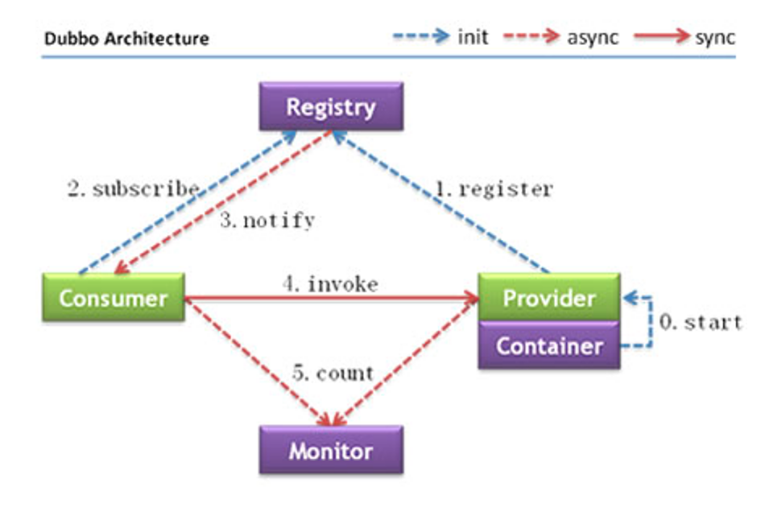

Dubbo定义和一些概念
<!-- more -->

## 概念：
是阿里巴巴公司开源的一个高性能，轻量级的Java RPC框架。  
是SOA时代的产物，SOA（面向服务的架构）是一个组件模型，它将应用程序的不同单元（称为服务）进行拆分，并通过这些服务之间定义良好的接口和契约联系起来。  

[Dubbo官网](https://cn.dubbo.apache.org/zh-cn/docs/introduction/)

## 什么是RPC?
``RPC`` 全称为remote procedure call，即远程过程调用。  
比如两台服务器A和B，A服务器上部署一个应用，B服务器上部署一个应用，A服务器上的应用想调用B服务器上的应用提供的方法，由于两个应用不在一个内存空间，不能直接调用，所以需要通过网络来表达调用的语义和传达调用的数据。  
RPC是一个泛化的概念，严格来说一切远程过程调用手段都属于RPC范畴。各种开发语言都有自己的RPC框架。Java中的RPC框架比较多，广泛使用的有RMI、Hessian、Dubbo等。

## Dubbo的功能：
1. 面向接口的远程方法调用
2. 智能容错和负载均衡
3. 以及服务自动注册和发现

## Dubbo架构图（Dubbo官方提供）如下： 
{width=700}   
节点角色说明：
| 节点       | 角色名称                             |
|------------|------------------------------------|
| Provider   | 暴露服务的服务提供方                 |
| Consumer   | 调用远程服务的服务消费方             |
| Registry   | 服务注册与发现的注册中心             |
| Monitor    | 统计服务的调用次数和调用时间的监控中心 |
| Container  | 服务运行容器                         |
