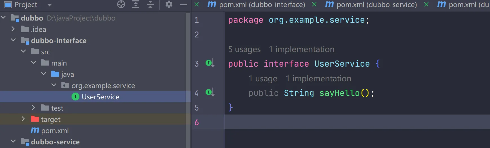
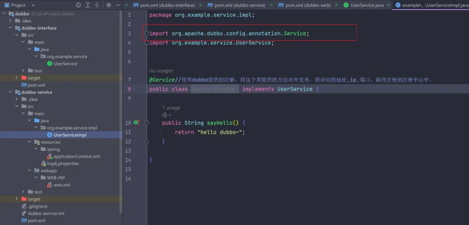
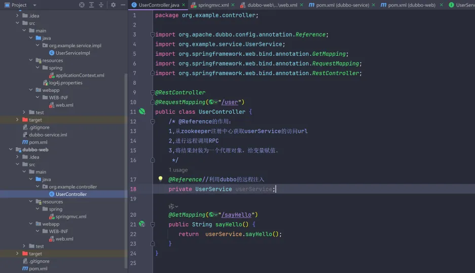

一个简单的Dubbo案例
<!-- more -->
注意：需要开启zookeeper服务，充当Dubbo的注册中心。  
## 公共模块：
定义一个公共模块，用来解耦服务提供者和服务消费者需要的接口：  

## 服务提供者：  
服务提供者提供的服务：  
  
编写配置文件配置dubbo ，applicationContext.xml:  
```xml
<beans xmlns="http://www.springframework.org/schema/beans" xmlns:xsi="http://www.w3.org/2001/XMLSchema-instance"
  xmlns:dubbo="http://dubbo.apache.org/schema/dubbo" xmlns:context="http://www.springframework.org/schema/context"
  xsi:schemaLocation="http://www.springframework.org/schema/beans http://www.springframework.org/schema/beans/spring-beans.xsd http://dubbo.apache.org/schema/dubbo http://dubbo.apache.org/schema/dubbo/dubbo.xsd http://www.springframework.org/schema/context https://www.springframework.org/schema/context/spring-context.xsd">

  <!-- dubbo的配置 -->
  <!-- 1.配置项目的名称,唯一 -->
  <dubbo:application name="dubbo-service"/>
  <!-- 2.配置注册中心的地址 -->
  <dubbo:registry address="zookeeper://ip:2181"/>
  <!-- 3.配置dubbo包扫描 -->
  <dubbo:annotation package="org.example.service.impl"/>

</beans>
```
log4j.properties:
``` properties
# Global logging configuration
log4j.rootLogger=debug, stdout, file

# Console output configuration
log4j.appender.stdout=org.apache.log4j.ConsoleAppender
log4j.appender.stdout.layout=org.apache.log4j.PatternLayout
log4j.appender.stdout.layout.ConversionPattern=%d{yyyy-MM-dd HH:mm:ss} [%t] %-5p %c{2}: %m%n

# File output configuration
log4j.appender.file=org.apache.log4j.FileAppender
log4j.appender.file.File=../logs/iask.log
log4j.appender.file.layout=org.apache.log4j.PatternLayout
log4j.appender.file.layout.ConversionPattern=%d{yyyy-MM-dd HH:mm:ss} [%t] %-5p %c{2}: %m%n

# Set specific package log levels
log4j.logger.org.apache.dubbo=debug
log4j.logger.org.springframework=debug
log4j.logger.org.apache.zookeeper=debug

```
web.xml的配置：
```xml
<web-app xmlns:xsi="http://www.w3.org/2001/XMLSchema-instance" xmlns="http://java.sun.com/xml/ns/javaee"
  xsi:schemaLocation="http://java.sun.com/xml/ns/javaee http://java.sun.com/xml/ns/javaee/web-app_2_5.xsd"
  version="2.5">
  
  <!--  spring  -->
  <context-param>
    <param-name>contextConfigLocation</param-name>
    <param-value>classpath*:spring/applicationContext*.xml</param-value>
  </context-param>
  <listener>
    <listener-class>org.springframework.web.context.ContextLoaderListener</listener-class>
  </listener>
</web-app>
```
pom.xml的配置：
```xml
<project xmlns="http://maven.apache.org/POM/4.0.0" xmlns:xsi="http://www.w3.org/2001/XMLSchema-instance"
  xsi:schemaLocation="http://maven.apache.org/POM/4.0.0 http://maven.apache.org/xsd/maven-4.0.0.xsd">
  <modelVersion>4.0.0</modelVersion>

  <groupId>org.example</groupId>
  <artifactId>dubbo-service</artifactId>
  <version>1.0-SNAPSHOT</version>
  <packaging>war</packaging>

  <name>dubbo-service</name>
  <url>http://maven.apache.org</url>

  <properties>
    <project.build.sourceEncoding>UTF-8</project.build.sourceEncoding>
    <spring.version>5.1.9.RELEASE</spring.version>
<!--     <dubbo.version>2.7.5</dubbo.version>
    <zookeeper.version>2.10.0</zookeeper.version> -->
    <dubbo.version>2.7.4.1</dubbo.version>
    <zookeeper.version>4.0.0</zookeeper.version>
  </properties>

  <dependencies>
    <dependency>
      <groupId>org.example</groupId>
      <artifactId>dubbo-interface</artifactId>
      <version>1.0-SNAPSHOT</version>
    </dependency>
    <!--  servlet3.0规范的坐标  -->
    <dependency>
      <groupId>javax.servlet</groupId>
      <artifactId>javax.servlet-api</artifactId>
      <version>3.1.0</version>
      <scope>provided</scope>
    </dependency>
    <!-- spring的坐标 -->
    <dependency>
      <groupId>org.springframework</groupId>
      <artifactId>spring-context</artifactId>
      <version>${spring.version}</version>
    </dependency>
    <!-- springmvc的坐标 -->
    <dependency>
      <groupId>org.springframework</groupId>
      <artifactId>spring-webmvc</artifactId>
      <version>${spring.version}</version>
    </dependency>
    <!-- 日志 -->
    <dependency>
      <groupId>org.slf4j</groupId>
      <artifactId>slf4j-api</artifactId>
      <version>1.7.21</version>
    </dependency>
    <dependency>
      <groupId>org.slf4j</groupId>
      <artifactId>slf4j-log4j12</artifactId>
      <version>1.7.21</version>
    </dependency>

    <!-- Dubbo的起步依赖，版本2.7之后统一为rg.apache.dubb  -->
    <dependency>
      <groupId>org.apache.dubbo</groupId>
      <artifactId>dubbo</artifactId>
      <version>${dubbo.version}</version>
    </dependency>
    <!-- ZooKeeper客户端实现  -->
    <dependency>
      <groupId>org.apache.curator</groupId>
      <artifactId>curator-framework</artifactId>
      <version>${zookeeper.version}</version>
    </dependency>
    <!-- ZooKeeper客户端实现  -->
    <dependency>
      <groupId>org.apache.curator</groupId>
      <artifactId>curator-recipes</artifactId>
      <version>${zookeeper.version}</version>
    </dependency>

  </dependencies>
  <build>
    <plugins>
      <!-- tomcat插件 -->
      <plugin>
        <groupId>org.apache.tomcat.maven</groupId>
        <artifactId>tomcat7-maven-plugin</artifactId>
        <version>2.1</version>
        <configuration>
          <port>9000</port>
          <path>/</path>
        </configuration>
      </plugin>
      <!-- 编译插件 -->
      <plugin>
        <groupId>org.apache.maven.plugins</groupId>
        <artifactId>maven-compiler-plugin</artifactId>
        <version>3.8.1</version> <!-- 更新插件版本 -->
        <configuration>
          <source>8</source> <!-- 设置源代码版本 -->
          <target>8</target> <!-- 设置目标字节码版本 -->
            </configuration>
            </plugin>
            </plugins>
            </build>

            </project>
```
## 服务消费者：
服务消费者的代码：  

springmvc.xml的配置：
```xml
<?xml version="1.0" encoding="UTF-8"?>
<beans xmlns="http://www.springframework.org/schema/beans"
  xmlns:xsi="http://www.w3.org/2001/XMLSchema-instance"
  xmlns:dubbo="http://dubbo.apache.org/schema/dubbo"
  xmlns:mvc="http://www.springframework.org/schema/mvc"
  xmlns:context="http://www.springframework.org/schema/context"
  xsi:schemaLocation="
  http://www.springframework.org/schema/beans
  http://www.springframework.org/schema/beans/spring-beans.xsd
  http://www.springframework.org/schema/mvc http://www.springframework.org/schema/mvc/spring-mvc.xsd
  http://dubbo.apache.org/schema/dubbo http://dubbo.apache.org/schema/dubbo/dubbo.xsd http://www.springframework.org/schema/context https://www.springframework.org/schema/context/spring-context.xsd">

  <mvc:annotation-driven/>
  <context:component-scan base-package="org.example.controller"/>

  <!-- dubbo 配置 -->
  <!--    配置项目的名称，唯一-->
  <dubbo:application name="dubbo-web"/>
  <!--    配置注册中心的地址-->
  <dubbo:registry address="zookeeper://ip:2181"/>
  <!--    配置dubbo包扫描路径-->
  <dubbo:annotation package="org.example.controller"/>

  <dubbo:reference interface="org.example.service.UserService"/>

</beans>
```
web.xml的配置：
```xml
<?xml version="1.0" encoding="UTF-8"?>
<web-app xmlns:xsi="http://www.w3.org/2001/XMLSchema-instance"
  xmlns="http://java.sun.com/xml/ns/javaee"
  xsi:schemaLocation="http://java.sun.com/xml/ns/javaee http://java.sun.com/xml/ns/javaee/web-app_2_5.xsd"
  version="2.5">

  <!-- Springmvc -->  
  <servlet>
    <servlet-name>springmvc</servlet-name>
    <servlet-class>org.springframework.web.servlet.DispatcherServlet</servlet-class>
    <!-- 指定加载的配置文件 ，通过参数contextConfigLocation加载-->
    <init-param>
      <param-name>contextConfigLocation</param-name>
      <param-value>classpath:spring/springmvc.xml</param-value>
    </init-param>
  </servlet>

  <servlet-mapping>
    <servlet-name>springmvc</servlet-name>
    <url-pattern>/*</url-pattern>
  </servlet-mapping>
</web-app>
```
pom.xml的配置:
```xml
<project xmlns="http://maven.apache.org/POM/4.0.0" xmlns:xsi="http://www.w3.org/2001/XMLSchema-instance"
  xsi:schemaLocation="http://maven.apache.org/POM/4.0.0 http://maven.apache.org/xsd/maven-4.0.0.xsd">
  <modelVersion>4.0.0</modelVersion>

  <groupId>org.example</groupId>
  <artifactId>dubbo-web</artifactId>
  <version>1.0-SNAPSHOT</version>
  <packaging>war</packaging>

  <name>dubbo-web</name>
  <url>http://maven.apache.org</url>

  <properties>
    <project.build.sourceEncoding>UTF-8</project.build.sourceEncoding>
    <spring.version>5.1.9.RELEASE</spring.version>
<!--     <dubbo.version>2.7.5</dubbo.version>
    <zookeeper.version>2.10.0</zookeeper.version> -->
    <dubbo.version>2.7.4.1</dubbo.version>
    <zookeeper.version>4.0.0</zookeeper.version>
  </properties>

  <dependencies>
    <dependency>
      <groupId>org.example</groupId>
      <artifactId>dubbo-interface</artifactId>
      <version>1.0-SNAPSHOT</version>
    </dependency>

    <!--  servlet3.0规范的坐标  -->
    <dependency>
      <groupId>javax.servlet</groupId>
      <artifactId>javax.servlet-api</artifactId>
      <version>3.1.0</version>
      <scope>provided</scope>
    </dependency>
    <!-- spring的坐标 -->
    <dependency>
      <groupId>org.springframework</groupId>
      <artifactId>spring-context</artifactId>
      <version>${spring.version}</version>
    </dependency>
    <!-- springmvc的坐标 -->
    <dependency>
      <groupId>org.springframework</groupId>
      <artifactId>spring-webmvc</artifactId>
      <version>${spring.version}</version>
    </dependency>
    <!-- 日志 -->
    <dependency>
      <groupId>org.slf4j</groupId>
      <artifactId>slf4j-api</artifactId>
      <version>1.7.21</version>
    </dependency>
    <dependency>
      <groupId>org.slf4j</groupId>
      <artifactId>slf4j-log4j12</artifactId>
      <version>1.7.21</version>
    </dependency>


    <!-- Dubbo的起步依赖，版本2.7之后统一为rg.apache.dubb  -->
    <dependency>
      <groupId>org.apache.dubbo</groupId>
      <artifactId>dubbo</artifactId>
      <version>${dubbo.version}</version>
    </dependency>
    <!-- ZooKeeper客户端实现  -->
    <dependency>
      <groupId>org.apache.curator</groupId>
      <artifactId>curator-framework</artifactId>
      <version>${zookeeper.version}</version>
    </dependency>
    <!-- ZooKeeper客户端实现  -->
    <dependency>
      <groupId>org.apache.curator</groupId>
      <artifactId>curator-recipes</artifactId>
      <version>${zookeeper.version}</version>
    </dependency>

  </dependencies>
  <build>
    <plugins>
      <!-- tomcat插件 -->
      <plugin>
        <groupId>org.apache.tomcat.maven</groupId>
        <artifactId>tomcat7-maven-plugin</artifactId>
        <version>2.1</version>
        <configuration>
          <port>8000</port>
          <path>/</path>
        </configuration>
      </plugin>
      <plugin>
        <groupId>org.apache.maven.plugins</groupId>
        <artifactId>maven-compiler-plugin</artifactId>
        <version>3.8.1</version> <!-- 更新插件版本 -->
        <configuration>
          <source>8</source> <!-- 设置源代码版本 -->
          <target>8</target> <!-- 设置目标字节码版本 -->
                     </configuration>
                     </plugin>
                     </plugins>
                     </build>

                     </project>
 ```
