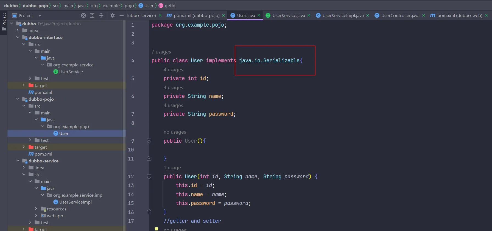
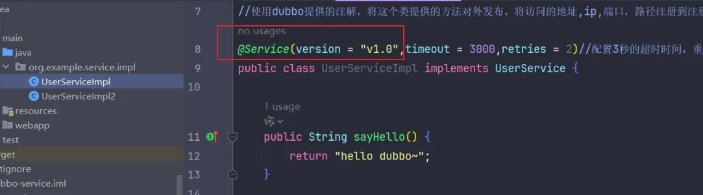
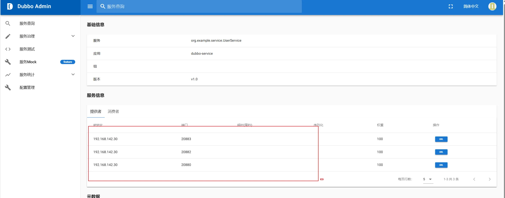

Dubbo的高级特性
<!-- more -->
## 高级特性一-序列化：
dubbo内部已经将序列化和反序列化的过程内部封装了  
我们只需要定义pojo类时实现Serializable接口即可  
一般会定义一个公共的pojo模块，让生产者和消费者都依赖该模块。  
修改Dubbo的案例如下：  
1，创建pojo模块，实体类需要实现Serizlizable接口：  

2，公共接口模块定义一个接口findUserById(int id)  

3,服务提供者实现这个接口：  

4，服务消费者消费这个接口：   

发起请求进行测试：  

可以看到返回了json类型的数据。  
## 高级特性二-地址缓存：
注册中心挂了，服务是否可以正常访问？  
答案是可以的，因为Dubbo服务消费者在第一次调用时，会将服务提供方地址缓存到本地，以后在调用则不会访问注册中心。  
当服务提供者地址发生变化时，注册中心会通知服务消费者。   
## 高级特性三-超时&重试：

1. 服务消费者在调用服务提供者的时候发生了阻塞、等待的情形，这个时候，服务消费者会一直等待下去。
2. 在某个峰值时刻，大量的请求都在同时请求服务消费者，会造成线程的大量堆积，势必会造成雪崩。
3. dubbo利用超时机制来解决这个问题，设置一个超时时间，在这个时间段内，无法完成服务访问，则自动断开连接。
4. 使用timeout属性配置超时时间，默认值1000，单位毫秒。
5. 在服务提供者和服务消费者都可以设置超时时间，最好设置在服务提供者方。
6. 重试可以在服务超时之后进行重试连接，重试次数默认2次。
  
  
## 高级特性四-多版本： 

在服务提供方可以设置多个版本：  

在服务调用方可以选择使用哪个版本：  

## 高级特性五-负载均衡：
Dubbo提供了4中不同的负载均衡的策略：    
● Random：按权重随机，默认设置。按权重设置随机概率。  
● RoundRobin：按权重轮询。就是轮流访问，访问到的就减掉一定的权重。  
● LeastActive：最少活跃调用数，相同活跃数的随机。找最快的服务。  
● ConsistentHash：一致性Hash,相同参数的请求总是发到同一提供者。  
一致性Hash例子：  
{width="400"}   
可以在服务调用者配置负载均衡：     
{width="700"}   
修改几个端口，启动多个相同的服务提供者，使之成为一个集群：  
{width="700"}    
{width="700"}   
在dubbo admin可以看到：    
{width="700"}      
 ## 高级特性六-集群容错：
可以在服务消费者设置集群容错的策略：  
{width="700"}     
{width="300"}   
集群容错模式：   
● Failover Cluster:失败重试。默认值。当出现失败，重试其它服务器，默认重试2次，使用retries配置。一般用于读操作。   
● Failfast Cluster:快速失败，只发起一次调用，失败立即报错。通常用于写操作。  
● Failsafe Cluster:失败安全，出现异常时，直接忽略。返回一个空结果。   
● FailbackCluster:失败自动恢复，后台记录失败请求，定时重发。   
● Forking Cluster:并行调用多个服务器，只要一个成功即返回。   
● Broadcast Cluster:广播调用所有提供者，逐个调用，任意一台报错则报错。    
## 高级特性七-服务降级：
● mock=force:return null 表示消费方对该服务的方法调用都直接返回 null 值，不发起远程调用。用来屏蔽不重要服务不可用时对调用方的影响。   
● 还可以改为 mock=fail:return null 表示消费方对该服务的方法调用在失败后，再返回 null 值，不抛异常。用来容忍不重要服务不稳定时对调用方的影响。

可以在服务消费者配置服务降级的选择：  
