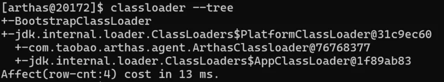
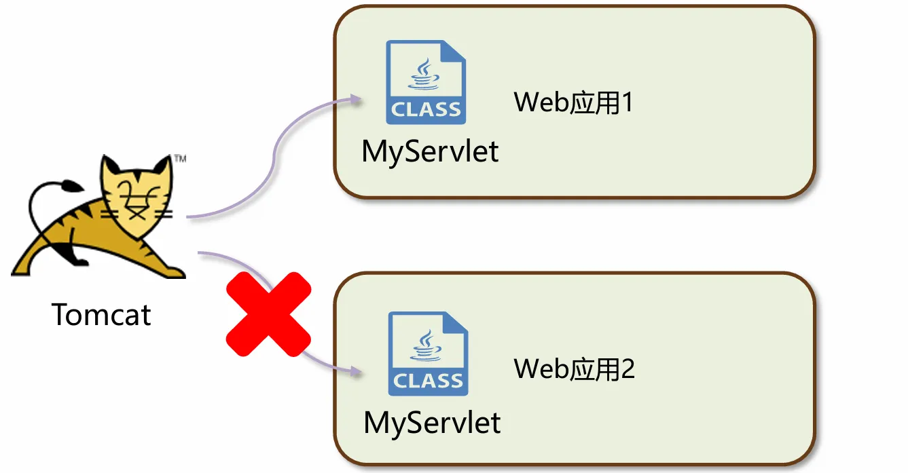

jvm定义，功能，字节码的组成，类的声明周期，类加载器，双亲委派机制。

<!-- more -->

## JVM
### 1，JVM是什么？
JVM全称Java Virtual Machine,中文译名Java虚拟机，是一个运行在计算机上的程序，他的职责是运行Java字节码文件。

### 2，JVM的三大核心功能？
**内存管理：** 自动为对象，方法等分配内存，自动的垃圾回收机制，回收不再使用的对象。

**解释和运行：** 对字节码文件中的指令，实时的解释成机器码，让计算机执行

**即时编译：** 对热点代码进行优化，提升执行效率。


### 3，常见的JVM虚拟机有哪些？
常见的JVM有HotSpot，GraalVM，OpenJ9 等，另外 DragonWell龙井JDK也提供了一款功能增强版的JVM,其中使用最广泛的是HotSpot虚拟机。  


## 字节码的组成
字节码文件的打开方式有很多种，可以使用javap命令，使用Jclasslib字节码插件，还可以使用Arthas

jclasslib下载地址：

[https://github.com/ingokegel/jclasslib/releases](https://github.com/ingokegel/jclasslib/releases)

### 使用notepad++查看字节码文件头/魔数
为notepad++安装HEX-Editor插件，使用Ctrl+Alt+Shift+H 用16进制的方法查看.class文件：


每一个.class文件前4个字节都是cafebabe,这前4个字节称为文件头，每种类型的文件都有文件头，用来标志这是那种类型的文件，字节码文件的文件头又称为magic魔数。

### 使用jclasslib查看字节码文件信息
基本信息：  


常量池：  


+ 常量池中的数据都有一个编号，编号从1开始。在字段或者字节码指令中通过编号可快速的找到对应的数据。
+ 字节码指令中通过编号引用到常量池的过程称之为“符号引用”。

### 字节码常用的工具
**1，javap -v命令**

javap是JDK自带的反编译工具，可以通过控制台查看字节码文件的内容。**适合在服务器上查看字节码文件内容。**

比如我这只有一个jar包，要想看字节码怎么办呢？


首先把jar包解压：jar -xvf xxx.jar

解压完毕后，后多出来几个文件夹，打开BOOT-INF就可以找到对应的字节码文件路径

使用javap -v命令打印出来字节码并保存到txt文件中：


打开txt文件就能看到字节码文件中的所有内容了。

**2，使用jclasslib插件**

**3,使用阿里arthas**

是一款线上诊断产品，通过全局视角实时查看应用load,内存，gc,线程的状态信息，并能在不修改应用代码的情况下，对业务问题进行诊断，大大提升线上问题排查效率。

[arthas官网](https://arthas.aliyun.com/doc/commands.html) 下载jar包运行


选择需要监控的进程序号回车就启动了。

**arthas的功能：**

1. 监控面板
2. 查看字节码信息
3. 方法监控
4. 类的热部署
5. 内存监控
6. 垃圾回收监控
7. 应用热点定位

**下面是几个例子：**

查看监控面板：使用dashboard


查看字节码信息：使用dump   


反编译已加载类的源码：使用jad+ 全限定名


## 类的生命周期
### 1，加载阶段
1，第一步是类加载器根据类的全限定名通过不同的渠道以二进制流的方式获取字节码信息。（不同的渠道是指：本地文件，动态代理生成的文件，通过网络传输的类）

2，类加载器在加载完类之后，类加载器的任务就完成了，java虚拟机会将字节码中的信息保存到**方法区中**。生成一个**InstanceKlass对象**（使用C++编写的对象），保存类的所有信息，里边还包含实现特定功能比如多态的信息。

所有信息包括字节码文件的所有信息：一般信息，常量池，接口，字段，方法，属性。如果要实现多态还包括虚方法表。


3，同时，Java虚拟机还会在堆中生成一份与方法区中数据类似的**java.lang.Class**对象

作用是可以在java代码中去获取类的信息以及存储静态字段的数据（JDK8之后）。


对于开发者来说，只需要访问堆中的Class对象而不需要访问方法区中所有信息。 

<font style="color:#DF2A3F;">这样Java虚拟机就能很好地控制开发者访问数据的范围。</font>

查看内存中的对象：（验证对象存储分别存储在堆中和方法区中）


下面探讨HsdbDemo对象是否存在于堆中和方法区中：  
运行之后先通过 jps命令查看进程id

通过hsdb工具查看java虚拟机内存信息：（不同的版本方法不一样，我的是jdk11）


选择Tools -> Object Histogram查看对象：


点击PreviousOop可以找到下面这个，是指向堆中对象的引用


以上可以知道这个对象存储在方法区中，下面使用visualVM可以查出来对象也存在于堆中：

首先堆转存储文件  


让visualVM来分析：


综上所述，可以知道类加载阶段把类的信息存储在**方法区中**和**堆中。**

### 2，连接阶段（分为验证，准备，解析三个阶段）
#### 1，验证阶段
  
验证内容是否满足《Java虚拟机规范》下面是几个例子：

1，文件格式验证，比如文件是否以0xCAFEBABE开头，主次版本号是否满足当前Java虚拟机版本要求。


主次版本号是否满足当前Java虚拟机版本要求：


<font style="color:rgb(192,0,0);">主版本号不能高于运行环境主版本号，如果主版本号相等，副版本号也不能超过环境支持的最大副版本号。</font>


2，元信息验证，例如类必须有父类（super不能为空）


3，验证程序执行指令的语义，比如方法内的指令执行中跳转到不正确的位置。


4.符号引用验证，例如是否访问了其他类中private的方法等。

#### 2，准备阶段
**给静态变量（static）分配内存并设置初始值，jdk8之后的版本**


**每一种基本数据类型和引用数据类型都有其初始值:**


**final修饰的基本数据类型的静态变量，准备阶段直接会将代码中的值进行赋值:**


#### 3，解析阶段
**将常量池中的符号引用替换成指向内存的直接引用**

**符号引用就是在字节码文件中使用编号来访问常量池中的内容**

**直接引用不再使用编号，而是使用内存中地址进行访问具体的数据。**

### 3，初始化阶段
+ **初始化阶段会执行静态代码块中的代码，并为静态变量赋值**
+ **初始化阶段会执行字节码文件中**<font style="color:#DF2A3F;">clinit</font>**部分的字节码指令，给静态变量赋值**


**让类发生初始化的方式:**

1.访问一个类的静态变量或者静态方法时，注意如果变量是final修饰的并且等号右边是常量不会触发初始化。（这种变量在准备阶段就已经初始化好了） 

例如：下面的代码中，main方法访问了Demo2类的静态变量，因此会触发Demo2类的初始化，执行静态代码块中的方法。但如果Demo2中的变量i又被fianl修饰了，则不会触发

```java
public class Demo1{
    public static void main(String[] args){
        int i = Demo2.i;
        System.out.println(i);
    }
}
class Demo2{
    static {
        System.out.println("初始化了");
    }
    public static int i = 0;
}
```
{width=500}

2.调用Class.forName(String className),只要是使用了这个方法就会初始化指定的类

```java
public class Demo1{
    public static void main(String[] args) throws ClassNotFoundException {
       Class<?> clazz = Class.forName("com.koal.kcs.demo.Demo2");//全限定名
    }
}
class Demo2{
    static {
        System.out.println("初始化了");
    }
}
```

3.new一个该类的对象时：

4.执行main方法的当前类。

```java
public class Demo1{
    static {
        System.out.println("Demo1初始化了");
    }
    public static void main(String[] args){
        new Demo2();
    }

}
class Demo2{
    static {
        System.out.println("Demo2初始化了");
    }
}
```

执行main方法的Demo1类首先初始化，会打印"Demo1初始化了"，main方法中创建了Demo2对象则触发Demo2的初始化，打印"Demo2初始化了"。

#### 案例1：(下面会打印什么结果？)
```java
public class Demo1{
    public static void main(String[] args) {
        System.out.print("A");
        new Demo1();
        new Demo1();
    }
    public Demo1(){
        System.out.print("B");
    }
    {
        System.out.print("C");
    }
    static {
        System.out.print("D");
    }
}
```

分析jclasslib:

执行main方法的当前类会首先进行初始化：Demo1初始化，打印"D"


执行main方法打印A，执行Demo1的构造方法``<init>()``初始化对象两次：


初始化方法的字节码：打印CB


为什么先C后B 字节码都写了，或者是 <font style="color:#f8f8f2;background-color:#282a36;">因为实例代码块会在构造方法之前执行</font>

所以结果是： DACBCB

#### <font style="color:#f8f8f2;background-color:#282a36;">以下几种情况字节码中是不会有clinit方法的</font>
```java
public class Demo1{
    //1，无静态代码块且无静态变量赋值语句
    //  空
    //2，有静态变量声明，但是没有赋值语句
    //static String str;
    //3，静态变量的定义使用final关键字，这类变量会在准备阶段直接进行初始化
    static final String str2 = "hello";
    public static void main(String[] args) {
    }
}
```

**子类的初始化clinit调用前，会先调用父类的clinit初始化方法.**

例：

```java
public class Demo1{
    public static void main(String[] args) {
        new B02();
        System.out.println(B02.a);
    }
}
class B01{
    static int a = 0;
    static {
        a=1;
    }
}

class B02 extends B01{
    static {
        a=2;
    }
}
```

上面代码中会执行B02的初始化，但是B02继承了B01，因此B01先初始化，B01使a=1,B02使a=2,因此打印2

**直接访问父类的静态变量，不会触发子类的初始化。**

例：

```java
public class Demo1{
    public static void main(String[] args) {
        System.out.println(B02.a);
    }
}
class B01{
    static int a = 0;
    static {
        a=1;
    }
}

class B02 extends B01{
    static {
        a=2;
    }
}
```

打印结果是1

**数组的创建不会导致数组中元素的类进行初始化**

```java
public class Demo1{
    public static void main(String[] args) {
        B01[]arr = new B01[10];
    }
}
class B01{
    static {
        System.out.println("B01 static block");
    }
}
```

**特例：**

**final修饰的变量如果赋值的内容需要执行指令才能得到结果，会执行clinit方法进行初始化**

```java
public class Demo1{
    public static void main(String[] args) {
        System.out.println(B01.a);
    }
}
class B01{
    //需要执行指令才能得到结果
    public static final int a = Integer.valueOf(1);
    static {
        System.out.println("B01 static block");
    }
}
```

## 类加载器：
作用：类加载器负责在加载阶段获取字节码文件并且加载到内存中，通过加载字节码数据放入内存转换成byte[],接下来调用虚拟机底层方法将byte[]转换成方法区和堆中的数据。

类加载器分为两大类，一类是Java代码中实现的（JDK提供的），一类是虚拟机底层源码实现的。

**虚拟机底层实现的类加载器：**

源码位于Java虚拟机的源码中，实现语言与虚拟机底层语言一致，如Hotspot使用C++语言；

主要加载程序运行时的基础类，保证Java程序中基础类被正确的加载，比如java.lang.String，确保其可靠性。

**JDK中默认提供或自定义的加载器：**

JDK中默认提供了多种处理不同渠道的累加载器，我们也可以自己根据需求定制；

所有Java中实现的类加载器都需要继承ClassLoader这个抽象类；


可以通过**Arthas**查看类加载器：

例：（这是jdk11版本的跟jdk8以及之前的有些区别）  




### 启动类加载器：
启动类加载器（Bootstrap ClassLoader）是由Hotspot虚拟 机提供的、使用C++编写的类加载器。 

默认加载Java安装目录/jre/lib下的类文件，比如rt.jar， tools.jar，resources.jar等


#### 通过启动类加载器去加载用户的jar包：  
最好的方式是通过参数进行扩展，使用命令 -Xbootclasspath/a:jar包目录/jar包名 进行扩展

下面是一个例子：

比如我首先写了一个A类：我想让启动类加载器加载它

```java
public class A{
    static {
        System.out.println("A 类被加载了");
    }
}
```

首先使用maven 的package打包成jar包


记住它的路径和名字，当然也可以修改，C:\Users\lcyli\Desktop\jarbao

jdkDemo-1.0-SNAPSHOT.jar

在另一个需要加载jar包的程序中的启动配置中添加虚拟机参数：


测试：jar包是否被成功加载：

```java
public class Main{
    public static void main(String[] args) throws ClassNotFoundException {
        //使用A类的全限定名加载类，如果A类被加载成功就会打印:"A 类被加载了"
        Class<?> aClass = Class.forName("org.example.A");
        //打印Class类
        System.out.println(aClass);
        //获取并打印加载该类的类加载器，如果结果是null，则表示该类由启动类加载器加载
        ClassLoader classLoader = aClass.getClassLoader();
        System.out.println(classLoader);
    }
}
```

#### 通过Arthas工具查看一个类的详细信息以及类加载器是哪个：


### JDK8提供的类加载器：
扩展类加载器和应用程序类加载器都是JDK提供的，使用Java编写的类加载器。

它门的源码都位于sun.misc.Launcher中，是一个静态内部类。继承自URLClassLoader.具备通过目录或者指定jar包将字节码文件加载到内存中。


#### 扩展类加载器：
扩展类加载器（Extension Class Loader）是JDK中提供的、 使用Java编写的类加载器。  

 默认加载**Java安装目录/jre/lib/ext**下的类文件。  


同样使用扩展类加载器想要加载用户的jar包，也可以通过jvm命令来进行配置:

使用-Djava.ext.dirs=jar包目录  进行扩展，但是这种方式会覆盖掉原始的目录，因此除了配置自己的jar包目录，还要配置上原始的扩展目录，如果是window系统使用“;”进行分割，macos/linux系统使用“:”进行分割,下面是例子：


#### 应用类加载器：
应用类加载器加载classpath路径下的类文件，包括项目中自己编写的类和接口的文件以及第三方jar包中的类和接口的文件。

下面的示例打印出来两种类的类加载器：

```java
public class Main{
    public static void main(String[] args) throws ClassNotFoundException {
        //当前项目中创建的Student类
        Student student = new Student();
        ClassLoader classLoader = Student.class.getClassLoader();
        System.out.println(classLoader);
        //maven依赖中包含的的类
        ClassLoader classLoader1 = FileUtils.class.getClassLoader();
        System.out.println(classLoader1);
    }
}
//结果：
jdk.internal.loader.ClassLoaders$AppClassLoader@1f89ab83
jdk.internal.loader.ClassLoaders$AppClassLoader@1f89ab83
```

#### 通过Arthas查看类加载器加载类的路径的方式：


## 双亲委派机制
### 什么是双亲委派机制？
双亲委派机制指的是：自底向上查找是否加载过，再由顶向下进行加载  

以应用类加载器来说，应用类加载器想要加载一个类，首先会检查自己是否已经加载该类，没有加载则向上级委派，扩展类加载器检查是否加载该类，也没有，向它的上级委派，启动类加载器检查是否加载该类，发现也没有，则自己尝试加载该类，如果此类不在自己的加载路径中，就交给下级加载，扩展类加载器也不能加载，最后应用类加载器加载该类。


它们之间的上下级关系并不是继承关系，而是每个java实现的类加载器中都保存了一个成员变量parent类加载器，理解为它的上级：


应用类加载器的parent是扩展类加载器，扩展类加载器的parent是null， 因为启动类加载器使用C++编写，也没有上级类加载器了。

**作用：**

1，保证类加载的安全性

通过双亲委派机制避免恶意代码替换JDK中的核心类库，比如java.lang.String，确保核心类库的完整性和安全性。

2，避免重复加载

双亲委派机制可以避免同一个类被多次加载。

### 在Java中如何使用代码的方式去主动加载一个类呢？
方式1：使用Class.forName方法，使用当前类的类加载器去加载指定的类。 

方式2：获取到类加载器，通过类加载器的loadClass方法指定某个类加载器加载。 

在Idea中测试下面的案例：

```java
public class Main{
    public static void main(String[] args) throws ClassNotFoundException {
        //获取本类的类加载器
        ClassLoader classLoader = Main.class.getClassLoader();
        System.out.println(classLoader);
        //使用本类的类加载器加载类
        Class<?> aClass = classLoader.loadClass("org.example.Student");
        //打印加载这个类的类加载器
        System.out.println(aClass.getClassLoader());

    }
}
```

### Arthas工具查看类加载器的上下级关系：


### 打破双亲委派机制：
打破的原因：

⚫  一个Tomcat程序中是可以运行多个Web应用的，如果这两个应用中出现了相同限定名的类，比如Servlet类， Tomcat要保证这两个类都能加载并且它们应该是不同的类。 

⚫ 如果不打破双亲委派机制，当应用类加载器加载Web应用1中的MyServlet之后，Web应用2中相同限定名的 MyServlet类就无法被加载了。  



#### 类加载器的核心源码解读：
类加载器是怎么加载类的，请看下面代码。

loadClass()方法是类加载的入口，提供了双亲委派机制，它会检查类是否被加载，以及交给父类加载或者交给启动类加载此类，如果都失败，则执行自己的加载方法，主要是调用findClass方法

```java
protected Class<?> loadClass(String name, boolean resolve)
throws ClassNotFoundException
{
    synchronized (getClassLoadingLock(name)) {
        //首先，检查类是否被加载了
        Class<?> c = findLoadedClass(name);
        //如果类没有被加载
        if (c == null) {
            long t0 = System.nanoTime();
            try {
                //有父类，让委派给父类进行加载
                if (parent != null) {
                    c = parent.loadClass(name, false);
                } else {
                    //没有父类，交给启动类加载器加载
                    c = findBootstrapClassOrNull(name);
                }
            } catch (ClassNotFoundException e) {
                // ClassNotFoundException thrown if class not found
                // from the non-null parent class loader
            }

            if (c == null) {
                //如果仍然没有被加载，则调用findClass方法找到该类
                long t1 = System.nanoTime();
                c = findClass(name);

                // this is the defining class loader; record the stats
                PerfCounter.getParentDelegationTime().addTime(t1 - t0);
                PerfCounter.getFindClassTime().addElapsedTimeFrom(t1);
                PerfCounter.getFindClasses().increment();
            }
        }
        if (resolve) {
            //如果传递的resolve是true，则会执行生命周期中的连接阶段
            resolveClass(c);
        }
        return c;
    }
}
```

findClass（）方法的主要目的是查找指定路径的资源：资源找到之后执行defineClass()方法

```java
protected Class<?> findClass(final String name)
throws ClassNotFoundException
{
    final Class<?> result;
    try {
        //AccessController.doPrivileged:以受信任的权限上下文执行代码，避免安全管理器阻止某些操作
        result = AccessController.doPrivileged(
            new PrivilegedExceptionAction<>() {
                public Class<?> run() throws ClassNotFoundException {
                    //将类名转换为路径格式：
                    String path = name.replace('.', '/').concat(".class");
                    //从类路径中查找指定路径的资源
                    Resource res = ucp.getResource(path, false);
                    if (res != null) {
                        try {
                            //资源查找成功则执行defineClass()方法;
                            return defineClass(name, res);
                        } catch (IOException e) {
                            throw new ClassNotFoundException(name, e);
                        } catch (ClassFormatError e2) {
                            if (res.getDataError() != null) {
                                e2.addSuppressed(res.getDataError());
                            }
                            throw e2;
                        }
                    } else {
                        return null;
                    }
                }
            }, acc);
    } catch (java.security.PrivilegedActionException pae) {
        throw (ClassNotFoundException) pae.getException();
    }
    if (result == null) {
        throw new ClassNotFoundException(name);
    }
    return result;
}
```

`defineClass` 方法的具体实现如下，负责将字节码定义为 Java 的 `Class` 对象  

```java
private Class<?> defineClass(String name, Resource res) throws IOException {
    long t0 = System.nanoTime();
    //找到类名中最后一个.的位置，用于获取类的包名
    int i = name.lastIndexOf('.');
    URL url = res.getCodeSourceURL();
    if (i != -1) {
        String pkgname = name.substring(0, i);
        // Check if package already loaded.
        Manifest man = res.getManifest();
        if (getAndVerifyPackage(pkgname, man, url) == null) {
            try {
                if (man != null) {
                    //定义类所在的包信息
                    definePackage(pkgname, man, url);
                } else {
                    definePackage(pkgname, null, null, null, null, null, null, null);
                }
            } catch (IllegalArgumentException iae) {
                // parallel-capable class loaders: re-verify in case of a
                // race condition
                if (getAndVerifyPackage(pkgname, man, url) == null) {
                    // Should never happen
                    throw new AssertionError("Cannot find package " +
                                             pkgname);
                }
            }
        }
    }
    // Now read the class bytes and define the class
    //从资源中获取类的字节码
    java.nio.ByteBuffer bb = res.getByteBuffer();
    if (bb != null) {
        // 获取代码签名者信息
        CodeSigner[] signers = res.getCodeSigners();
        //获取类的来源信息
        CodeSource cs = new CodeSource(url, signers);
        PerfCounter.getReadClassBytesTime().addElapsedTimeFrom(t0);
        //重载，使用ByteBuffer定义类
        return defineClass(name, bb, cs);
    } else {
        byte[] b = res.getBytes();
        // 必须在读取字节后读取证书。
        CodeSigner[] signers = res.getCodeSigners();
        CodeSource cs = new CodeSource(url, signers);
        PerfCounter.getReadClassBytesTime().addElapsedTimeFrom(t0);
        //重载：使用字节数组定义类
        return defineClass(name, b, 0, b.length, cs);
    }
}
```

 defineClass（)重载的方法中的操作：使用字节码将类加载到 JVM 的内存中，并返回 `Class` 对象。它通过调用底层的本地方法实现具体的类定义，同时提供了一些钩子方法（如 `preDefineClass` 和 `postDefineClass`）以便在定义类之前和之后执行额外逻辑。  

```java
protected final Class<?> defineClass(String name, java.nio.ByteBuffer b,
                                     ProtectionDomain protectionDomain)
throws ClassFormatError
{
    int len = b.remaining();

    // Use byte[] if not a direct ByteBuffer:
    if (!b.isDirect()) {
        if (b.hasArray()) {
            return defineClass(name, b.array(),
                               b.position() + b.arrayOffset(), len,
                               protectionDomain);
        } else {
            // no array, or read-only array
            byte[] tb = new byte[len];
            b.get(tb);  // get bytes out of byte buffer.
            return defineClass(name, tb, 0, len, protectionDomain);
        }
    }

    protectionDomain = preDefineClass(name, protectionDomain);
    String source = defineClassSourceLocation(protectionDomain);
    Class<?> c = defineClass2(this, name, b, b.position(), len, protectionDomain, source);
    postDefineClass(c, protectionDomain);
    return c;
}
```


#### 三种方式打破双亲委派机制：
1. 自定义类加载器：

自定义类加载器并且重写loadClass方法，就可以将双亲委派机制的代码去除;

Tomcat通过这种方式实现应用之间隔离。《面试篇分享做法》

```java
package org.example.broken;

import org.apache.commons.io.IOUtils;
import java.io.File;
import java.io.FileInputStream;
import java.util.regex.Matcher;

//打破双亲委派机制-自定义类加载器
public class BreakClassLoader1 extends ClassLoader{

    private String basePath;
    private final static String FILE_EXT = ".class";

    public void setBasePath(String basePath) {
        this.basePath = basePath;
    }

    private byte[] loadClassData(String name)  {
        try {
            String tempName = name.replaceAll("\\.", Matcher.quoteReplacement(File.separator));
            FileInputStream fis = new FileInputStream(basePath + tempName + FILE_EXT);
            try {
                return IOUtils.toByteArray(fis);
            } finally {
                IOUtils.closeQuietly(fis);
            }
            /**
             * 使用IOUtils需要引入以下依赖
             *     <dependency>
             *       <groupId>commons-io</groupId>
             *       <artifactId>commons-io</artifactId>
             *       <version>2.11.0</version>
             *     </dependency>
             */

        } catch (Exception e) {
            System.out.println("自定义类加载器加载失败，错误原因：" + e.getMessage());
            return null;
        }
    }

    @Override
    public Class<?> loadClass(String name) throws ClassNotFoundException {
        if(name.startsWith("java.")){
            return super.loadClass(name);
        }
        byte[] data = loadClassData(name);
        return defineClass(name, data, 0, data.length);
    }

    // 测试
    public static void main(String[] args) throws Exception {
        // 创建一个自定义类加载器
        BreakClassLoader1 loader = new BreakClassLoader1();
        // 设置自定义类加载器的加载路径
        loader.setBasePath("C:\\Users\\lcyli\\Desktop\\my\\");
        // 加载一个类
        Class<?> aClass = loader.loadClass("org.example.Demo1");
        System.out.println(aClass);
        // 获取加载类的类加载器
        ClassLoader classLoader = aClass.getClassLoader();
        System.out.println(classLoader);


        BreakClassLoader1 loader2 = new BreakClassLoader1();
        loader2.setBasePath("C:\\Users\\lcyli\\Desktop\\my\\");
        Class<?> aClass2 = loader2.loadClass("org.example.Demo1");
        System.out.println(aClass2);
        ClassLoader classLoader2 = aClass2.getClassLoader();
        System.out.println(classLoader2);

        // 判断两个类是否是同一个类
        System.out.println(aClass == aClass2);
        // 获取父类加载器
        ClassLoader parent = classLoader2.getParent();
        System.out.println(parent);//默认自定义类加载器父类是AppClassLoader
        System.out.println(getSystemClassLoader());//获取系统类加载器，结果与上面一样
        System.in.read();
    }
}
```

可以使用arthas的“sc -d 类的全限定名 ”命令查看类的信息，发现有两个，证明了这个类被加载了两次由不同的类加载器加载。


注：双亲委派机制最好不要打破，如果想实现一个自定义类加载器，最好的方式是重写findClass方法。

2. 线程上下文类加载器：

利用**上下文加载器**加载类，比如JDBC和JNDI等

JDBC案例：

在jdbc4.0之前是没有破坏双亲委派机制的，案例如下：

**5.1.7** 是明确声明支持 JDBC 4.0 标准的版本  

首先我们引入一个比较老旧的jdbc3.0的依赖版本：

```xml
<dependency>
  <groupId>mysql</groupId>
  <artifactId>mysql-connector-java</artifactId>
  <version>5.0.8</version>
</dependency>
```

这是我们从前使用jdbc连接数据库的案例：

```java
import java.sql.*;
public class JDBCExampleOld {
    public static void main(String[] args) {
        try {
            // 显式加载 MySQL 驱动类
            Class.forName("com.mysql.jdbc.Driver");
            // 连接数据库
            String url = "jdbc:mysql://localhost:3306/love?characterEncoding=utf8";
            String user = "root";
            String password = "123456";
            Connection conn = DriverManager.getConnection(url, user, password);
            System.out.println("Connected to the database!");
            Statement statement = conn.createStatement();
            ResultSet resultSet = statement.executeQuery("SELECT * FROM guest");
            while (resultSet.next()) {
                int id = resultSet.getInt("id");
                String name = resultSet.getString("name");
                System.out.println("ID: " + id + ", Name: " + name);
            }
        } catch (ClassNotFoundException e) {
            System.err.println("MySQL JDBC Driver not found.");
            e.printStackTrace();
        } catch (SQLException e) {
            System.err.println("Connection failed.");
            e.printStackTrace();
        }
    }
}
```

可以看到，这个时期使用Jdbc必须要显示加载驱动类：

```java
Class.forName("com.mysql.jdbc.Driver");
```

进入这个方法内部可以看到是使用了何种加载器来加载"com.mysql.jdbc.Driver"驱动类的，可以打断点进行测试：


看到是应用类加载器，而com.mysql.jdbc.Driver驱动本来就在我们引入的jar包中，理应被应用类加载器加载，没有毛病。

下面进入到Driver类中，可以看到：

```java
public class Driver extends NonRegisteringDriver implements java.sql.Driver {
    public Driver() throws SQLException {
    }

    static {
        try {
            //加载之后，Driver会把自己交给驱动管理器来注册驱动
            DriverManager.registerDriver(new Driver());
        } catch (SQLException var1) {
            throw new RuntimeException("Can't register driver!");
        }
    }
}
```

Driver会把自己交给驱动管理器来注册驱动，那么势必会触发DriverManager类的加载，而DriverManager类是jdk提供的类，是由启动类加载器来加载的。

整个过程中，应用类加载器加载Drive类，加载Drive时执行静态方法，又需要加载DriverManager类，应用类加载DriverManager类，但是不在它的加载路径下，就像上委派给启动类加载器加载。复合双亲委派机制。


而在jdbc4.0之后，我们引入高版本的依赖：

```xml
<dependency>
  <groupId>mysql</groupId>
  <artifactId>mysql-connector-java</artifactId>
  <version>5.1.8</version>
</dependency>
```

发现不需要显式加载 MySQL 驱动类也能够查询数据了，myslq驱动肯定已经被加载好了：

```java
public class JDBCExampleOld {
    public static void main(String[] args) {
        try {
            // 显式加载 MySQL 驱动类
            // 连接数据库
            String url = "jdbc:mysql://localhost:3306/love?characterEncoding=utf8";
            String user = "root";
            String password = "123456";
            Connection conn = DriverManager.getConnection(url, user, password);
            System.out.println("Connected to the database!");
            Statement statement = conn.createStatement();
            ResultSet resultSet = statement.executeQuery("SELECT * FROM guest");
            while (resultSet.next()) {
                int id = resultSet.getInt("id");
                String name = resultSet.getString("name");
                System.out.println("ID: " + id + ", Name: " + name);
            }
        } catch (SQLException e) {
            System.err.println("Connection failed.");
            e.printStackTrace();
        }
    }
}
```

直接把DriverManager加载的驱动全都打印出来：（证实了这种情况）

```java
public class JDBCExampleOld {
    public static void main(String[] args) {
        //获取DriverManager的所有驱动
        Enumeration<Driver> drivers = DriverManager.getDrivers();
        //遍历打印：
        while (drivers.hasMoreElements()) {
            Driver driver = drivers.nextElement();
            System.out.println("Driver: " + driver.getClass().getName());
        }
    }
}
//结果：Driver: com.mysql.jdbc.Driver

```

为啥驱动都有了呢？

DriverManager.getConnection()和DriverManager.getDrivers()方法中都会执行一个方法：

```java
ensureDriversInitialized()
```

进入这个方法里面可以看到关键的两行代码：

```java
ServiceLoader<Driver> loadedDrivers = ServiceLoader.load(Driver.class);
Iterator<Driver> driversIterator = loadedDrivers.iterator();
```

ServiceLoader类是SPI机制的核心，DriverManager可能是通过SPI机制来加载的驱动类了，想必mysql的jar包肯定暴漏在了META-INF/services文件夹中，以接口的全限定名来命名文件名，对应的文件里面写该接口的实现。


确实是有啊，的确使用了SPI机制。

现在我们知道了驱动类是由SPI机制加载出来的，但是驱动类可以测试出来是由应用类加载器加载的，可以想到SPI机制肯定通过应用类加载器加载类了，那么他是如何获取应用类加载器的？

SPI中使用了线程上下文中保存的类加载器进行类的加载，这个类加载器一般是应用类加载器，我们可以进入到SPI机制加载方法ServiceLoader.load(Driver.class)中可以看到就是应用类加载器：

```java
public static <S> ServiceLoader<S> load(Class<S> service) {
    //获取当前线程中上下文类加载器
    ClassLoader cl = Thread.currentThread().getContextClassLoader();
    return new ServiceLoader<>(Reflection.getCallerClass(), service, cl);
}
```


难道获取线程上下文加载器是获取应用类加载器的一种方式吗？

```java
public class NewThreadDemo {
    public static void main(String[] args) {
        new Thread(new Runnable() {
            @Override
            public void run() {
                System.out.println(Thread.currentThread().getContextClassLoader());
            }
        }).start();
    }
}
//结果：获取线程上下文加载器是获取应用类加载器的一种方式
```

分析以上过程：应用类加载器向上委托到启动类加载器加载DriverManager类，然后加载DriverManager类时会通过SPI机制加载jar包中的Driver实现类，SPI通过获取线程上下文加载器拿到应用类加载器加载Driver类。

Oracle 官方对类加载器的双亲委派机制有以下描述：

**Class loaders use a delegation model to search for classes and resources. Each instance of a class loader has an associated parent class loader. When asked to find a class or resource, a class loader delegates the search to its parent before attempting to find the class or resource itself.**

**翻译：**  
类加载器使用委派模型来搜索类和资源。每个类加载器实例都有一个关联的父类加载器。当类加载器被要求寻找某个类或资源时，它会在尝试自行查找之前，将搜索任务委托给其父类加载器。

案例中SPI通过获取线程上下文加载器拿到应用类加载器加载Driver类，并没有将搜索任务委托给其父类加载器，因此确实打破了双亲委派机制。


1. Osgi框架的类加载器：

历史上Osgi框架实现了一套新的类加载器机制，允许同级的自定义类加载器互相委派，这种就打破了双亲委派机制。OSGI还使用类加载器实现了热部署的功能。热部署指的是在服务不停止的情况下，动态的更新字节码文件到内存中。


### 使用Arthas不停机解决线上问题


## JDK 8 之前的类加载器机制
在 JDK 8 之前，类加载器的结构是传统的三层架构，遵循 **双亲委派模型**：

### **类加载器层次结构**
1. **Bootstrap ClassLoader（启动类加载器）**：
    - 由 JVM 内部实现（本地代码）。
    - 负责加载 **核心类库**（`rt.jar`、`resources.jar` 等）。
    - 无法直接在 Java 程序中访问。
2. **Extension ClassLoader（扩展类加载器）**：
    - 负责加载 `JAVA_HOME/lib/ext` 目录中的扩展类。
    - 继承自 `ClassLoader`，由 Java 代码实现。
3. **Application ClassLoader（应用程序类加载器）**：
    - 负责加载应用程序类路径（`classpath`）上的类。
    - 也是 `ClassLoader` 的子类，由 Java 代码实现。

### **特点**
+ **无模块化支持**：
    - 类加载器完全基于类路径，所有的类都共享一个全局命名空间。
    - 不同的类库可能因为命名冲突导致问题。
+ **扩展功能有限**：
    - 没有明确的机制区分平台类和用户定义的类。
    - 类加载器之间缺乏灵活性，难以实现定制化的加载逻辑。

## **JDK 9+ 的类加载器机制**
从 JDK 9 开始，随着 **JPMS（Java 平台模块化系统）** 的引入，类加载器体系发生了显著变化，主要目的是支持模块化加载。

### **类加载器层次结构**
1. **Bootstrap ClassLoader（启动类加载器）**：
    - 依然负责加载基础模块（`java.base`）中的核心类，但其职责被封装在 `BootClassLoader` 类中。
    - 由底层 JVM 实现。
2. **Platform ClassLoader（平台类加载器）**：
    - **新引入**，用于加载平台模块（如 `java.sql`、`java.xml`）。
    - 在层次上位于 `Bootstrap ClassLoader` 和 `Application ClassLoader` 之间。
3. **Application ClassLoader（应用程序类加载器）**：
    - 负责加载应用程序模块和 `classpath` 上的类。
    - 支持加载模块化应用程序。

### **特点**
+ **模块化支持**：
    - 类加载器被设计为支持模块化加载。
    - 每个模块有自己的类命名空间，可以避免类冲突。
+ **分工更细化**：
    - 新增 `Platform ClassLoader` 专门负责加载平台模块。
    - 更清晰地划分类加载的职责，便于扩展和维护。
+ **继承关系调整**：
    - 引入了 `BuiltinClassLoader` 抽象类，作为 `PlatformClassLoader` 和 `ApplicationClassLoader` 的共同父类。
    - 对启动类加载器（`Bootstrap ClassLoader`）进行了封装，便于统一管理。

## **两者的具体区别**
| **特性** | **JDK 8 及之前** | **JDK 9+** |
| --- | --- | --- |
| **模块化支持** | 不支持模块化，基于类路径 | 引入 JPMS，支持模块化加载 |
| **类加载器层次结构** | 三层（Bootstrap、Extension、Application） | 四层（Bootstrap、Platform、Application、Custom Modules） |
| **Platform ClassLoader** | 不存在 | 新增，专门负责加载平台模块 |
| **类加载器继承关系** | `Extension`<br/> 和 `Application`<br/> 继承自 `ClassLoader` | `PlatformClassLoader`<br/> 和 `ApplicationClassLoader`<br/> 继承自 `BuiltinClassLoader` |
| **启动类加载器（Bootstrap）** | 由 JVM 内部实现，不能被封装访问 | 由 JVM 内部实现，但通过 `BootClassLoader`<br/> 封装并支持管理 |
| **类路径冲突** | 所有类共享一个全局命名空间，易冲突 | 各模块有独立的命名空间，模块间依赖更清晰 |
| **定制化加载** | 定制化加载逻辑较为复杂 | 基于模块化机制，加载逻辑更灵活 |


## **图示对比**
### **JDK 8 之前**
```plain
Bootstrap ClassLoader
      ↓
Extension ClassLoader
      ↓
Application ClassLoader
```

### **JDK 9+**
```plain
Bootstrap ClassLoader (封装为 BootClassLoader)
      ↓
Platform ClassLoader
      ↓
Application ClassLoader
```

## **总结**
1. **模块化引入**是 JDK 9 类加载器的最大变化，提升了 Java 生态的可维护性和扩展性。
2. JDK 9 的类加载器分工更加明确，新增 `Platform ClassLoader` 进一步解耦平台类和应用程序类。
3. 向后兼容：尽管类加载机制发生了变化，但 JDK 9+ 依然能够兼容非模块化的传统应用程序。


