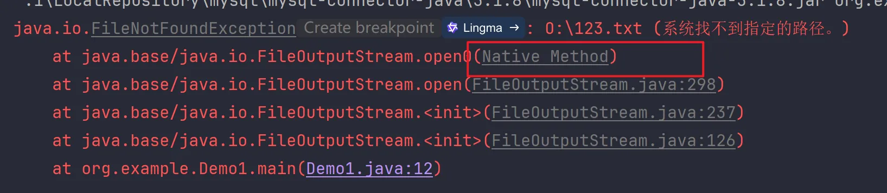
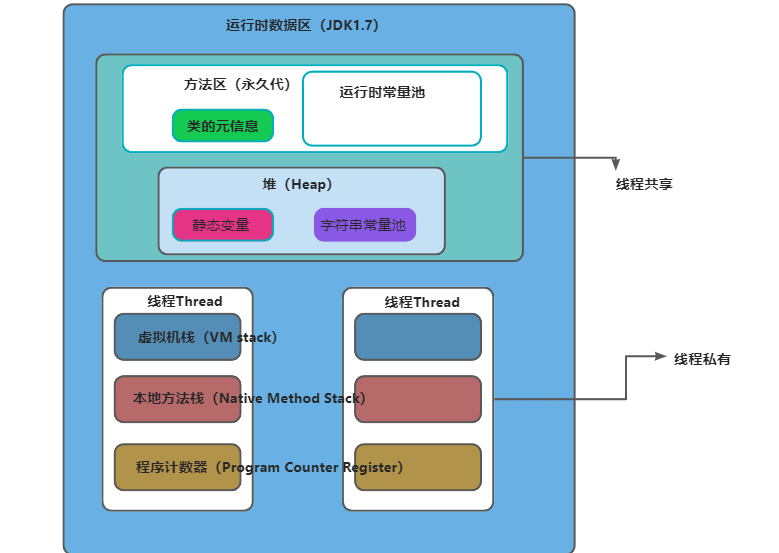

Java虚拟机的内存结构
<!-- more -->


## 程序计数器(PC寄存器)

程序计数器（ProgramCounterRegister）也叫PC寄存器。

程序计数器是线程私有的，每个线程一份，每个线程会通过程序计数器记录当前要执行的字节码指令的地址。

在加载阶段，虚拟机将字节码文件中的指令读取到内存之后，会将原文件中的偏移量转换成内存地址。每一条字节码指令都会拥有一个内存地址。


+ **程序计数器** 作为 JVM 的一个重要组成部分，管理了线程执行过程中各个指令的顺序，确保多线程程序能够正常运行。
+ 在多线程环境下，它提供了必要的线程间状态隔离，以确保每个线程从其应有的位置继续执行。
+ JVM 通过程序计数器、栈帧等数据结构协作，实现了线程控制和方法调用的功能。

### 1. **在硬件中的作用**
+ **硬件层面**，程序计数器是一个很小的内存区域，它保存着当前正在执行的指令的地址（或偏移量）。CPU 会根据程序计数器中的值来从内存中取指令并执行。每当 CPU 执行完一条指令后，程序计数器会自动更新为下一条指令的地址。
+ 程序计数器保证了程序在执行过程中能够按照正确的顺序逐条执行指令。

### 2. **在 Java 中的作用**
在 **Java 虚拟机（JVM）** 中，程序计数器有着不同的作用，具体来说，JVM 中的程序计数器主要用于以下目的：

+ **线程执行的控制**：每个线程都有独立的程序计数器。Java 中的多线程是通过线程之间的切换来实现的，而每个线程的程序计数器用于记录该线程当前执行到的字节码指令的地址。当线程被调度时，程序计数器帮助虚拟机恢复该线程的执行位置。
+ **方法调用与返回**：在方法调用过程中，程序计数器指向当前方法的下一条指令。当方法调用结束时，程序计数器将指向调用该方法的位置。

### 3. **JVM 中的程序计数器的特性**
+ **每个线程都有自己的程序计数器**：JVM 是多线程的，每个线程都有一个独立的程序计数器，这使得线程可以在暂停和恢复时正确执行，不会受到其他线程的影响。
+ **程序计数器的内容**：对于 **普通方法**，程序计数器保存当前线程正在执行的字节码的**地址**；对于 **native 方法**（由本地方法实现的方法），程序计数器的值为 `undefined`。
+ **线程切换时的作用**：程序计数器帮助在多线程切换时保存当前线程的执行位置，确保线程被切换回来时能够从正确的位置继续执行。

### 4. **在 JVM 栈中的作用**
+ 在 JVM 中，程序计数器属于每个线程的私有数据。线程的执行是通过 JVM 栈中的栈帧来管理的，每个栈帧包含了方法的局部变量、操作数栈、常量池引用等内容。程序计数器则与栈帧中的内容一起工作，确保线程能够根据自己的执行路径正确跳转到对应的字节码。

### 5. **程序计数器与其他内存区域的关系**
+ **堆（Heap）**：用于存放对象实例，程序计数器不会直接涉及堆。
+ **栈（Stack）**：每个线程拥有一个独立的栈，栈中保存了方法调用的上下文（栈帧）。程序计数器通过记录方法调用的下一条指令来帮助线程在栈帧间跳转。
+ **方法区（Method Area）**：方法区包含了类信息、常量池、静态变量等，程序计数器通过加载字节码的方式与方法区互动。

### 6. **程序计数器的特点**
+ **小巧且高效**：程序计数器是一块非常小的内存区域（通常只有几字节），它的作用是指示当前指令的地址，因此非常高效。
+ **独立于线程**：每个线程都有独立的程序计数器，确保线程间不会互相影响。

### 7. **总结**
+ **程序计数器** 作为 JVM 的一个重要组成部分，管理了线程执行过程中各个指令的顺序，确保多线程程序能够正常运行。
+ 在多线程环境下，它提供了必要的线程间状态隔离，以确保每个线程从其应有的位置继续执行。
+ JVM 通过程序计数器、栈帧等数据结构协作，实现了线程控制和方法调用的功能。


## 程序计数器在运行中会出现内存溢出吗？
内存溢出指的是程序在使用某一块内存区域时，存放的数据需要占用的内存大小超过了虚拟机能提供的内存上限。

**因为每个线程只存储一个固定长度的内存地址，程序计数器是不会发生内存溢出的。**

程序员无需对程序计数器做任何处理

## 栈
栈分为两个部分，分别是Java虚拟机栈和本地方法栈。

Java虚拟机栈用来保存在Java中实现的方法，本地方法栈保存的是Native方法（用C++实现的方法）

但是HotSpot实现人员发现不管是Java来实现还是C++来实现的方法本质上都是方法，所以在HotSpot中就使用了一个栈来保存这两种方法的信息。

Java虚拟机栈（JavaVirtualMachineStack）采用栈的数据结构来管理方法调用中的基本数据，先进后出（FILO）,每一个方法的调用都使用一个栈帧（StackFrame）来保存。

虚拟机栈是每个线程独有的，是每个线程运行时所需要的内存，因此栈内存也是线程安全的。每个栈由多个栈帧frame组成，每个栈帧对应着每次方法调用的时候所占用的内存。正在执行的方法对应的栈帧叫活动栈帧，每个线程只能有一个活动栈帧。当有栈帧来了就会压入栈底，再来就继续压入，方法执行完后就会依次弹栈。**Java虚拟机栈随着线程的创建而创建，而回收则会在线程的销毁时进行。由于方法可能会在不同线程中执行，每个线程都会包含一个自己的虚拟机栈。**

在idea中通过debug调试可以看到每个线程对应的栈的栈帧：


栈帧的组成：

### 局部变量表：
局部变量表的作用是在方法执行过程中存放所有的局部变量。编译成字节码文件时就可以确定局部变量表的内容。

栈帧中的局部变量表是一个**数组**，数组中每一个位置称之为槽（slot），long和double类型占用两个槽，其它类型占用一个槽。

通过jclasslib可以看局部变量表的内容：


jvm通过局部变量表控制每个局部变量能访问的范围。

局部变量表除了能够保存**方法体中声明的局部变量（在局部变量表最后边存）**，还能保存**实例方法(没有 **static修饰的方法** )的this对象（保存在0号槽）**，**方法的参数（顺序和方法中定义的顺序一致）**。

这是一个带有形参的实例方法案例：


案例：为了节省空间，局部变量表中的槽是可以复用的，一旦某个局部变量不再生效，当前槽就可以再次被使用。


### 操作数栈：
 操作数栈是栈帧中虚拟机在执行指令过程中用来存放中间数据的一块区域。他是一种栈式的数据结构，如果一条指令将一个值压入操作数栈，则后面的指令可以弹出并使用该值。

在编译期就可以确定操作数栈的最大深度，从而在执行时正确的分配内存大小。


### 帧数据：
帧数据主要包含动态链接，方法出口，异常表的引用。

#### 动态链接：
当前类的字节码指令引用了其它类的属性或方法时，需要将符号引用（编号）转换成对应的运行时常量池中的内存地址。动态链接就保存了编号到运行时常量池的内存地址的映射关系。


保存的是其它类的属性或方法数据。

#### 方法出口：
方法出口指的是方法在正确或者异常结束时，当前栈帧会被弹出，同时程序计数器应该指向上一个栈帧中的下一条指令的地址。所以在当前栈帧中，需要存储此方法出口的地址。

因此方法出口就是一个地址：上一个栈帧中的下一条指令的地址。

#### 异常表:
异常表存放的是代码中**异常的处理信息**，包含了异常捕获的生效范围以及**异常发生后跳转到的字节码指令位置**。


### 栈内存溢出
Java虚拟机栈如果栈帧过多，占用内存超过栈内存可以分配的最大大小就会出现内存溢出。

Java虚拟机栈内存溢出时会出现StackOverflowError的错误。

模型：


#### 设置栈的大小：
语法：-Xss栈大小

单位：字节（默认，必须是2024的倍数），k或者K（KB），m或者M（MB），g或者G（GB）

例：


与-Xss类似，也可以使用-XX:ThreadStackSize调整标志来配置堆栈大小。

格式为：-XX:ThreadStackSize=1024

#### HotSpotJVM对栈大小的最大值和最小值有要求：
比如测试如下两个参数：

-Xss1k

-Xss1025m

Windows(64位)下的jdk8测试最小值为180k,最大值为1024m。


**局部变量过多，操作数栈深度过大也会影响栈内存的大小。**

一般情况下，工作中即便使用了递归进行操作，栈的深度最多也只能到几百，不会出现栈的溢出。所以可以手动指定为-Xss256k节省内存。

### 本地方法栈
Java虚拟机栈存储了Java方法调用时的栈帧，而本地方法栈存储的是native本地方法的栈帧。

在Hotspot虚拟机中，**Java虚拟机栈和本地方法栈实现上使用了同一个栈空间。**

本地方法栈会在栈内存上生成一个栈帧，临时保存方法的参数同时方便出现异常时也把本地方法的栈信息打印出来。


```java
public class Demo1 {
    public static void main(String[] args) {
        try {
            FileOutputStream fos = new FileOutputStream("O:\\123.txt");
            fos.write(1);
        } catch (FileNotFoundException e) {
            e.printStackTrace();
        } catch (IOException e) {
            e.printStackTrace();
        }
    }
}
```


## 堆
模拟堆内存溢出：

通过new关键字不停创建对象，放入集合中

```java
public class Demo1 {
    public static void main(String[] args) {
        ArrayList<Object> objects = new ArrayList<>();
        while (true){
            objects.add(new byte[1024 * 1024 * 100]);
        }
    }
}
```

```java
Exception in thread "main" java.lang.OutOfMemoryError: Java heap space
at org.example.Demo1.main(Demo1.java:13)
```

可以看到堆内存大小是有上限的，当对象一直向堆中放入对象达到上限之后，就会抛出OutOfMemory错误。

### Arthas查看堆内存的大小：
used指的是当前已使用的堆内存，total是jvm已经分配的可以使用的内存，max是jvm可以分配的最大堆内存。

**dashboard -i 刷新频率(毫秒)**


**memory 命令**


随着堆中的对象增多，used的空间会变大，total会将自己的空间分配给used,max也会将一部分空间分配给total。

如果不设置任何的虚拟机参数，max默认是系统内存的1/4,total默认是系统内存的1/64.在实际应用中一般都需要设置total和max的值。

### 设置堆的大小：
要修改堆的大小，可以使用虚拟机参数 -Xmx(max最大值) 和 -Xms(初始的total)

语法： -Xmx(max最大值)  -Xms(初始的total)

单位：字节（默认，必须是1024的倍数），k或者K（KB），m或者M(MB),g或者G(GB)

限制：Xmx必须大于2MB，Xms必须大于1MB


使用Arthas，memory命令查看：


如果显示的堆大小与设置的值不一样，是因为与垃圾回收器有关，计算的是可以分配对象的内存，而不是整个内存。

Java服务端程序开发时，建议将-Xmx和-Xms设置为相同的值，这样在程序启动之后可以使用的总内存就是最大内存，而无需向Java虚拟机再次申请，减少了申请并分配内存时间上的开销，同时也不会出现内存过剩之后堆收缩的情况。


## 方法区
方法区是《Java虚拟机规范》中设计的**虚拟概念**，每款jvm在实现上都各不相同，Hotspot设计如下：

jdk7及之前的版本将方法区存放在**堆区域中的永久代**空间，堆的大小由虚拟机参数来控制。

jdk7调整永久代大小：-XX:MaxPermSize=值

jdk8及之后的版本将方法区存放在**元空间**中，元空间位于操作系统维护的**直接内存**中，默认情况下只要不超过操作系统承受的上限，可以一直分配。

jdk8设置元空间的最大大小：-XX:MaxMetaspaceSize=值


**方法区是存放基础信息的位置，线程共享，主要包含3部分内容：**

**类的元信息**：保存了所有类的基本信息

**运行时常量池**：保存了字节码文件中的常量池

**字符串常量池**：保存了字符串常量


**永久代和Java堆的关系：**

1. **逻辑上的分离** ： 
    - **Java堆** ：是用于存放对象实例的内存区域，包括年轻代和老年代。所有通过  ` new  ` 关键字创建的对象实例都会被分配在这个区域内。  
    - **永久代** ：是一个独立于Java堆的内存区域，专门用于存储类的元数据（如类结构、方法信息）、运行时常量池以及静态变量等。它有自己的内存管理和垃圾回收机制。  
2. **物理位置** ：  
    -  在某些实现中，永久代和Java堆可能位于同一块连续的物理内存地址范围内，但这并不意味着它们在逻辑上是相同的或可以互换使用。实际上，它们有着不同的用途和管理策略。  
3. **内存管理和垃圾回收** ：  
    -  Java堆和永久代有不同的内存管理和垃圾回收机制。例如，Java堆中的垃圾回收主要关注的是对象的可达性分析，而永久代则有自己特定的垃圾回收算法，比如处理类卸载等。  

 在JDK 6及之前版本中，虽然永久代和Java堆在物理上可能是相邻或者连续的内存区域，但它们在逻辑上是两个独立的内存区域，各自服务于不同的目的并且具有不同的管理和回收机制。随着JDK版本的发展，永久代的概念逐渐被淘汰，其功能被新的机制所替代。  

 jdk6的内存模型图（大致内容）：  


jdk7时，有永久代，但是字符串常量池，静态变量从永久代移除，保存到堆中：



jdk8及以后，没有永久代，被替换成了元空间，存储在了本地内存中：


### 1，类的元信息：
类加载器在加载完类之后，类加载器的任务就完成了，java虚拟机会将字节码中的信息保存到**方法区中**。生成一个**InstanceKlass对象**（使用C++编写的对象），保存类的所有信息（一般信息，常量池，接口，字段，方法，属性），里边还包含实现特定功能比如多态的信息（虚方法表）。


在底层实现上，jvm会把常量池和方法信息筛出来用一块单独的区域存放，而InstanceKlass中只是存放了他们的引用。

### 2，运行时常量池：
字节码文件通过编号查表的方式找到常量，这种常量池称为静态常量池，比如字节码文件中的常量池。

当常量池加载到内存中之后，可以通过内存地址快速的定位到常量池中的内容，这种常量池称为运行时常量池。

在加载阶段，字节码文件中的常量池会被读取到内存中，由原来的静态常量池变成运行时常量池。

常量由符号引用变为直接引用。

### 3，字符串常量池：
方法区中除了类的元信息、运行时常量池之外，还有一块区域叫字符串常量池(StringTable)。 

字符串常量池存储代码中定义的常量字符串内容。比如“123” 这个123就会被放入字符串常量池。


**字符串常量池和运行时常量池有什么关系？**

早期设计时，字符串常量池是属于运行时常量池的一部分，他们存储的位置也是一致的。后续做出了调整， 将字符串常量池和运行时常量池做了拆分。

**存储位置**：

+ **JDK 6 及之前**：字符串常量池位于方法区（永久代实现）。
+ **JDK 7**：字符串常量池被移到了堆内存中。
+ **JDK 8 及之后**：字符串常量池继续位于堆中。

**唯一性**：

+ 每个字符串字面量在常量池中只存储一个副本。
+ 如果两个字符串字面量的内容相同，它们会共享常量池中的同一个实例。

**字符串的驻留**：

+ 字面量字符串会自动存储在常量池中。
+ 非字面量字符串可以通过调用`intern()`方法手动将其加入到常量池中。


### intern()方法
**定义：**

` intern()  `  方法是   ` java.lang.String  `  类中的一个方法，用于管理字符串常量池（String Intern Pool）。它的主要作用是确保在Java应用程序中，对于相同内容的字符串只保留一份副本，并返回该副本的引用。具体来说，  ` intern()  `  方法的行为如下：  

1. **检查字符串常量池** ：当调用   ` String.intern()  `  时，JVM会首先检查字符串常量池中是否已经存在一个与调用   ` intern()  `  的字符串内容相同的字符串。  
2. **返回现有实例或添加新实例** ：  
    -  如果存在，则直接返回字符串常量池中已有字符串的引用。  
    -  如果不存在，则将当前字符串添加到字符串常量池中，并返回这个新添加的字符串的引用。  
3. **性能和内存优化** ：通过这种方式，  ` intern()  `  可以减少内存使用，尤其是在程序中有大量重复字符串的情况下。此外，由于比较两个字符串是否相等只需要比较它们的引用，这可以提高字符串比较的速度。  
4. **编译期和运行期的区别** ：需要注意的是，通过双引号定义的字符串字面量（例如   ` "hello"  ` ）在编译时会被自动加入字符串常量池，而通过   ` new String("hello")  `  创建的字符串则不会自动进入常量池，除非显式调用了   ` intern()  `  方法。  

jdk6版本中intern()方法会把第一次遇到的字符串实例复制到永久代的**字符串常量池**中，返回的也是永久代里面这个字符串实例的引用，jvm启动时就会把”java“加入到常量池中。


JDK7及之后版本中由于字符串常量池在堆上，所以intern () 方法会把第一次遇到的字符串的引用放入字符串常量池。


####  注意事项  
+ **性能考虑** ：虽然   ` intern()  `  可以节省内存并加速字符串比较，但它也可能会增加垃圾回收的压力，特别是在大量使用   ` intern()  `  的情况下。因此，在使用   ` intern()  `  时需要权衡利弊。  
+ **版本差异** ：在JDK 6及之前版本中，所有通过   ` intern()  `  方法添加到字符串常量池的字符串都被存储在永久代（PermGen）中；从JDK 7开始，字符串常量池被移到了Java堆中，从而减少了对永久代空间的需求，并且允许更灵活地管理这些字符串的生命周期。  

### 模拟方法区内存溢出：
通过ByteBuddy框架，动态生成字节码数据，加载到内存中。通过死循环不停地加载到方法区，观察方法区是否出现内存溢出的情况：

```xml
<dependency>
  <groupId>net.bytebuddy</groupId>
  <artifactId>byte-buddy</artifactId>
  <version>1.12.23</version>
</dependency>
```

```java
public class Demo1 extends ClassLoader{
    public static void main(String[] args) throws IOException {
        System.in.read();
        Demo1 demo1=new Demo1();
        int count = 0;
        while (true){
            String name = "Class" + count;
            ClassWriter writer = new ClassWriter(0);
            //第一个参数是Jdk版本，我的是11，显然11时方法区在元空间中，不会发生
            //但是可以设置方法区的最大内存上线，实现元空间内存溢出
            writer.visit(Opcodes.V11,Opcodes.ACC_PUBLIC,name,null,"java/lang/Object",null);
            byte[] byteArray = writer.toByteArray();
            demo1.defineClass(name,byteArray,0, byteArray.length);
            System.out.println(++count);
        }
    }
}
```

   

##  直接内存：  
 直接内存（Direct Memory）并不在《Java虚拟机规范》中存在，所以并不属于Java运行时的内存区域。   

 在 JDK 1.4 中引入了 NIO 机制，使用了直接内存，主要为了解决以下两个问题:   

 1，Java堆中的对象如果不再使用要回收，回收时会影响对象的创建和使用。   

 2，IO操作比如读文件，需要先把文件读入直接内存（缓冲区）再把数据复制到Java堆中。   

 3，在jdk8之后可用来保存方法区中的数据。  

 直接内存（Direct Memory）是Java应用程序可以使用的、位于JVM堆外的内存区域。它允许程序直接与操作系统交互，而不经过JVM的垃圾回收机制。直接内存的主要特点和用途如下：  

###  主要特点  
1. **非堆内存** ：  
    -  直接内存不属于JVM管理的堆空间，因此它的分配和释放不会影响JVM的垃圾收集器。  
2. **高效I/O操作** ：  
    -  对于某些类型的I/O操作（如文件或网络I/O），使用直接内存在性能上可能更优。因为数据可以直接在本地内存和硬件设备之间传输，减少了数据复制的成本。  
3. **减少GC压力** ：  
    -  由于直接内存不在JVM堆中，大量使用直接内存的对象不会增加GC的负担，从而减少GC暂停时间。  
4. **资源管理责任** ：  
    -  开发者需要手动管理直接内存的生命周期。如果管理不当，可能会导致内存泄漏或其他问题。  
5. **不受-Xmx限制** ：  
    -  直接内存的大小不由JVM堆的最大值（  ` -Xmx  ` ）控制，而是受限于操作系统的可用内存及配置。  

###  使用场景  
+ **高性能网络编程** ：例如NIO中的  ` java.nio.ByteBuffer.allocateDirect()  ` 用于创建直接缓冲区。  
+ **大数据处理** ：当处理的数据量非常大时，使用直接内存可以避免JVM堆溢出。  
+ **与本地代码交互** ：通过JNI调用本地代码时，直接内存可以提高效率，因为它不需要在堆和本地内存之间复制数据。  

   

###  要创建直接内存上的数据，可以使用ByteBuffer：  
 ⚫       语法：    ByteBuffer directBuffer = ByteBuffer.allocateDirect(size);   

 ⚫    注意事项： arthas的memory命令可以查看直接内存大小，属性名direct。  

###  如果需要手动调整直接内存的大小，可以使用-XX:MaxDirectMemorySize=大小   
 单位k或K表示千字节，m或M表示兆字节，g或G表示千兆字节。默认不设置该参数情况下，JVM 自动选择 最   

 大分配的大小。   

 以下示例以不同的单位说明如何将 直接内存大小设置为 1024 KB：   

```java
-XX:MaxDirectMemorySize=1m 
-XX:MaxDirectMemorySize=1024k 
-XX:MaxDirectMemorySize=1048576
```

直接内存内存溢出会报错：

```java
Exception in thread "main" java.lang.OutOfMemoryError: Direct buffer memory
```


