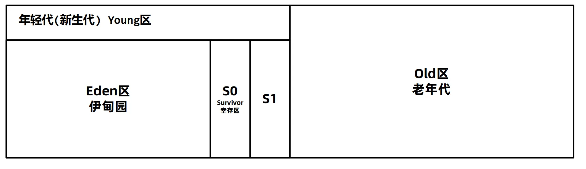

Java虚拟机的内存结构
<!-- more -->
## 方法区的回收：
1. **类卸载（Class Unloading** ： 
    -  类卸载是方法区垃圾回收的一部分，它允许不再需要的类从方法区中移除。 
    -  需要满足下面这三个条件： 

              1、此类所有实例对象都已经被回收，在堆中不存在任何该类的实例对象以及子类对象。 

              2、加载该类的类加载器经被回收。  

              3、该类对应的 java.lang.Class 对象没有在任何地方被引用 

2. **废弃常量的回收** ： 
    -  在运行时常量池中，那些不再有任何引用指向的常量（例如字符串常量）也可以被垃圾回收。这类似于堆中对象的回收机制。 
3. **永久代（PermGen）与元空间（Metaspace）** ： 
    -  在JDK 6及更早版本中，方法区通常实现为永久代（PermGen），并且也会有相应的垃圾回收机制。 
    -  从JDK 7开始，永久代逐渐被移除，到了JDK 8，方法区被迁移到了本地内存中的元空间（Metaspace）。元空间的垃圾回收行为更加灵活，因为它位于本地内存而不是受限于固定大小的永久代。 

###  垃圾回收触发条件 
+ **类卸载** ：当一个类的所有实例都被回收，没有更多的类加载器引用该类，以及没有任何地方再使用这个类时，JVM可能会选择卸载这个类以释放方法区的空间。 
+ **常量池清理** ：如果运行时常量池中的某些常量不再被引用，它们也可能成为垃圾回收的目标。 

###  注意事项 
+ **有限制的垃圾回收** ：尽管方法区支持垃圾回收，但这并不意味着每次常规的GC周期都会对方法区进行检查或清理。类的卸载和常量的回收通常发生在特定条件下，比如Full GC时，或者是在内存压力下触发。 
+ **类加载器的作用** ：由于类的生命周期与类加载器紧密相关，因此只有当类加载器本身可以被回收时，相关的类才能从方法区中移除。 

 如果需要 **手动触发** 垃圾回收，可以调 用System .gc()方法。  

 语法： System.gc()  

 注意事项：  

 调用System.gc()方法并不一定会立即回收垃圾，仅仅是向Java虚拟机发送一个垃圾回收的请求，具体是否需要 执行垃圾回收Java虚拟机会自行判断。 

## 堆对象的垃圾回收：
如果一个或多个对象没有任何的**引用**指向它了，那么这个对象现在就是垃圾，如果定位了垃圾，则有可能会被垃圾回收器回收。

定位垃圾有两种方式来确定：第一个是引用计数法 ，第二个是可达性分析算法 。

### 引用计数法：
引用计数法会为每个对象维护一个引用计数器，当对象被引用时加1，取消引用时减1。当这个对象的引用次数为0，代表这个对象可回收。

**引用计数法的缺点：**

1.每次引用和取消引用都需要维护计数器，对系统性能会有一定的影响 

2.存在循环引用问题，所谓循环引用就是当A引用B，B同时引用A时会出现对象无法回收的问题。


### 可达性分析算法：
定位垃圾的方式如果是**可达性分析算法**，jvm会扫描堆中的对象，看是否能够沿着**GC Root对象**为起点的**引用链**找到该对象，找不到，表示可以回收。

可达性分析将对象分为两类：垃圾回收的根对象（GC Root）和普通对象，对象与对象之间存在引用关系。

### 哪些对象可以看作是GC Root对象呢？
+ 线程Thread对象，引用线程栈帧中的方法参数，局部变量等。
+ 应用类加载器加载的java.lang.Class对象，引用类中的静态变量。 
+ 监视器对象，用来保存同步锁synchronized关键字持有的对象。 
+ 本地方法调用时使用的全局对象。

### 查看GCRoot对象：
通过arthas和eclipse Memory Analyzer (MAT) 工具可以查看GC Root，MAT工具是eclipse推出的Java堆内存 

检测工具。具体操作步骤如下： 

1、使用arthas的heapdump命令将堆内存快照保存到本地磁盘中。 


2、使用MAT工具打开堆内存快照文件，工具名：MemoryAnalyzer

我的是jdk11版本，下载的是1.12版本的MemoryAnalyzer，之后需要修改一下mat\MemoryAnalyzer.ini文件：


3、选择GC Roots功能查看所有的GC Root。


## 几种常见的对象引用 
可达性算法中描述的对象引用，一般指的是**强引用，**即是GCRoot对象对普通对象有引用关系，只要这层关系存在， 普通对象就不会被回收。除了强引用之外，Java中还设计了几种其他引用方式： 

⚫ 软引用 

⚫ 弱引用 

⚫ 虚引用 

⚫ 终结器引用

### 软引用
软引用相对于强引用是一种比较弱的引用关系，如果一个对象只有软引用关联到它，当程序内存不足时，就会将软引用中的数据进行回收。   

在JDK 1.2版之后提供了SoftReference类来实现软引用，软引用常用于缓存中。

**软引用的执行过程如下**

1.将对象使用软引用包装起来，new SoftReference<对象类型>(对象)。 

2.内存不足时，虚拟机尝试进行垃圾回收。 

3.如果垃圾回收仍不能解决内存不足的问题，回收软引用中的对象。 

4.如果依然内存不足，抛出OutOfMemory异常。

示例：开局我们先把堆内存设置为200m

```java
public class Demo1 {
    public static void main(String[] args) {
        // 创建一个100MB的字节数组
        byte[] bytes = new byte[1024*1024*100];
        // 使用软引用包装字节数组，软引用允许垃圾回收器在内存不足时回收内存
        SoftReference<byte[]> softReference = new SoftReference<>(bytes);
        // 设置bytes为null，表示不再直接使用bytes变量访问原始内存位置
        bytes = null;
        // 打印软引用的内容，此时应该还能获取到字节数组
        System.out.println(softReference.get());
        // 创建第二个100MB的字节数组，可能会触发内存回收
        byte[] bytes2 = new byte[1024*1024*100];
        // 再次打印软引用的内容，由于内存压力，软引用可能已经被回收，此时可能返回null
        System.out.println(softReference.get());
        // 创建第三个100MB的字节数组，进一步观察内存回收情况,因为设置了堆内存为200m,因此会报OOM
        byte[] bytes3 = new byte[1024*1024*100];
    }
}
```

上面的示例中，如果软引用引用的对象被回收了，那么SoftReference对象也需要回收，如何知道哪些SoftReference对象需要回收？SoftReference提供了一套队列机制：

SoftReference提供了一套队列机制：

1，软引用创建时，通过构造器传入**引用队列**

2，在软引用中包含的对象被回收时，该软引用对象会被放入引用队列

3，通过代码遍历引用队列，将SoftReference的强引用删除

案例：

```java
public class Demo1 {
    public static void main(String[] args) {
        ArrayList<SoftReference> softReferences = new ArrayList<>();
        // 创建引用队列，里面将要存储所有被回收掉数据的软引用对象
        ReferenceQueue<byte[]> queues = new ReferenceQueue<byte[]>();
        for (int i = 0; i < 10; i++) {
            byte[] bytes = new byte[1024 * 1024 * 100];
            //创建10个软引用对象，会被回收掉9个，这9个会被放入引用队列，一个引用对象100m，因为
            //设置的堆内存200m，因此只能创建一个软引用对象，其余都会被回收
            SoftReference studentRef = new SoftReference<byte[]>(bytes, queues);
            softReferences.add(studentRef);
        }
        SoftReference<byte[]> ref = null;
        int count = 0;
        while ((ref = (SoftReference<byte[]>) queues.poll()) != null) {
            count++;
        }
        //打印出引用队列里面的对象个数
        System.out.println(count);
    }
}
```

**软引用的使用场景-缓存案例：**

软引用也可以使用继承自SoftReference类的方式来实现


```java
public class StudentCache {

    private static StudentCache cache = new StudentCache();

    public static void main(String[] args) {
        for (int i = 0; ; i++) {
            StudentCache.getInstance().cacheStudent(new Student(i, String.valueOf(i)));
        }
    }
    private Map<Integer, StudentRef> StudentRefs;// 用于Cache内容的存储
    private ReferenceQueue<Student> q;// 垃圾Reference的队列
    // 继承SoftReference，使得每一个实例都具有可识别的标识。
    // 并且该标识与其在HashMap内的key相同。
    private class StudentRef extends SoftReference<Student> {
        private Integer _key = null;
        public StudentRef(Student em, ReferenceQueue<Student> q) {
            super(em, q);
            _key = em.getId();
        }
    }
    // 构建一个缓存器实例
    private StudentCache() {
        StudentRefs = new HashMap<Integer, StudentRef>();
        q = new ReferenceQueue<Student>();
    }
    // 取得缓存器实例
    public static StudentCache getInstance() {
        return cache;
    }
    // 以软引用的方式对一个Student对象的实例进行引用并保存该引用
    private void cacheStudent(Student em) {
        cleanCache();// 清除垃圾引用
        StudentRef ref = new StudentRef(em, q);
        StudentRefs.put(em.getId(), ref);
        System.out.println(StudentRefs.size());
    }

    // 依据所指定的ID号，重新获取相应Student对象的实例
    public Student getStudent(Integer id) {
        Student em = null;
        // 缓存中是否有该Student实例的软引用，如果有，从软引用中取得。
        if (StudentRefs.containsKey(id)) {
            StudentRef ref = StudentRefs.get(id);
            em = ref.get();
        }
        // 如果没有软引用，或者从软引用中得到的实例是null，重新构建一个实例，
        // 并保存对这个新建实例的软引用
        if (em == null) {
            em = new Student(id, String.valueOf(id));
            System.out.println("Retrieve From StudentInfoCenter. ID=" + id);
            this.cacheStudent(em);
        }
        return em;
    }

    // 清除那些所软引用的Student对象已经被回收的StudentRef对象
    private void cleanCache() {
        StudentRef ref = null;
        while ((ref = (StudentRef) q.poll()) != null) {
            StudentRefs.remove(ref._key);
        }
    }

    // 清除Cache内的全部内容
    public void clearCache() {
        cleanCache();
        StudentRefs.clear();
        //System.gc();
        //System.runFinalization();
    }
}

class Student {
    int id;
    String name;

    public Student(int id, String name) {
        this.id = id;
        this.name = name;
    }

    public int getId() {
        return id;
    }

    public void setId(int id) {
        this.id = id;
    }

    public String getName() {
        return name;
    }

    public void setName(String name) {
        this.name = name;
    }
}
```

### 弱引用：
弱引用的整体机制和软引用基本一致，区别在于弱引用包含的对象在垃圾回收时，不管内存够不够都会被回收，在jdk1.2版之后提供了WeakReference类来实现弱引用，弱引用主要在ThreadLoacal中使用。弱引用对象本身也可以使用引用队列进行回收。

```java
public class WeakReferenceDemo {
    public static void main(String[] args) {

        byte[] b = new byte[1024 * 1024* 100];
        WeakReference<byte[]> weakReference = new WeakReference<byte[]>(b);
        b = null;
        System.out.println(weakReference.get());
        System.gc();
        System.out.println(weakReference.get());
    }
}
```

### 虚引用：
虚引用也叫幽灵引用/幻影引用，不能通过虚引用对象获取到包含的对象。虚引用唯一的用途是当对象被垃圾回收器回收时可以接收到对应的通知。Java中使用PhantomReference实现了虚引用，直接内存中为了及时知道直接内存对象不再使用，从而回收内存，使用了虚引用来实现。

```java
public class WeakReferenceDemo {
    public static int size = 1024* 1024* 100;
    public static List<ByteBuffer> list = new ArrayList<>();
    public static int count = 0;
    public static void main(String[] args) throws IOException {
        System.in.read();
        while (true){
            /**
             * allocateDirect方法中执行了两步操作：
             * 1，创建DirectByteBuffer对象并返回
             * 2，在DirectByteBuffer构造方法中，向操作系统申请直接内存空间
             */
            ByteBuffer buffer = ByteBuffer.allocateDirect(size);
            buffer = null;//删除ByteBuffer的强引用
            /**
             * 但是直接内存如何被回收？
             * 进入方法里面，进入DirectByteBuffer类，可以看到一个Cleaner类
             * 这个类中有一个方法clean，这个方法就是用来释放直接内存的。
             * 而cleaner类就继承于PhantomReference，
             */
        }
    }
```

### 终结器引用：
终结器引用指的是在对象需要被回收时，终结器引用会关联对象并放置在Finalizer类中的引用队列中，在稍后 由一条由FinalizerThread线程从队列中获取对象，然后执行对象的finalize方法，在对象第二次被回收时，该 对象才真正的被回收。在这个过程中可以在finalize方法中再将自身对象使用强引用关联上，但是不建议这样做。

```java
/**
 * 终结器引用案例
 */
public class FinalizeReferenceDemo {
    public static FinalizeReferenceDemo reference = null;

    public void alive() {
        System.out.println("当前对象还存活");
    }

    @Override
    protected void finalize() throws Throwable {
        try{
            System.out.println("finalize()执行了...");
            //设置强引用自救
            reference = this;
        }finally {
            super.finalize();
        }
    }

    public static void main(String[] args) throws Throwable {
        reference = new FinalizeReferenceDemo();
        test();
        test();
    }

    private static void test() throws InterruptedException {
        reference = null;
        //回收对象
        System.gc();
        //执行finalize方法的优先级比较低，休眠500ms等待一下
        Thread.sleep(500);
        if (reference != null) {
            reference.alive();
        } else {
            System.out.println("对象已被回收");
        }
    }
}
```

虚引用和终结器引用在工作中的使用场景极少。


垃圾回收算法的历史：

⚫ 1960年John McCarthy发布了第一个GC算法：标记-清除算法。 

⚫ 1963年Marvin L. Minsky 发布了复制算法。 

本质上后续所有的垃圾回收算法，都是在上述两种算法的基础上优化而来


## 垃圾回收算法：
## 垃圾回收算法的评价标准：
Java垃圾回收过程会通过**单独的GC线程**来完成，但是不管使用哪一种GC算法，都会有部分阶段需要停止所 有的用户线程。这个过程被称之为Stop The World简称STW，如果STW时间过长则会影响用户的使用。

所以判断GC算法是否优秀，可以从三个方面来考虑： 

1.吞吐量 

吞吐量指的是 CPU 用于执行用户代码的时间与 CPU 总执行时间的比值，即吞吐量 = 执行用户代码时间 /（执行用户代码时间 + GC时间）。吞吐量数值越高，垃圾回收的效率就越高。


2.最大暂停时间 

最大暂停时间指的是所有在垃圾回收过程中的STW时间最大值。比如如下的图中，黄色部分的STW就是最 大暂停时间，显而易见上面的图比下面的图拥有更少的最大暂停时间。最大暂停时间越短，用户使用系统时 受到的影响就越短


3.堆使用效率 

不同垃圾回收算法，对堆内存的使用方式是不同的。比如标记清除算法，可以使用完整的堆内存。而复制算法会将堆内存一分为二，每次只能使用一半内存。从堆使用效率上来说，标记清除算法要优于复制算法。


上述三种评价标准：堆使用效率、吞吐量，以及最大暂停时间不可兼得。 

一般来说，堆内存越大，最大暂停时间就越长。想要减少最大暂停时间，就会降低吞吐量。 

不同的垃圾回收算法，适用于不同的场景。

## 标记清除算法：
定义：

标记清除算法的核心思想分为两个阶段： 

1.标记阶段，将所有存活的对象进行标记。Java中使用可达性分析算法，从GC Root开始通过引用链遍历出 

所有存活对象。 

2.清除阶段，从内存中删除没有被标记也就是非存活对象。

优点：

实现简单，只需要在第一阶段给每个对象维护标志位，第二阶段删除对象即可。

缺点:

1.碎片化问题 

由于内存是连续的，所以在对象被删除之后，内存中会出现很多细小的可用内存单元。如果我们需要的是一个比较大的空间，很有可能这些内存单元的大小过小无法进行分配。

2.分配速度慢。由于内存碎片的存在，需要维护一个空闲链表，极有可能发生每次需要遍历到链表的最后才能获得合适的内存空间。


## 复制算法：
定义：

1.准备两块空间From空间和To空间，每次在对象分配阶段，只能使用其中一块空间（From空间）。 

2.在垃圾回收GC阶段，将From中存活对象复制到To空间。 

3.将两块空间的From和To名字互换。

完整的复制算法的例子： 

1.将堆内存分割成两块From空间 To空间，对象分配阶段，创建对象。 

2.GC阶段开始，将GC Root搬运到To空间 

3.将GC Root关联的对象，搬运到To空间 

4.清理From空间，并把名称互换

优点：

**吞吐量高:** 复制算法只需要遍历一次存活对象 复制到To空间即可，比标记-整理 算法少了一次遍历的过程，因而性 能较好，但是不如标记-清除算法， 因为标记清除算法不需要进行对象的移动

**不会发生碎片化:** 复制算法在复制之后就会将对象按顺序放 入To空间中，所以对象以外的区域都是可 用空间，不存在碎片化内存空间。

缺点:

**内存使用效率低:** 每次只能让一半的内存空间来为创 建对象使用

## 标记整理算法：
定义：

标记整理算法也叫标记压缩算法，是对标记清理算法中容易产生内存碎片问题的一种解决方案。

核心思想分为两个阶段： 

1.标记阶段，将所有存活的对象进行标记。Java中使用可达性分析算法，从GC Root开始通过引用链遍历出 所有存活对象。 

2.整理阶段，将存活对象移动到堆的一端。清理掉存活对象的内存空间。


优点：

**内存使用效率高:** 整个堆内存都可以使用，不会像复 制算法只能使用半个堆内存 

**不会发生碎片化:** 在整理阶段可以将对象往内存的一侧进行 移动，剩下的空间都是可以分配对象的有效空间 

缺点:

**整理阶段的效率不高:** 整理算法有很多种，比如Lisp2整 理算法需要对整个堆中的对象搜索3 次，整体性能不佳。可以通过TwostxFinger、表格算法、ImmixGC等高 效的整理算法优化此阶段的性能 

## 分代GC算法：
**定义：**

现代优秀的垃圾回收算法，会将上述描述的垃圾回收算法 **组合 **进行使用，其中应用最广的就是分代垃圾回收算法(Generational GC)。 分代垃圾回收将整个堆内存区域划分为 **年轻代(新生代)和老年代**  

**他们之间的内存占比关系**

新生代和老年代的比例默认是 1：2 

新生代又分为三个区域： 

+ 伊甸园区Eden,新生的对象都分配到这里 
+ 幸存者区survivor(分为两个大小相等的from和to区) 
+ Eden:from:to = 8:1:1 

**当然堆的各个区域大小都是可以调整的:**

-Xms:设置堆的最小和初始大小，必须是1024倍数且大于1m 

-Xmx:设置最大的堆的大小，必须是1024的倍数且大于2m 

-Xmn:新生代的大小 

-XX:SurvivorRatio：伊甸园区和幸存者区的比例，默认8， 

-XX:+PrintGCDetails：打印GC日志，或者verbose:gc 

例如： **注意加上-XX:+UseSerialGC使用分代回收**


### 分代GC的过程：
分代回收时，创建出来的对象，首先会被放入Eden伊甸园区。  

随着对象在Eden区越来越多，如果Eden区满，新创建的对象已经无法放入，就会触发年轻代的GC，称为 Minor GC或者Young GC。  

Minor GC会把需要eden中和From需要回收的对象回收，把没有回收的对象放入To区。 


接下来，S0会变成To区，S1变成From区。当eden区满时再往里放入对象，依然会发生Minor GC。  

此时会回收eden区和S1(from)中的对象，并把eden和from区中剩余的对象放入S0。  

注意：每次Minor GC中都会为对象记录他的年龄，初始值为0，每次GC完加1。 

如果Minor GC后对象的年龄达到阈值（最大15，默认值和垃圾回收器有关），对象就会被晋升至老年代。  

当老年代中空间不足，无法放入新的对象时，先尝试minor gc如果还是不足，就会触发Full GC，Full GC会对整个堆进行垃圾回收。  

如果Full GC依然无法回收掉老年代的对象，那么当对象继续放入老年代时，就会抛出Out Of Memory异常。 

测试：（还是使用上面的vm配置） 

```java
public class GcDemo0 {
    public static void main(String[] args) throws IOException {
        List<Object> list = new ArrayList<>();
        int count = 0;
        while (true) {
            System.in.read();
            System.out.println(++count);
            //每次添加1m的数据
            list.add(new byte[1024 * 1024]);
        }
    }
}
```

### 为什么分代GC要把堆分成年轻代和老年代？
1、可以通过调整年轻代和老年代的比例来适应不同类型的应用程序，提高内存的利用率和性能。  

2、新生代和老年代使用不同的垃圾回收算法，新生代一般选择复制算法，老年代可以选择标记-清除和标记-整理 算法，由程序员来选择灵活度较高。  

3、分代的设计中允许只回收新生代（minor gc），如果能满足对象分配的要求就不需要对整个堆进行回收(full gc),STW时间就会减少。 


## 垃圾回收器
垃圾回收器是垃圾回收算法的具体实现。

垃圾回收器也分为年轻代使用和老年代使用的。堆又分为年轻代和老年代，因此，除了G1垃圾回收器之外其它垃圾回收器必须成对组合进行使用。

具体关系图如下：


###  年轻代-Serial垃圾回收器  
 Serial是是一种  单线程串行  回收年轻代的垃圾回收器。 


回收年轻代的垃圾，采用复制算法

优点：单CPU处理器下吞吐量非常出色

缺点: 多CPU下吞吐量不如其它垃圾回收器，堆如果偏大会让用户线程处于长时间的等待

使用场景：Java编写的客户端程序或者硬件配置有限的场景。

###  老年代-SerialOld垃圾回收器  
 SerialOld是Serial垃圾回收器的老年代版本，采用  单线程串行回收  

 -XX:+UseSerialGC 新生代、老年代都使用串行回收器 


回收老年代 的对象，采用标记-整理算法 

优点：单CPU处理器下吞吐量非常出色

缺点：多CPU下处理器不如其它垃圾回收器，堆如果偏大会让用户线程处于长时间的等待。

适用场景：与Serial垃圾回收器搭配使用，或者在CMS特殊情况下使用。

测试：

配置jvm的垃圾回收器，使用Arthas的dashboard命令查看GC：


###  年轻代-ParNew垃圾回收器 
 ParNew垃圾回收器本质上是对Serial在多 CPU下的优化，使用  多线程  进行垃圾回收  

 -XX:+UseParNewGC 新生代使用ParNew 回收器， 老年代使用串行回收器 


回收年轻代的垃圾，采用复制算法

优点：多CPU处理器下停顿时间较短

缺点：吞吐量和停顿时间不如G1，所以在JDK9之后不建议使用

使用场景：JDK8及之前的版本中，与CMS老年代垃圾回收搭配使用 

使用例子：

年轻代使用ParNewGC,老年代使用 SerialOld垃圾回收器，这种方式在jdk9之后已经被废弃 


年轻代使用ParNewGC，老年代使用CMS：


###  老年代- CMS(Concurrent Mark Sweep)垃圾回收器 
 CMS垃圾回收器关注的是系统的  暂停时间  ， 允许用户线程和垃圾回收线程在某些步骤中同时执行，减少了用户线程的等待时间。  

 参数： **XX:+UseConcMarkSweepGC**

回收**老年代**的垃圾，采用标记清除算法。

**CMS执行步骤**

 1.初始标记，用极短的时间标记出GC Roots能直接关联到的对象。  

 2.并发标记, 标记所有的对象，用户线程不需要暂停。  

 3.重新标记，由于并发标记阶段有些对象会发生了变化，存在错标、漏标等情况，需要重新标记。  

 4.并发清理，清理死亡的对象，用户线程不需要暂停。 


**缺点**

 1、CMS使用了标记-清除算法，在垃圾收集结束之后会出现大量的内存碎片，CMS会在Full GC时进行碎片的整理。 这样会导致用户线程暂停，可以使用-XX:CMSFullGCsBeforeCompaction=N 参数（默认0）调整N次Full GC之 后再整理。  

 2.、无法处理在并发清理过程中产生的“浮动垃圾”，不能做到完全的垃圾回收。  

 3、如果老年代内存不足无法分配对象，CMS就会退化成Serial Old单线程回收老年代。 

**优点：**

 系统由于垃圾回收出现的停顿时间较短，用户体验好。 

 适用场景： 

 大型互联网系统中用户请求数据量大，频率高的场景，比如订单接口，商品接口。 

####  CMS垃圾回收器存在的问题 – 线程资源争抢问题 
 在CMS中 并发阶段  运行时的线程数可以通过 **-XX:ConcGCThreads** 参数设置，默认值为0，由系统计算得出。  


   计算公式为( **-XX:ParallelGCThreads**定义的线程数 + 3) / 4， ParallelGCThreads是STW停顿之后的  

 并行线程数 ParallelGCThreads是由处理器核数决定的：  

 1、当cpu核数小于8时，ParallelGCThreads = CPU核数  

 2、否则 ParallelGCThreads = 8 + (CPU核数 – 8 )*5/8  


 由于CPU的核心数有限，就会影响用户线程执行的性能。 


###  年轻代-Parallel Scavenge垃圾回收器 
 Parallel Scavenge是JDK8默认的年轻代垃圾回收器， 多线程并行回收，关注的是系统的吞吐量。具备自动调整堆内存大小的特点。 


回收年轻代的垃圾，采用复制算法。

优点：吞吐量高，而且手动可控。为了提高吞吐量，虚拟机会动态调整堆的参数。

缺点：不能保证单次的停顿时间

使用场景：后台任务，不需要与用户交互，并且容易产生大量的对象的情况，比如大数据的处理，大文件的导出。

###  老年代-Parallel Old垃圾回收器 
 Parallel Old是为Parallel Scavenge收集器设计的老年代版本，利用多线程并发收集。  


回收老年代的对象，采用标记整理算法

优点：并发收集，在多核CPU下效率较高

缺点：暂停时间会比较长

适用场景：与Parallel Scavenge配套适用

 参数：  

 -XX:+UseParallelGC 或 -XX:+UseParallelOldGC可以使用  

 Parallel Scavenge + Parallel Old这种组合。 

 例： 


 Parallel Scavenge允许手动设置 **最大暂停时间** 和 **吞吐量** 。 
 Oracle官方建议在使用这个组合时，  不要设置堆内存的最大值  ，垃圾回收器会根据最大暂停时间和吞吐量自动调整内存大小。 

**最大暂停时间：**

 -XX:MaxGCPauseMillis=n  

 设置每次垃圾回收时的最大停顿毫秒数 

**吞吐量：**

 -XX:GCTimeRatio=n  

 设置吞吐量为n（用户线程执行时间 = n/（n + 1)） 

**自动调整内存大小：**

 -XX:+UseAdaptiveSizePolicy 

 可以让垃圾回收器根据 **吞吐量** 和 **最大停顿的毫秒数** 自动调整内存大小，是默认开启的。 

**在启动时打印所有配置项及值：**

 -XX:+PrintFlagsFinal 

###  G1垃圾回收器 
 JDK9之后默认的垃圾回收器是G1（Garbage First）垃圾回收器。  

 Parallel Scavenge关注吞吐量，允许用户 **设置最大暂停时间**  ，但是会减少年轻代可用空间的大小。  

 CMS关注暂停时间，但是吞吐量方面会下降。  

**而G1设计目标就是将上述两种垃圾回收器的优点融合：**

1.  支持巨大的堆空间回收，并有较高的吞吐量。  
2.  支持多CPU并行垃圾回收。  
3.  允许用户 **设置最大暂停时间**

 G1出现之前的垃圾回收器，内存结构一般是连续的，如下图： 


 G1的整个堆会被划分成多个大小相等的区域，称之为区（Region），区域不要求是连续的。分为 **Eden、Survivor、 Old** 区。Region的大小通过 **堆空间大小** /2048计算得到，也可以通过参数 

 -XX:G1HeapRegionSize=32m指定(其 中32m指定region大小为32M)，Region size必须是2的指数幂，取值范围从1M到32M 


 G1垃圾回收有两种方式：  

 1、年轻代回收（Young GC）  

 2、混合回收（Mixed GC） 

 年轻代回收（Young GC），采用复制算法回收Eden区和Survivor区中不用的对象。会导致STW，G1中可以通过参数 -XX:MaxGCPauseMillis=n（默认200） 设置每次垃圾回收时的最大暂停时间毫秒数，G1垃圾回收器会尽可能地保证暂停时间。 

**执行流程：**

年轻代回收：

 1、新创建的对象会存放在Eden区。当G1判断年轻代区不足（max默认60%），无法分配对象时需要回收时会执行 Young GC。  

 2、标记出Eden和Survivor区域中的存活对象，  

 3、根据配置的最大暂停时间选择某些区域将存活对象复制到一个新的Survivor区中（年龄+1），清空这些区域。 


 G1在进行 **Young GC** 的过程中会去记录每次垃圾回收时每个Eden区和Survivor区的平均耗时，以作为下次回收时的 参考依据。这样就可以根据配置的最大暂停时间计算出本次回收时最多能回收多少个Region区域了。  

 比如 -XX:MaxGCPauseMillis=n（默认200），配置最大暂停时间是200ms，每个Region回收耗时40ms，那么这次回收最多只能回收4个Region，因为不能超过用户设置的最大暂停时间。 

 4、后续Young GC时与之前相同，只不过Survivor区中存活对象会被搬运到另一个Survivor区。  

 5、当某个存活对象的年龄到达阈值（默认15），将被放入老年代。 


 6、部分对象如果大小超过Region的一半，会直接放入一个老年代的Humongous区（专门存放大对象的区域）。比如堆内存是 4G，那么每个Region是2M，只要一个大对象超过了1M就被放入Humongous区，如果对象过大会横跨多个Region。 


混合回收：

 7、多次回收之后，会出现很多Old老年代区，此时Old区总堆占有率达到阈值时 

 （-XX:InitiatingHeapOccupancyPercent默认 **45%** ）会触发 **混合回收MixedGC** 。回收所有年轻代和  

 部分老年代的对象以及 **大对象区** 。采用复制算法来完成。 

 混合回收分为： **初始标记（initial mark）、并发标记（concurrent mark）、最终标记（remark或者Finalize Marking）、并发清理（cleanup）**  几个阶段 

 G1对老年代的清理会选择存活对象最少的区域来进行回收，这样可以保证回收效率最高，这也是G1（Garbage first）名称的由来。 


**初始标记：标记GC Root引用的对象为存活，一般是和年轻代回收一起的**

**并发标记：将第一步中标记的对象的引用的对象，标记为存活**

**最终标记：标记一些引用改变导致漏标的对象，不管新创建，不再关联的对象了**

**并发清理：将存活对象复制到别的Region不会产生内存碎片**

 FULL GC： 

 如果清理过程中发现没有足够的空Region存放转移的对象，会出现 **Full GC** 。单线程执行 **标记-整理算法** ， 此时会导致用户线程的暂停。所以尽量保证应该用的堆内存有一定多余的空间。 


我们可以通过代码测试来看整个垃圾回收过程，设置jvm参数，我的默认使用G1垃圾回收器

```plain
-XX:+PrintGCDetails
-XX:+PrintFlagsFinal
```

```java
public class GcDemo0 {
    public static void main(String[] args) throws IOException {
        int count = 0;
        List<Object> list = new ArrayList<>();
        while (true){
            if(count++ %10240 == 0){
                list.clear();
            }
            list.add( new byte[1024* 1024 * 1/2 * 1/2]);
        }
    }
}
```

对打印的日志进行分析：


日志太多让AI分析了一下啊：

1. **年轻代垃圾回收（Young GC）**  
主要处理堆中年轻代的垃圾回收，分为以下子阶段：
    - **Pre Evacuate Collection Set（预清理）**  
检查并标记需要进行垃圾回收的集合（Collection Set），为后续阶段做准备。
    - **Evacuate Collection Set（转移对象）**  
将存活的对象从Eden区转移到Survivor区或直接提升到老年代。这是主要的垃圾转移操作。
    - **Post Evacuate Collection Set（后清理）**  
更新元数据，清理临时数据结构，确保整个过程完成后堆的状态一致。
    - **Other（其他操作）**  
处理附加任务，如统计或日志生成。
1. **并发标记周期（Concurrent Marking Cycle）**  
用于老年代的垃圾回收，包括以下阶段：
    - **Initial Mark（初始标记）**  
标记老年代中直接可达的对象。这阶段与Young GC一起触发 ，暂停时间较短。
    - **Concurrent Mark（并发标记）**  
使用多线程标记堆中存活的对象。这一阶段不需要暂停应用线程。
    - **Remark（重新标记）**  
矫正并发标记阶段中因应用线程运行而遗漏的标记，暂停时间较短。
    - **Cleanup（清理）**  
清除未被标记的对象，释放老年代空间，并重新组织堆布局。
1. **混合垃圾回收（Mixed GC）**  
包括年轻代和部分老年代区域的回收。在Concurrent Marking Cycle完成后触发，优先回收老年代中垃圾占比高的区域。 
1. **Humongous对象处理**  
对大对象（Humongous Objects）的特殊处理。这些对象分配在老年代，但可能在Young GC或Mixed GC中被回收。

上述阶段由日志文件中相关信息得以验证，例如：

+ **年轻代GC日志**显示阶段耗时，如`Evacuate Collection Set`花费时间和区域变化。
+ **并发标记日志**显示标记操作时间和清理情况。

这些阶段的设计实现了低延迟和高吞吐量的平衡，适用于大多数内存使用模式。

摘取了一些日志来证明:

 初始标记（Initial Mark）

```java
[0.233s][info   ][gc,start     ] GC(8) Pause Young (Concurrent Start) (G1 Evacuation Pause)
[0.247s][info   ][gc            ] GC(8) Pause Young (Concurrent Start) (G1 Evacuation Pause) 250M->249M(845M) 13.817ms

```

 并发标记（Concurrent Mark）  

```java
[0.247s][info   ][gc           ] GC(9) Concurrent Cycle
[0.247s][info   ][gc,marking   ] GC(9) Concurrent Clear Claimed Marks
[0.247s][info   ][gc,marking   ] GC(9) Concurrent Clear Claimed Marks 0.007ms
[0.247s][info   ][gc,marking   ] GC(9) Concurrent Scan Root Regions
[0.247s][info   ][gc,marking   ] GC(9) Concurrent Scan Root Regions 0.135ms
[0.247s][info   ][gc,marking   ] GC(9) Concurrent Mark (0.247s)
[0.247s][info   ][gc,marking   ] GC(9) Concurrent Mark From Roots
[0.247s][info   ][gc,task      ] GC(9) Using 2 workers of 2 for marking
[0.249s][info   ][gc,marking   ] GC(9) Concurrent Mark From Roots 2.060ms
[0.249s][info   ][gc,marking   ] GC(9) Concurrent Preclean
[0.249s][info   ][gc,marking   ] GC(9) Concurrent Preclean 0.063ms
[0.249s][info   ][gc,marking   ] GC(9) Concurrent Mark (0.247s, 0.249s) 2.167ms
```

 重新标记（Remark）  

```java
[0.249s][info   ][gc,start     ] GC(9) Pause Remark
[0.250s][info   ][gc,stringtable] GC(9) Cleaned string and symbol table, strings: 2641 processed, 5 removed, symbols: 26833 processed, 0 removed
[0.250s][info   ][gc           ] GC(9) Pause Remark 254M->254M(845M) 0.650ms
```

 清理（Cleanup）  

```java
[0.251s][info   ][gc,start     ] GC(9) Pause Cleanup
[0.251s][info   ][gc           ] GC(9) Pause Cleanup 256M->256M(845M) 0.177ms
[0.251s][info   ][gc,marking   ] GC(9) Concurrent Cleanup for Next Mark
[0.252s][info   ][gc,marking   ] GC(9) Concurrent Cleanup for Next Mark 1.043ms
[0.252s][info   ][gc           ] GC(9) Concurrent Cycle 5.303ms
```

最后：

 垃圾回收器的组合关系虽然很多，但是针对几个特定的版本，比较好的组合选择如下：  

 JDK8及之前：  

+  ParNew + CMS（关注暂停时间）、 
+  Parallel Scavenge + Parallel Old (关注吞吐量)、 
+  G1（JDK8之前不建议，较大堆并且关注暂停时间）  

  

 JDK9之后:  

+  G1（默认）  

 从JDK9之后，由于G1日趋成熟，JDK默认的垃圾回收器已经修改为G1，所以  

 强烈建议在生产环境上使用G1 


