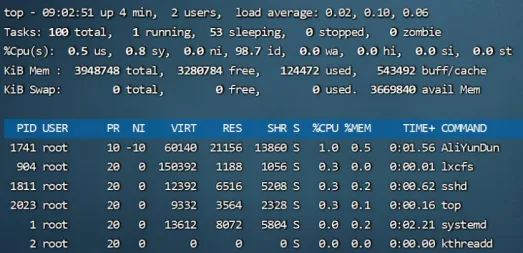
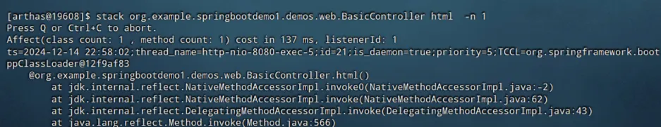

Java虚拟机的内存调优
<!-- more -->
## 内存泄漏内存溢出
### 内存泄漏（Memory Leak）：
内存泄漏是指程序中已分配的内存不再被使用，但由于某种原因没有被释放，导致这部分内存无法被其它部分重新使用。随着时间的推移，这些未释放的内存会逐渐积累，最终可能导致内存耗尽。

**特征：**

+ 通常是由于程序逻辑错误引起的，例如忘记释放不再使用的对象。
+ 内存泄漏不会立即导致程序崩溃，但会逐渐消耗可用内存。
+ 内存泄漏可以通过工具（Eclipse MAT,VisualVM等）进行检测和分析。

**常见原因：**

+ 静态集合类持有大量对象。
+ 未关闭的资源（如数据库连接，文件句柄）。
+ 未正确取消注册的监听器或回调函数。
+ 内部类持有外部类的引用。

### 内存溢出（Out of Memory,OOM）:
**定义：** 内存溢出是指程序在运行过程中请求的内存超过了JVM所提供的最大内存限制，导致JVM无法再分配更多的内存。当JVM无法分配所需的内存时，会抛出OOM异常。

**特征：**

+ 内存溢出会导致程序崩溃，通常会抛出OOM
+ 内存溢出_**可以是由于内存泄漏积累导致的，也可以是由于程序正常运行所需内存超出JVM配置的内存限制**_。
+ 内存溢出通常需要通过增加JVM的内存配置或优化代码来解决。

**常见原因：**

+ 堆内存不足
+ 栈内存不足
+ 元空间内存不足
+ 直接内存不足
+ 常量池溢出

区别：

**内存泄漏** 是程序中的一个缺陷，导致了内存无法被正确释放，从而逐渐积累未使用的内存。内存泄漏不会立即导致程序崩溃，但会逐渐消耗内存资源。

**内存溢出** 是由于程序请求的内存超过了JVM所提供的大量内存限制，导致JVM无法再分配更多内存，从而抛出OOM，内存溢出会导致程序崩溃。

## 内存泄漏的常见场景
一种是是大型的Java后端应用中，在处理用户的请求之后，没有及时将用户的数据删除。随着用户请求数量越来越多，内存泄漏的对象占满了堆内存最终导致内存溢出。 

这种产生的内存溢出会直接导致用户请求无法处理，影响用户的正常使用。重启可以恢复应用使用，但是在 运行一段时间之后依然会出现内存溢出。


第二种常见场景是分布式任务调度系统如Elastic-job、Quartz等进行任务调度时，被调度的Java应用在调度任务结束中出现了内存泄漏，最终导致多次调度之后内存溢出。 

这种产生的内存溢出会导致应用执行下次的调度任务执行。同样重启可以恢复应用使用，但是在调度执行一段时间之后依然会出现内存溢出。

## 监控内存的工具：
想要防止程序出现内存泄漏我们首先是要发现问题，因此就需要一些手段对进程进行监控，下面我列了几种监控进程的手段：

## Top命令
top命令是linux下用来查看系统信息的一个命令，它提供给我们去实时地去查看系统的资源，比如执行时的进程、线程和系统参数等信息。 

进程使用的内存为RES（常驻内存）- SHR（共享内存）



优点：操作简单，没有额外的软件安装

缺点：只能查看最基础的进程信息，无法查看到每个部分的内存占用（堆，方法区，堆外）

## VisualVM工具
VisualVM是多功能合一的Java故障排除工具并且他是一款可视化工具，整合了命令行 JDK 工具和轻量级分析功能，功能非常强大。 

这款软件在Oracle JDK 6~8 中发布，但是在 Oracle JDK 9 之后不在 JDK安装目录下需要单独下载。

下载地址：https://visualvm.github.io/


优点：功能丰富，实时监控CPU，内存，线程等详细信息，支持Idea插件，开发过程中也可以使用


缺点：对大量集群化部署的Java进程需要手动进行管理

## jconsole工具
**在jdk安装目录下的bin目录下，使用jconsole.exe工具来查看内存使用情况：**


## Arthas工具
Arthas 是一款线上监控诊断产品，通过全局视角实时查看应用 load、内存、 gc、线程的状态信息，并能在不修改应用代码的情况下，对业务问题进行诊断， 包括查看方法调用的出入参、异常，监测方法执行耗时，类加载信息等，大大提升 线上问题排查效率。

优点：功能强大，不止于监控基础的信息，还能监控单个方法的执行耗时等细节内容，支持应用的集群管理

缺点：部分高级功能使用门槛较高

## arthas tunnel管理所有的需要监控的程序
只需要一个tunnel图形界面就能够管理多个应用程序，微服务场景下非常合适

下面是使用步骤的一个例子：

我新创建了一个极其简单的Springboot应用，没有任何功能。

1，在SpringBoot程序中添加Arthas的依赖，需要注意arthas的版本和SpringBoot的版本对应问题，我的SpringBoot版本选择了2.6.13，使用jdk11

```java
        <dependency>
            <groupId>com.taobao.arthas</groupId>
            <artifactId>arthas-spring-boot-starter</artifactId>
            <version>3.7.1</version>
        </dependency>
```

2，添加Yml配置：

```yaml
server:
  port: 8080
spring:
  application:
    name: SpringbootDemo1
arthas:
  #tunnel地址，localhost是本机，如果是远程，请填写远程的arthas tunnel地址，7777是tunnel的注册端口
  tunnel-server: ws://localhost:7777/ws
  # tunnel中显示的arthas应用名称，直接使用应用名
  app-name: ${spring.application.name}
  #arthas的http端口和远程连接的telnet端口
  http-port: 8888
  telnet-port: 9999
```

3,进行package打包，到linux服务器上部署这个应用。因为我部署了2个，所以需要更改端口，防止端口冲突。

运行java程序：

```yaml
nohup java -jar -Dserver.port=8082 -Darthas.http-port=3662 -Darthas.telnet-port=8566 SpringbootDemo1-0.0.1-SNAPSHOT.jar &
```

```yaml
 nohup java -jar -Dserver.port=8081 -Darthas.http-port=3661 -Darthas.telnet-port=8565 SpringbootDemo1-0.0.1-SNAPSHOT.jar &
```

4，下载跟依赖对应版本的arthasjar包，拉到linux中，运行它

[https://github.com/alibaba/arthas/releases](https://github.com/alibaba/arthas/releases)  在对应的版本的Assets下拉选项中

我下载的是arthas-tunnel-server-3.7.1-fatjar.jar，下面是运行命令：

```yaml
nohup java -jar -Darthas.enable-detail-pages=true arthas-tunnel-server-3.7.1-fatjar.jar &
```

-Darthas.enable-detail-pages=true 是开启图形界面的意思

tunnel的默认注册端口是7777，访问端口是8080

5，现在打开 http://ip:8080/apps.html就可以访问到tunnel了   


注意：

适配问题：

linux的jdk要和jar包中的适配，否则可能会报错UnsupportedClassVersionError

centos安装jdk11只要执行：

sudo yum install java-11-openjdk-devel

java -version可以查看jdk版本

如果你在centos中安装了多个jdk，可以使用下面命令修改使用哪个：

sudo update-alternatives --config java

查看Java进程的命令：ps -ef|grep java

如果应用程序启动不成功可以查看**nohup.out**日志文件，里面有详细的信息。

**报错：没有主清单属性**

如果遇到“没有主清单属性”的错误信息，通常意味着 JAR 文件未正确打包，或者您尝试运行的不是可执行的 JAR 文件。

使用这个命令检查是否是可执行文件

unzip -p SpringbootDemo1-0.0.1-SNAPSHOT.jar META-INF/MANIFEST.MF

如果发现缺少了一些比如下面的没有，意味着打包错误了


检查以下pom文件里面是不是``<skip>``标签值为true了：


之后重新打包运行就行。

## Prometheus + Grafana工具
Prometheus+Grafana是**企业中运维常用的监控方案**，其中Prometheus用来采集 

系统或者应用的相关数据，同时具备告警功能。Grafana可以将Prometheus采集 

到的数据以可视化的方式进行展示。 

**优点**：支持系统级别和应用级别的监控，比如linux操作系统，Redis,Mysql,Java进程，支持告警并允许自定义告警指标，通过邮件，短信方式尽早通知相关人员进行处理

**缺点**：环境搭建较为复杂，一般由运维人员完成


另外还可以使用阿里云提供的Prometheus版可观测监控功能：


在代码方面需要以下操作暴漏信息：

```xml
<!--暴漏java虚拟机相关的信息，数据库连接池的信息，磁盘信息等，并且组装成prometheus能够识别的格式-->
        <dependency>
            <groupId>io.micrometer</groupId>
            <artifactId>micrometer-registry-prometheus</artifactId>
            <scope>runtime</scope>
        </dependency>
        <!--引入依赖，向外暴漏SpringBoot中的属性信息等-->
        <dependency>
            <groupId>org.springframework.boot</groupId>
            <artifactId>spring-boot-starter-actuator</artifactId>
            <exclusions>
                <exclusion>
                    <groupId>org.springframework.boot</groupId>
                    <artifactId>spring-boot-starter-logging</artifactId>
                </exclusion>
            </exclusions>
        </dependency>
```

```yaml
management:
  endpoint:
    metrics:
      enabled: true #支持metrics
    prometheus:
      enabled: true #支持Prometheus
  metrics:
    export:
      prometheus:
        enabled: true
    tags:
      application: jvm-test #示例名采集
  endpoints:
    web:
      exposure:
        include: '*' #开放所有端口
```

现在运行程序，就能把指标信息暴漏出去了，打开url可以查看暴漏出去的信息：http://localhost:8080/actuator

例如：


测试成功之后把jar包部署到云服务器上（部署用了端口8081因此下面是8081不是8080了）


**开通：应用实时监控服务ARMS**


成功监控：


## 正常情况和出现内存泄漏的内存区别：


## 产生内存泄漏的原因：代码中的内存泄漏
### 1，equals()和hashCode()导致的内存泄漏
例如：

```java
public class Demo2 {
    public static long count = 0;
    public static Map<Student,Long> map = new HashMap<>();
    public static void main(String[] args) throws InterruptedException {
        while(true){
            if(count++ %100 ==0){
                Thread.sleep(10);
            }
            Student student = new Student();
            student.setId(1);
            student.setName("张三");
            map.put(student, 1L);
        }
    }
}
```

```java
public class Student {
    private long id;
    private String name;
    //目的是让这个对象占用的内存变大些
    private byte[] bytes = new byte[1024];

    public long getId() {
        return id;
    }
    public void setId(long id) {
        this.id = id;
    }
    public String getName() {
        return name;
    }
    public void setName(String name) {
        this.name = name;
    }
}
```

产生了内存泄漏：


如果时间过长则会报出内存溢出异常，原因在于没有重写equals()和hashCode()方法。

**正常情况下：**

1、以JDK8为例，首先调用hash方法计算key的哈希值，hash方法中会使用到key的hashcode方法。根据hash 方法的结果决定存放的数组中位置。 

2、如果没有元素，直接放入。如果有元素，先判断key是否相等，会用到equals方法，如果key相等，直接替换 value；key不相等，走链表或者红黑树查找逻辑，其中也会使用equals比对是否相同。

**异常情况：**

1、hashCode方法实现不正确，会导致相同id的学生对象计算出来的hash值不同，可能会被分到不同的槽中。 

2、equals方法实现不正确，会导致key在比对时，即便学生对象的id是相同的，也被认为是不同的key。 

3、长时间运行之后HashMap中会保存大量相同id的学生数据。

**解决方案：**

1、在定义新实体时，始终重写equals()和hashCode()方法。 

2、重写时一定要确定使用了唯一标识去区分不同的对象，比如用户的id等。 

3、hashmap使用时尽量使用编号id等数据作为key，不要将整个实体类对象作为key存放。

### 2，内部类引用外部类
问题： 

1、非静态的内部类默认会持有外部类，尽管代码上不再使用外部类，所以如果有地方引 

用了这个非静态内部类，会导致外部类也被引用，垃圾回收时无法回收这个外部类。 

例：

```java
public class Outer {
    private byte[] bytes = new byte[1024];
    private String name = "测试";
    class Inner{
        private String name;
        public Inner(){
            this.name = Outer.this.name;
        }
    }

    public static void main(String[] args) throws InterruptedException {
        int count =0;
        ArrayList<Inner> inners = new ArrayList<>();
        while (true){
            //            if(count++ %100 ==0){
            //                Thread.sleep(10);
            //           }
            inners.add(new Outer().new Inner());
        }
    }
}
```

应修改为：就不会产生垃圾回收无法回收外部类的情况了

```java
package org.example.springbootdemo1.memoryleak;

import java.util.ArrayList;

public class Outer {
    private byte[] bytes = new byte[1024];
    private static String name = "测试";
    static class Inner{
        private String name;
        public Inner(){
            this.name = Outer.name;
        }
    }
    public static void main(String[] args) throws InterruptedException {
        int count =0;
        ArrayList<Inner> inners = new ArrayList<>();
        while (true){
            //            if(count++ %100 ==0){
            //                Thread.sleep(10);
            //           }
            inners.add(new Inner());
        }
    }
}
```

2、匿名内部类对象如果在非静态方法中被创建，会持有调用者对象，垃圾回收时无法回收调用者对象。

例：

```java
public class Outer {
    private byte[] bytes = new byte[1024];
    //匿名内部类
    public List<String> newList() {
        List<String> list = new ArrayList<String>() {{
            add("1");
            add("2");
        }};
        return list;
    }
    public static void main(String[] args) throws IOException {
        System.in.read();
        int count = 0;
        ArrayList<Object> arrayList = new ArrayList<>();
        while (true) {
            System.out.println(++count);
            arrayList.add(new Outer().newList());
        }
    }
}
```

打开静态内部类的字节码文件可以看到，引用了外部类：


如果我们稍作修改，把匿名内部类改为静态的，加上static，使用的时候直接调用：arrayList.add(newList());，冲洗编译就能看到不再引用外部类了：


**解决方案：**

1、这个案例中，使用内部类的原因是可以直接获取到外部类中的成员变量值，简化开发。如果不想持有外部类 对象，应该**使用静态内部类**。 

2、**使用静态方法**，可以避免匿名内部类持有调用者对象。

### 3，ThreadLocal的错误使用：
**问题：**

如果仅仅使用手动创建的线程，就算没有调用ThreadLocal的remove方法清理数据，也不会 

产生内存泄漏。因为当线程被回收时，ThreadLocal也同样被回收。但是如果使用线程池就 

不一定了。 

这样不会产生内存泄漏：

```java
public class Demo3 {
    public static ThreadLocal<Object> threadLocal = new ThreadLocal<>();

    public static void main(String[] args) throws InterruptedException {
        while (true){
            new Thread(()->{
                threadLocal.set(new byte[1024*1024*10]);
            }).start();
            Thread.sleep(10);
        }
    }
}
```

使用线程池会产生内存泄漏，需要使用remove()方法释放资源

```java
public class Demo3 {
    public static ThreadLocal<Object> threadLocal = new ThreadLocal<>();

    public static void main(String[] args) throws InterruptedException {
        ThreadPoolExecutor executor = new ThreadPoolExecutor(Integer.MAX_VALUE,Integer.MAX_VALUE,
                                                             0, TimeUnit.DAYS,new SynchronousQueue<>());
        int count = 0;
        while (true){
            System.out.println(++count);
            executor.execute(()->{
                threadLocal.set(new byte[1024*1024]);
                //解决内存溢出
                //threadLocal.remove();
            });
            Thread.sleep(10);
        }
    }
}
```

**解决方案：**

线程方法执行完，一定要调用ThreadLocal中的remove方法清理对象。

### 4，String的intern方法
**问题：**

JDK6中字符串常量池位于堆内存中的Perm Gen永久代中，如果不同字符串的intern方法被大量调用，字符串常量池会不停的变大超过永久代内存上限之后就会产生内存溢出问题。        

例如：                          

```java
public class Demo6 {
    public static void main(String[] args) {
        int i = 0;
        List<String> list = new ArrayList<String>();
        while (true){
            list.add(String.valueOf(i++).intern());
        }
    }
}
```

**解决方案：**

1、注意代码中的逻辑，尽量不要将随机生成的字符串加入字符串常量池 

2、增大永久代空间的大小，根据实际的测试/估算结果进行设置-XX:MaxPermSize=256M（并不能绝对解决）

### 5，通过静态字段保存对象
**问题：**

如果大量的数据在静态变量中被长期引用，数据就不会被释放，如果这些数据不再使用，就成为了内存泄漏。 

例如：

```java
@Lazy //解决方式：懒加载，需要默认是单例的
@Component
public class TestLazy {
    private byte[] bytes = new byte[1024 * 1024 * 1024];
}
```

缓存：

```java
public class CaffineDemo {
    public static void main(String[] args) throws InterruptedException {
        Cache<Object,Object> build = Caffeine.newBuilder()
        .expireAfterWrite(Duration.ofSeconds(10))//设置合适的过期时间可以防止内存溢出
        .build();
        int count = 0;
        while(true){
            build.put(count++,new byte[1024*1024*10]);
            Thread.sleep(100L);
        }
    }
```

**解决方案：**

1、尽量减少将对象长时间的保存在静态变量中，如果不再使用，必须将对象删除（比如在集合中）或 

者将静态变量设置为null。 

2、使用单例模式时，尽量使用懒加载@Lazy注解，而不是立即加载。 

3、Spring的Bean中不要长期存放大对象，如果是缓存用于提升性能，尽量设置过期时间定期失效。

### 6，资源没有正常关闭
**问题：**

连接和流这些资源会占用内存，如果使用完之后没有关闭，会导致close方法不被执行，这部分内存可能会出现内存泄漏，比如jdbc连接数据库这种。


**解决方案：**

1、为了防止出现这类的资源对象泄漏问题，必须在finally块中关闭不再使用的资源。 

2、从 Java 7 开始，使用try-with-resources语法可以用于自动关闭资源。

## 产生内存溢出原因 ： 并发请求问题
并发请求问题指的是用户通过发送请求向Java应用获取数据，正常情况下Java应用将数据返回之后，这部分数据就可以在内存中被释放掉。但是由于用户的并发请求量有可能很大，同时处理数据的时间很长，导致大量的数据存在于内存中，最终超过了内存的上限，导致内存溢出。

这类问题的处理思路和内存泄漏类似，首先要定位到对象产生的根源。

### 使用Jmeter进行并发测试，发现内存溢出问题
Jmeter操作步骤：

1. 安装Jmeter软件，添加线程组。


2. 在线程组中增加Http请求，添加随机参数。


3. 在线程组中添加监听器 – 聚合报告，用来展示最终结果。


4. 启动程序，运行线程组并观察程序是否出现内存溢出。

**证明大量数据请求，处理慢的场景会发生内存溢出**

设置堆内存只有1g 

请求这个接口：

```java
@RequestMapping("/hello")
@ResponseBody
public String hello() throws InterruptedException {
byte[] bytes = new byte[1024 * 1024 * 100];//100m
Thread.sleep(10* 1000L);
return "大量数据请求，处理慢的场景，使用jmeter测试是否会发生内存泄漏";
}
```

Jmeter设置100个线程同时开始运行，运行一次，后台报错：

java.lang.OutOfMemoryError: Java heap space

**证明静态变量中保存了大量不用数据会导致内存溢出：**

使用jmeter对这个接口发起100个线程同时请求

```java
//登录接口，传递名字和id，放入hashmap中
private static Map<Long ,UserEntity> userCache = new HashMap<>();
@PostMapping("/user")
@ResponseBody
public void user(String name ,Long id) {
    userCache.put(id,new UserEntity(id,name));
}
```

添加http请求：


点击工具，函数助手对话框，选择Random函数，填写参数，点击生成，回到http请求界面粘贴到值里面就好了。随机name可以选择RandomString函数。


再添加一个聚合报告，进行测试。

然后后台服务器就能够看到错误：


### 如何定位内存溢出是如何导致的呢？
**内存快照：**

当堆内存溢出时，需要在堆内存溢出时将整个堆内存保存下来，生成内存快照(Heap Profile )文件。 

使用MAT打开hprof文件，并选择内存泄漏检测功能，MAT会自行根据内存快照中保存的数据分析内存泄漏的根源。

当堆内存溢出时，需要在堆内存溢出时将整个堆内存保存下来，生成内存快照(Heap Profile )文件。 

生成内存快照的Java虚拟机参数： 

-XX:+HeapDumpOnOutOfMemoryError：发生OutOfMemoryError错误时，自动生成hprof内存快照文件。 

-XX:HeapDumpPath=``<path>：``指定hprof文件的输出路径。 

使用MAT（就是MemoryAnalyzer）打开hprof文件，并选择内存泄漏检测功能，MAT会自行根据内存快照中保存的数据分析内存泄漏的根源。

如：


### MAT内存泄漏检测原理：
支配树

MAT提供了称为支配树（Dominator Tree）的对象图。支配树展示的是对象实例间的支配关系。在对象引用 图中，所有指向对象B的路径都经过对象A，则认为对象A支配对象B。


深堆和浅堆

支配树中对象本身占用的空间称之为浅堆(Shallow Heap）。 

支配树中对象的子树就是所有被该对象支配的内容，这些内容组成了对象的深堆（Retained Heap），也称 之为保留集（ Retained Set ） 。深堆的大小表示该对象如果可以被回收，能释放多大的内存空间。


**需求：**

使用如下代码生成内存快照，并分析TestClass对象的深堆和浅堆。 

如何在不内存溢出情况下生成堆内存快照？

-XX:+HeapDumpBeforeFullGC可以在FullGC之 前就生成内存快照。


MAT就是根据支配树，从叶子节点向根节点遍历，如果发现深堆的大小超过整个堆内存的一定比例阈值，就会将其标记成内存泄漏的“嫌疑对象”。

在MAT上看支配树：


### 导出运行中系统的内存快照并进行分析
如果系统在**运行中**怎么获取内存快照？未产生内存溢出所以不能通过HeapDumpOnOutOfMemoryError参数生成内存 快照。

有两种方式：

1. linxu命令通过JDK自带的jmap命令导出，格式为：  
jmap -dump:live,format=b,file=文件路径和文件名 进程ID
2. 通过**arthas**的heapdump命令导出，格式为：  
heapdump --live 文件路径和文件名

导出的文件通过MAT软件打开，进行分析。

### 分析超大堆的内存快照怎么操作？
上面的方案适合于堆内存较小的情况，但是如果堆内存过大，该如何解决？

在程序员开发用的机器**内存范围之内**的快照文件，直接使用MAT打开分析即可。但是经常会遇到服务器上的程序占用的内存达到10G以上，程序员开发用的机器无法正常打开此类内存快照，

此时就需要下载服务器操作系统对应的 MAT。

步骤：

首先通过arthas在运行中打印堆内存快照：(快照文件路径记着)


下载linux适用的MAT:

下载地址：[https://eclipse.dev/mat/download/](https://eclipse.dev/mat/download/)

比如我下载了这个：


然后把这个mat解压，放到Linux服务器上。

注意：

给mat目录及其子文件读写执行权限。

默认MAT分析时只使用了1G的堆内存，如果快照文件超过1G，需要修改MAT目录下的MemoryAnalyzer.ini配置文件调整最大堆内存。建议是堆内存的1.5倍。


进入mat目录，通过MAT中的脚本把堆内存快照转成静态的内存分析报告，执行命令：

```java
./ParseHeapDump.sh 快照文件路径 org.eclipse.mat.api:suspects org.eclipse.mat.api:overview org.eclipse.mat.api:top_components
```

快照文件路径是: /root/1.hprof,则在root目录下就会生成一些文件，其中包含这些：


解压后，就能看到堆内存分析报告：


### 案例1 – 分页查询文章接口的内存溢出

**问题原因：**

文章微服务中的分页接口没有限制最大单词访问条数，并且单个文章对象占用的内存量较大，在业务高峰期间并发量较大时这部分从数据库获取到内存之后会占用大量的内存空间。

**解决思路：**

1，服务出现OOM内存溢出时，生成内存快照

在部署的时候加上jvm参数


2，适用MAT分析内存快照，找到内存溢出的对象

MAT可以分析出来多个嫌疑对象，打开支配树，按照深堆倒序排序，就能很快的知道哪些地方出现了内存泄漏，从线程入手，根据线程对象找到处理器方法（HandleMethod），选择处理器方法的关联对象（右键 outgoing..）找到当前线程在执行哪个方法


3，尝试在开发环境中重现问题，分析代码中问题产生的原因。

4，修改代码。尝试：

+ 与产品设计人员沟通，限制最大的单次访问条数
+ 分页接口如果只是为了展示文章列表，不需要获取文章内容，可以大大减小对象的大小。
+ 在高峰期对微服务进行限流保护。

5，测试并验证结果。

### 案例2-Mybatis导致的内存溢出


背景：

小李负责的文章微服务进行了升级，新增加了一个判断id是否存在的接口，第二天业务高峰期再次出现了内存溢出，小李觉得应该和新增加的接口有关系。

问题根源：

Mybatis在使用foreach进行sql拼接时，会在内存中创建对象，如果foreach处理的数组或者集合元素个数过多，会占用大量的内存空间。

解决思路：

1，限制参数中最大的id个数

2，将id缓存到redis或者内存缓存中，通过缓存进行校验

### 案例3-导出大文件内存溢出
**背景：**

小李负责了一个管理系统，这个管理系统支持**几十万条数据的excel文件导出**。他发现系统在运行时如果有几十个人同时进行大数据量的导出，会出现内存溢出。

小李团队使用的是k8s将管理系统部署到了容器中，所以这一次我们使用阿里云的k8s环境还原场景，并解决问题。阿里云的k8s整体规划如下：


[模拟K8s中出现内存溢出](https://www.yuque.com/kalihai/wam64a/og1ratn79b7vva5x)

**问题根源：**

Excel文件导出如果使用POI的XSSFWorkbook,在大数据量（几十万）的情况下会占用大量的内存。

**解决思路：**

1，使用poi的SXSSFWorkbook。

2，hutool提供的BigExcelWriter减少内存开销。

3，使用easy excel，对内存进行大量的优化。

### 案例4 – ThreadLocal使用时占用大量内存
**背景：**

小李负责了一个微服务，但是他发现系统在没有任何用户使用时，也占用了大量的内存。导致可以使用的内存大大减少。

**问题根源和解决思路：**

很多微服务会选择在拦截器preHandle方法中去解析请求头中的数据，并放入一些数据到 ThreadLocal中方便后续使用。在拦截器的afterCompletion方法中，必须要将ThreadLocal 中的数据清理掉。

在Springboot 中可以设置tomcat 的核心线程数，这些线程是不会被回收掉的：

min-spare的最低值是10个线程。


### 案例5 – 文章内容审核接口的内存问题
**背景：**

文章微服务中提供了文章**审核接口**，会调用阿里云的内容安全接口进行文章中文字和图片的审核，在自测过程中出现内存占用较大的问题。

**设计1：**

使用SpringBoot中的@Async注解进行异步的审核。

**存在问题：**

1、线程池参数设置不当，会导致大量线程的创建或者队列中保存大量的数据。 

2、任务没有持久化，一旦走线程池的拒绝策略或者服务宕机、服务器掉电等情况很有可能会丢失任务。


**设计2：**

使用生产者和消费者模式进行处理，队列数据可以实现持久化到数据库。

**存在问题：**

1、队列参数设置不正确，会保存大量的数据。 

2、实现复杂，需要自行实现持久化的机制，否则数据会丢失


**设计3：**

使用mq消息队列进行处理，由mq来保存文章的数据。发送消息的服务和拉取消息的服务可以是同一个，也可以不是同一个。

**问题根源和解决思路：**

在项目中如果要使用异步进行业务处理，或者实现生产者 – 消费者的模型，如果在Java代码中实现，会占用大量的内存去保存中间数据。 

尽量使用Mq消息队列，可以很好地将中间数据单独进行保存，不会占用Java的内存。同时也可以将生产者和消费者拆分成不同的微服务。


## 在线定位问题
通过先生成内存分析报告文件，线下进行分析

优点：通过完整的内存快照准确的判断出问题的原因

缺点：生成堆内存的时候会降低服务器处理响应的时间，会影响用户的使用，通过MAT分析内存快照，至少要准备1.5-2倍大小的内存空间

因此，需要另一种方式-在线定位问题来解决

优点：无需生成内存快照，整个过程对用户的影响较小

缺点：无法查看到详细的内存信息，需要通过arthas或者btrace工具调测发现问题产生的原因，需要具备一定的经验。

**步骤：**

1、使用 **jmap -histo:live 进程ID > 文件名**  命令将内存中存活对象以直方图的形式保存到文件中，这个过程会影响用户的时间，但是时间比较短暂。 

使用jmeter观察响应时间需要安装插件：

[jmeter插件.zip](https://www.yuque.com/attachments/yuque/0/2024/zip/26146216/1734181743295-d6a8ed55-ab37-4541-91c6-1e8d5d147ab0.zip)


linux命令生成内存快照文件如下，这种方式通过观察可知对用户影响较大：

jmap -dump:live,format=b,file=/usr/local/jvm/apps/test.hprof 28089

但是使用另一个linux命令时间比较短暂：


2、分析内存占用最多的对象，一般这些对象就是造成内存泄漏的原因。 

打开这个文件，分析可能占用内存过多的对象。

3、使用arthas的stack命令，追踪对象创建的方法被调用的调用路径，找到对象创建的根源。

进入arthas,使用:   stack 全类名+空格+方法名 -n 1 (打印一次，或者直接是全类名) 


打印调用此对象的位置，然后评估修改代码。。。

**也可以使用btrace工具编写脚本追踪方法执行的过程。**

BTrace 是一个在Java 平台上执行的追踪工具，可以有效地用于线上运行系统的方法追踪，具有侵入性小、对性能的影响微乎其微等特点。 

项目中可以使用btrace工具，打印出方法被调用的栈信息。 

使用方法： 

1、下载btrace工具， 官方地址：https://github.com/btraceio/btrace/releases/latest 

将btrace工具上传到服务器，并且将bin目录加到环境变量中：

```java
export PATH=$PATH:/usr/local/jvm/apps/btrace-v2.2.4-bin/bin  仅对此窗口有效
永久有效：
cd ~ 进入你的主目录
vim .bashrc 编辑这个文件
将export PATH=$PATH:/usr/local/jvm/apps/btrace-v2.2.4-bin/bin添加到文件末尾保存退出
source ~/.bashrc  生效
echo $PATH 检查是否成功
```

2、编写btrace脚本，通常是一个java文件。 

```java
@BTrace
public class TracingUserEntity {
    @OnMethod(
        clazz="com.itheima.jvmoptimize.entity.UserEntity",//指定监控哪个类
        method="/.*/")
    public static void traceExecute(){
        jstack();
    }
}
```

[btrace.zip](https://www.yuque.com/attachments/yuque/0/2024/zip/26146216/1734196509528-913cae9c-d719-43ce-906d-19a57daaaec6.zip)

[TracingUserEntity.java](https://www.yuque.com/attachments/yuque/0/2024/java/26146216/1734196521200-28b182cf-b219-4ea8-b6df-e88dbe3ad373.java) 把这个java文件也拉到linux服务器中

3、将btrace工具和脚本上传到服务器，在服务器上运行 btrace 进程 ID 脚本文件名 。 


4、观察执行结果


### 1、什么是内存溢出，什么是内存泄漏？ 

⚫ 内存泄漏（memory leak）：在Java中如果不再使用一个对象，但是该对象依然 

在GC ROOT的引用链上，这个对象就不会被垃圾回收器回收，这种情况就称之为 

内存泄漏。 

⚫ 内存溢出指的是内存的使用量超过了Java虚拟机可以分配的上限，最终产生了内存 

溢出OutOfMemory的错误。


### 2、内存溢出有哪几种产生的原因？ 

1、持续的内存泄漏：内存泄漏持续发生，不可被回收同时不再使用的内存越来越多， 

就像滚雪球雪球越滚越大，最终内存被消耗完无法分配更多的内存取使用，导致内存 

溢出。 

2、并发请求问题：用户通过发送请求向Java应用获取数据，正常情况下Java应用将 

数据返回之后，这部分数据就可以在内存中被释放掉。但是由于用户的并发请求量有 

可能很大，同时处理数据的时间很长，导致大量的数据存在于内存中，最终超过了内 

存的上限，导致内存溢出。


### 3、解决内存泄漏问题的方法是什么？ 

1、发现问题，通过监控工具尽可能尽早地发现内存慢慢变大的现象。 

2、诊断原因，通过分析内存快照或者在线分析方法调用过程，诊断问题产生的根源， 

定位到出现问题的源代码。 

3、修复源代码中的问题，如代码bug、技术方案不合理、业务设计不合理等等。 

4、在测试环境验证问题是否已经解决，最后发布上线。


