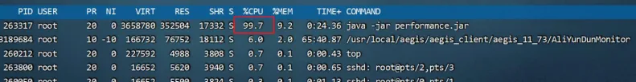

Java虚拟机的性能调优
<!-- more -->
## 常见的性能问题：
应用程序在运行过程中经常会出现性能问题，比较常见的性能问题现象是： 

1、通过top命令查看CPU占用率高，接近100甚至多核CPU下超过100都是有可能的。



2、请求单个服务处理时间特别长，多服务使用skywalking等监控系统来判断是哪一个环节性能低下。


3、程序启动之后运行正常，但是在运行一段时间之后无法处理任何的请求（内存和GC正常）。

## 线程转储的查看方式
线程转储（Thread Dump）提供了对所有运行中的线程当前状态的快照。线程转储可以通过jstack、visualvm等工 具获取。其中包含了线程名、优先级、线程ID、线程状态、线程栈信息等等内容，可以用来解决CPU占用率高、死锁等问题。

jstack线程转储文件：


visualvm:


线程转储（Thread Dump）中的几个核心内容： 

◆ **名称**： 线程名称，通过给线程设置合适的名称更容易“见名知意” 

◆ **优先级**（prio）：线程的优先级 

◆ **Java ID**（tid）：JVM中线程的唯一ID 

◆ **本地 ID** (nid)：操作系统分配给线程的唯一ID 

◆ **状态**：线程的状态，分为： 

NEW – 新创建的线程，尚未开始执行 

RUNNABLE –正在运行或准备执行 

BLOCKED – 等待获取监视器锁以进入或重新进入同步块/方法 

WAITING – 等待其他线程执行特定操作，没有时间限制 

TIMED_WAITING – 等待其他线程在指定时间内执行特定操作 

TERMINATED – 已完成执行 

◆ 栈追踪： 显示整个方法的栈帧信息 

线程转储的可视化在线分析平台： 

1、 https://jstack.review/ 


2、 https://fastthread.io/


## CPU占用率高问题的解决方案
**问题：**

监控人员通过prometheus的告警发现CPU占用率一直处于很高的情况，通过top命令看到是由 

于Java程序引起的，希望能快速定位到是哪一部分代码导致了性能问题。 

**解决思路：**

1、通过top –c 命令找到CPU占用率高的进程，获取它的进程ID。


2、使用top -p 进程ID 单独监控某个进程，按H可以查看到所有的线程以及线程对应的CPU使用率，找到CPU使用率特别高的线程。


3、使用 jstack 进程ID 命令可以查看到所有线程正在执行的栈信息。使用 jstack 进程ID > 文件名 保存到文件中方便查看。(线程转储)

4、找到nid线程ID相同的栈信息，需要将之前记录下的十进制线程号转换成16进制。

通过 printf ‘%x\n’ 线程ID 命令直接获得16进制下的线程ID。

5、找到栈信息对应的源代码，并分析问题产生原因。

也可以将线程转储文件交给https://fastthread.io/来解析，同样也能找到问题：


在定位CPU占用率高的问题时，比较需要关注的是状态为RUNNABLE的线程。但实 

际上，有一些线程执行本地方法时并不会消耗CPU，而只是在等待。但 JVM 仍然会 

将它们标识成“RUNNABLE”状态。


**如果方法中嵌套方法比较多，如何确定栈信息中哪一个方法性能较差？**

# 接口响应时间很长的问题 
**问题：**

在程序运行过程中，发现有几个接口的响应时间特别长，需要快速定位到是哪一个方法的代码 

执行过程中出现了性能问题。 

**解决思路：**

已经确定是某个接口性能出现了问题，但是由于方法嵌套比较深，需要借助于arthas定位到具 

体的方法。 

Arthas的trace命令 

使用arthas的trace命令，可以展示出整个方法的调用路径以及每一个方法的执行耗时。 

命令： trace 类名 方法名 

⚫ 添加 --skipJDKMethod false 参数可以输出JDK核心包中的方法及耗时。 

⚫ 添加 ‘#cost > 毫秒值’ 参数，只会显示耗时超过该毫秒值的调用。 

⚫ 添加 –n 数值 参数，最多显示该数值条数的数据。 

⚫ 所有监控都结束之后，输入stop结束监控，重置arthas增强的对象。

**例子：**

**要测试的接口：**

```java
@GetMapping("/slow")
public void a(int i ) throws InterruptedException {
    if(i<=0){
        return;
    }
    Thread.sleep(2000);
    b();
}

private void b() throws InterruptedException {
Thread.sleep(1000);
}
```

arthas执行命令进行对一个方法进行监控： 


postman进行接口测试：


**arthas已经把它认为占用时间较长的方法标红了：**


命令末尾加上--skipJDKMethod false参数来查看更加详细的内容：


加上'#cost > 1000' 只打印时间大于1s的请求：


再加上一个参数，只打印一次：

```java
trace org.example.springbootdemo1.demos.web.BasicController a --skipJDKMethod false '#cost > 1000' -n 1
```

注意：arthas对方法进行监控的时候也会对此方法的响应时间有影响。所有监控都结束之后，输入stop结束监控防止继续对接口产生影响。

trace命令并不能看到方法的参数和返回值，可以使用watch命令。

Arthas的watch命令 

在使用trace定位到性能较低的方法之后，使用watch命令监控该方法，可以获得更为详细的方法信息。 

命令： watch 类名 方法名 ‘{params, returnObj}’ ‘#cost>毫秒值' -x 2 

‘{params, returnObj}‘ 代表打印参数和返回值。 

 -x 代表打印的结果中如果有嵌套（比如对象里有属性），最多只展开2层。允许设置的最大值为4。

例如：


**总结：**

1、通过arthas的trace命令，首先找到性能较差的具体方法，如果访问量比较大，建议设置最 

小的耗时，精确的找到耗时比较高的调用。 

2、通过watch命令，查看此调用的参数和返回值，重点是参数，这样就可以在开发环境或者测 

试环境模拟类似的现象，通过debug找到具体的问题根源。 

3、使用stop命令将所有增强的对象恢复。

# 火焰图定位接口响应时间长的问题
定位偏底层的性能问题 

**问题：**

有一个接口中使用了for循环向ArrayList中添加数据，但是最终发现执行时间比较长，需要定位 

是由于什么原因导致的性能低下。 

**解决思路：**

Arthas提供了性能火焰图的功能，可以非常直观地显示所有方法中哪些方法执行时间比较长。

接口：

```java
@GetMapping("/profile1")
public void test3(){
    ArrayList<Integer> options = new ArrayList<>();
    for (Integer i = 0; i < 20000000; i++) {
        options.add(i);
    }
}
```
Arthas的profile命令 

使用arthas的profile命令，生成性能监控的火焰图。 (这个命令不支持windows)

命令1： profiler start 开始监控方法执行性能 

命令2： profiler stop --format html 以HTML的方式生成火焰图 

火焰图中一般找绿色部分Java中栈顶上比较平的部分，很可能就是性能的瓶颈。

开始监控：


使用postman请求几次。

生成火焰图：


下载到本地打开


可以手动指定Arraylist容量来解决。

# 线程被耗尽问题（死锁问题）
死锁的例子：

两个接口互相持有对方需要的锁

```java
@RestController
public class BasicController {
    private Object obj1 = new Object();
    private Object obj2 = new Object();
    private Lock lock1 = new ReentrantLock();
    private Lock lock2 = new ReentrantLock();

    @GetMapping("/deadlock1")
    public String test1() throws InterruptedException {
        synchronized (obj1) {
            Thread.sleep(5000);
            synchronized (obj2) {
                return "返回成功";
            }
        }
    }
    @GetMapping("/deadlock2")
    public String test2() throws InterruptedException {
        synchronized (obj2) {
            Thread.sleep(5000);
            synchronized (obj1) {
                return "返回成功";
            }
        }
    }
```

定位问题的方案：

线程死锁可以通过**三种方法**定位问题：

1，jstack -l 进程id > 文件名 将线程栈信息保存到本地。（生产环境可用）

在文件中搜索deadlock即可找到死锁为位置：


2，开发环境中使用visual vm或者Jconsole工具，都可以检测出死锁。使用线程快照生成工具就可以看到死锁的根源。生产环境的服务一般不会允许使用这两种工具连接。


3，把生成的txt文件使用fastthread自动检测线程问题。 https://fastthread.io/

Fastthread和GCeasy类似，是一款在线的AI自动线程问题检测工具，可以提供线程分析报告。通过报告查看是否存在死锁问题。


解决的方法可以使用ReentrantLock锁:

```java
@RestController
public class BasicController {
    private Object obj1 = new Object();
    private Object obj2 = new Object();
    private Lock lock1 = new ReentrantLock();
    private Lock lock2 = new ReentrantLock();

    @GetMapping("/deadlock1")
    public String test1() throws InterruptedException {
        boolean b1 = lock2.tryLock(1, TimeUnit.SECONDS);
        if (b1) {
            try {
                Thread.sleep(5000);
                boolean b = lock1.tryLock(1, TimeUnit.SECONDS);
                if (b) {
                    try {
                        return "返回成功";
                    } finally {
                        lock1.unlock();
                    }
                }
            } finally {
                lock2.unlock();
            }
        }
        return "处理失败";
    }
```

# 基准测试框架JMH的使用
一般如何判断一个方法需要耗时多少时间？

+ 在方法上打印开始时间和结束时间，他们的差值就是方法的执行耗时。
+ 手动通过postman或者jmeter发起一笔请求，在控制台上看输出的时间。

这样是不准确的，第一次测试时有些对象创建是懒加载的，所以会影响第一次的请求时间，第二因为虚拟机中JIT即时编译器会优化代码，所以测试的时间并不一定是最终用户处理的时间。

最好的方式我们可以使用JMH工具：

使用OpenJDK中的JMH基准测试框架对某些特定的方法比如加密算法进行基准测试，JMH可以完全模拟运行环境中的Java虚拟机参数，同时支持预热能通过JIT执行优化后的代码获得更准确的数据。

官网地址：https://github.com/openjdk/jmh

JMH会首先执行预热过程，确保JIT对代码进行优化之后再进行真正的迭代测试，最后输出测试的结果。

使用案例：  
先创建一个工作目录，在里面执行cmd命令：

```java
mvn archetype:generate -DinteractiveMode=false -DarchetypeGroupId=org.openjdk.jmh -DarchetypeArtifactId=jmh-java-benchmark-archetype -DgroupId=org.sample -DartifactId=test -Dversion=1.0
```

登上较长一段时间会自动创建一个maven项目。

这是一个简单的案例：

```java
//预热次数 时间
@Warmup(iterations = 5, time = 1)
//启动多少个进程 并且添加jvm参数
@Fork(value = 1, jvmArgsAppend = {"-Xms512m", "-Xmx512m"})
//指定显示结果
@BenchmarkMode(Mode.AverageTime)
//指定显示结果单位
@OutputTimeUnit(TimeUnit.NANOSECONDS)
//变量共享范围
@State(Scope.Benchmark)
public class MyBenchmark {

    @Benchmark
    public int testMethod() {
       int i = 0;
       i++;
       return i;
    }

}
```

可以通过verify打成jar包来运行。（官方建议）

如果安装了jmh的插件可以直接运行：


控制台你将看到结果：


也可以通过main函数来运行（不建议）：

加上main方法：

```java
public static void main(String[] args) throws RunnerException {
    Options options = new OptionsBuilder()
    .include(MyBenchmark.class.getSimpleName())
    .forks(1)
    .build();
    new Runner(options).run();
}
```

死代码问题：

JIT会对代码进行优化，将不用的变量删除，因此使用JMH时会产生死代码问题，可以通过黑洞类解决：

```java
@Benchmark
public void testMethod(Blackhole blackhole) {
int i = 0;
i++;
int j =0;
j++; //i和j没有被使用，也没有返回，会被JIT优化掉影响测试结果的准确性
//使用黑洞消费掉
blackhole.consume(i);
blackhole.consume(j);
}
```

控制台打印的形式不方便查看，可以使用可视化工具来对结果进行分析

通过: https://jmh.morethan.io/ 网站分析可是化结果，

首先需要把结果给保存下来：

```java
public static void main(String[] args) throws RunnerException {
    Options options = new OptionsBuilder()
    .include(MyBenchmark.class.getSimpleName())
    .forks(1)
    .resultFormat(ResultFormatType.JSON)//将结果保存为JSON格式
    .build();
    new Runner(options).run();
}
```

给https://jmh.morethan.io/分析：


案例比较两种日期格式化的性能：

在jdk8中，可以使用Date进行日期的格式化，也可以使用LocalDateTime进行格式化，使用JMH对比这两种格式化的性能。

```java
//预热次数 时间
@Warmup(iterations = 5, time = 1)
//启动多少个进程 并且添加jvm参数
@Fork(value = 1, jvmArgsAppend = {"-Xms512m", "-Xmx512m"})
//指定显示结果
@BenchmarkMode(Mode.AverageTime)
//指定显示结果单位
@OutputTimeUnit(TimeUnit.NANOSECONDS)
//变量共享范围
@State(Scope.Benchmark)
public class MyBenchmark {

    private static String sDateFormatString = "yyyy-MM-dd HH:mm:ss";
    private Date date = new Date();
    private LocalDateTime localDateTime = LocalDateTime.now();
    private static ThreadLocal<SimpleDateFormat> simpleDateFormatThreadLocal = new ThreadLocal();
    private static final DateTimeFormatter formatter = DateTimeFormatter.ofPattern("yyyy-MM-dd HH:mm:ss");

    @Setup
    public void setUp() {
        SimpleDateFormat sdf = new SimpleDateFormat(sDateFormatString);
        simpleDateFormatThreadLocal.set(sdf);
    }

    //每次创建SimpleDateFormat对象，测试date格式化
    @Benchmark
    public String date() {
        SimpleDateFormat simpleDateFormat = new SimpleDateFormat(sDateFormatString);
        return simpleDateFormat.format(date);
    }

    //使用ThreadLocal保存SimpleDateFormat对象，测试date格式化
    @Benchmark
    public String dateThreadLocal() {
        return simpleDateFormatThreadLocal.get().format(date);
    }

    //使用保存好的SimpleDateFormat对象，测试date格式化
    @Benchmark
    public String localDateTime() {
        return localDateTime.format(formatter);
    }
    //每次创建DateTimeFormatter对象，测试localDateTime格式化
    @Benchmark
    public String localDateTimeNotSave() {
        return localDateTime.format(DateTimeFormatter.ofPattern("yyyy-MM-dd HH:mm:ss"));
    }

    public static void main(String[] args) throws RunnerException {
        Options options = new OptionsBuilder()
        .include(MyBenchmark.class.getSimpleName())
        .forks(1)
        .resultFormat(ResultFormatType.JSON)//将结果保存为JSON格式
        .build();
        new Runner(options).run();
    }
}
```

给网站分析一下：


看到使用保存好的SimpleDateFormat对象，测试date格式化性能最好。


在使用双层for循环的情况下，性能一般比较低，可以使用并行流利用多核CPU的优势并行执行提升性能：

.parallelStream()

### 在自己的项目中嵌入JMH:
首先需要引入依赖：

```xml
<dependency>
  <groupId>org.openjdk.jmh</groupId>
  <artifactId>jmh-core</artifactId>
  <version>${jmh.version}</version>
</dependency>
<dependency>
  <groupId>org.openjdk.jmh</groupId>
  <artifactId>jmh-generator-annprocess</artifactId>
  <version>${jmh.version}</version>
  <scope>provided</scope>
</dependency>
```

编写测试代码：

```java
package org.example.springbootdemo1;
import org.example.springbootdemo1.demos.web.BasicController;
import org.junit.jupiter.api.Test;
import org.openjdk.jmh.annotations.*;
import org.openjdk.jmh.infra.Blackhole;
import org.openjdk.jmh.results.format.ResultFormatType;
import org.openjdk.jmh.runner.Runner;
import org.openjdk.jmh.runner.RunnerException;
import org.openjdk.jmh.runner.options.OptionsBuilder;
import org.springframework.boot.SpringApplication;
import org.springframework.context.ApplicationContext;

import java.util.concurrent.TimeUnit;

//预热次数 时间
@Warmup(iterations = 5, time = 1)
//启动多少个进程 并且添加jvm参数
@Fork(value = 1, jvmArgsAppend = {"-Xms512m", "-Xmx512m"})
//指定显示结果
@BenchmarkMode(Mode.AverageTime)
//指定显示结果单位
@OutputTimeUnit(TimeUnit.NANOSECONDS)
//变量共享范围
@State(Scope.Benchmark)
public class JMHtest {

    private BasicController basicController;
    private ApplicationContext context;

    //初始化将springboot容器启动，端口需要设置随机，因为
    @Setup
    public void setup()
    {
        this.context = new SpringApplication(SpringbootDemo1Application.class).run();
        basicController = this.context.getBean(BasicController.class);
    }
    //启动测试，从这开始
    @Test
    public void executeJmhRunner() throws RunnerException {
        new Runner(new OptionsBuilder()
                   .shouldDoGC(true)
                   .forks(0)//设置为0，不需要启动新的进程，初始化已经启动了
                   .resultFormat(ResultFormatType.JSON)
                   .shouldFailOnError(true)
                   .build()
                  ).run();
    }
    //用黑洞消费数据，避免JIT消除代码
    @Benchmark
    public void test1(final Blackhole bh) throws InterruptedException {
        bh.consume(basicController.test1());
    }
}
```

端口号设置随机的方法：

```java
server:
  port: ${random.int(2000,8000)} #端口号设为随机

```

左边会生成json文件，通过[https://jmh.morethan.io/](https://jmh.morethan.io/)可以进行分析。


