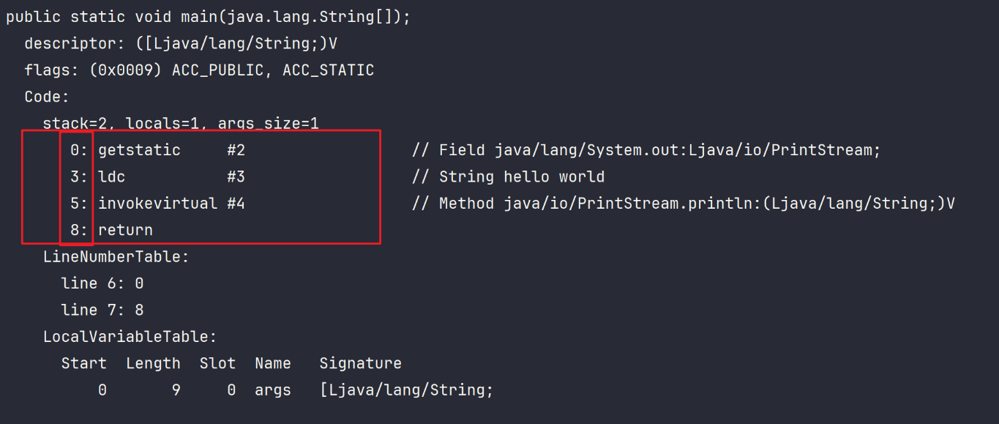
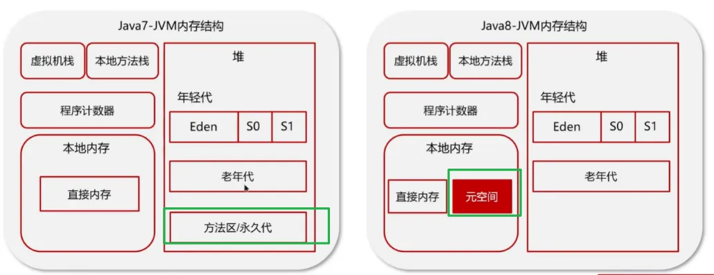

# JVM组成
## 1，什么是程序计数器               
程序计数器（ProgramCounterRegister）也叫PC寄存器。
程序计数器是线程私有的，每个线程一份，每个线程会通过程序计数器记录当前要执行的字节码指令的`地址`。
在加载阶段，虚拟机将字节码文件中的指令读取到内存之后，会将原文件中的偏移量转换成内存地址。每一条字节码指令都会拥有一个内存地址。
1. `字节码解释器`通过`程序计数器`来依次读取指令，然后实现代码的流程控制，如：顺序执行、选择、循环、异常处理。
2. 在多线程的情况下，`程序计数器`用于记录当前线程执行的位置，从而当线程被切换回来的时候能够知道该线程上次运行到哪儿了。
>打印堆栈大小，局部变量的数量和方法的参数：
>javap -v xx.class 

## 2，你能给我详细介绍一下堆吗？？
   虚拟机内存中有一个空间叫堆，这个堆中主要存储的是`对象的实例还有数组等`。内存不够的时候就会抛出Outofmemoryerror异常。。堆中又分成两部分，一部分叫年轻代，另一部分叫老年代，年轻代分成三个区，eden区和两个大小严格相等的survivor幸存者区。老年代中存储的是生命周期长的对象，根据jvm的策略，经过最多15次垃圾收集之后还存活在survivor中的对象就会放到老年代中。jdk1.7的时候还有一个永久代实现的方法区，存储的是类信息，静态变量，常量，编译后的代码。1.8后，为了防止内存溢出，永久代变成到本地内存中的元空间了。

>java7中的方法区/永久代  到Java8之后放到了本地内存中，叫元空间：

## 3，什么是虚拟机栈？
虚拟机栈是每个线程独有的，是每个线程运行时所需要的内存，是先进后出的。栈内存也是线程安全的。每个栈由多个栈帧frame组成，每个栈帧对应着每次方法调用的时候所占用的内存。正在执行的方法对应的栈帧叫活动栈帧，每个线程只能有一个活动栈帧。当有栈帧来了就会压入栈底，再来就继续压入，方法执行完后就会依次弹栈。栈一般存储局部变量和方法调用。

## 4，垃圾回收是否设计栈内存？
垃圾回收主要就是堆内存，当栈帧弹栈以后，栈内存就会释放
## 5，栈内存分配越大越好吗？
不是的，栈内存默认的内存是1M ，如果机器总内存是512M，那么能活动的线程数是512个
如果把栈内存增大一倍变成2M，那么能活动的线程数就会少一半。就会降低并发效率了。

## 6，方法内的局部变量是否线程安全？
这个需要进行判断：要看一个方法内的局部变量是否线程安全，首先要看它是不是可以被多个线程所共享。
被多个线程共享了，就需要考虑线程安全的问题了。  
1，如果方法内局部变量没有逃离方法的作用范围，它是线程安全的   
2，如果是局部变量引用了对象，并逃离方法的作用范围，需要考虑线程安全。

## 7，什么情况下会导致栈内存溢出?
栈内存溢出跟栈帧有关。要么栈帧过多了，要么栈帧过大了。比如方法使用递归调用就可能造栈内存溢出。  
1，栈帧过多导致栈内存溢出，典型问题：递归调用  
2，栈帧过大导致内存溢出
## 8，堆和栈的区别是什么?
1，线程方面：堆是线程共有的，栈是线程私有的  
2，存储的东西不同：堆是来存储java对象和数组的，栈一般存储局部变量和方法调用的。  
3，垃圾回收方面：堆会GC垃圾回收，栈不会  
4，内存不足抛出的异常不足，堆抛出outofmemoryError,栈抛出stackoverflowError  

## 9，能不能解释一下方法区/元空间？
方法区/老年代/元空间存储的是 类信息，静态变量，常量以及编译后的代码  
● jdk1.7叫(永久代实现的)方法区 ; jdk1.8叫元空间.  
● 1.7的时候放在堆中，1.8后放到本地内存了  
● 是各个线程共享的区域，主要存储类的信息和运行时常量池，  
● 虚拟机启动的时候创建，关闭的时候释放   
● 内存不足抛出异常：outofMemoryError:Metaspace.  

## 10，那解释一下运行常量池？
常量池是在字节码文件中记录的，叫Constant pool:可以看作一张表，虚拟机指令根据这张表找到要执行的类名，方法名，方法参数，字面量等信息。 
当类被加载的时候常量池就会放到运行时常量池中，并且因为常量池中记录的是符号嘛就是#数字，到运行时常量池就变成了真实地址了。 

## 11，了解直接内存吗？
直接内存在虚拟机内存中的本地内存中。是虚拟机的系统内存，常见于NIO操作时，用于数据缓冲区。不受jvm内存回收管理。
