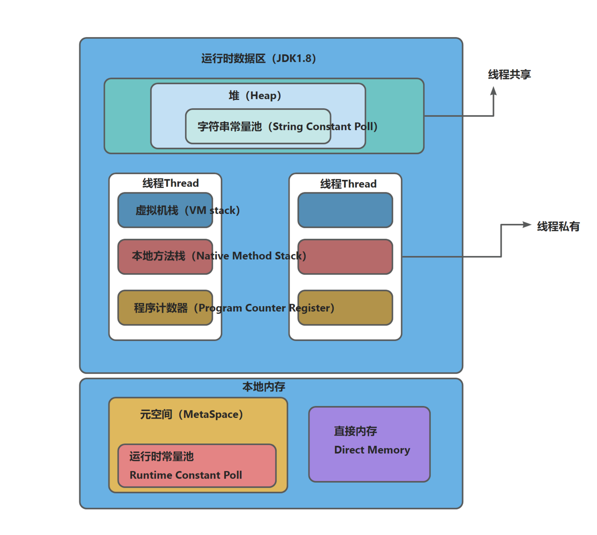

进程和线程的区别
<!-- more -->
# jvm
## 什么是进程？

根本区别：进程是操作系统资源分配的基本单位，而线程是处理器任务调度和执行的基本单位。
进程就是程序的一次执行过程，是系统运行程序的基本单位，一次进程是动态的，系统运行一个程序即是一个进程从创建，运行到销毁的过程。进程是一个独立的环境，而线程是在进程中执行的一个任务。
>在Java 中当我们启动main函数时其实就是运行了一个JVM的进程，而main函数所在的线程就是这个进程中的一个线程，
>称为主线程。
## 什么是线程？
线程是一个比进程更小的执行单位，一个进程在其执行的过程中可以产生多个线程。同类的多个线程共享进程的堆和方法区资源，但是每个线程又有自己的程序计数器，虚拟机栈，和本地方法栈，所以系统在产生一个线程，或是在各个线程间做切换工作时，负担要比进程小得多，因此，线程也被称为轻量级进程。
>java就是天生的多线程程序，一个java程序的运行就是main线程和多个其它线程同时运行。
## 描述一下线程与进程的关系，区别以及优缺点？
下图是 Java 内存区域，通过下图我们从 JVM 的角度来说一下线程和进程之间的关系。

可以看出：一个进程包含多个线程，多个线程共享进程的堆，方法区（jdk1.8之后的元空间）资源，但是每个线程又有自己的程序计数器，虚拟机栈，本地方法栈。
总结：线程是进程划分成的更小的运行单位。线程和进程最大的不同在于基本上各个进程是相互独立的，而各个线程不一定，因为同一进程中的线程极有可能相互影响。线程开销小，但不利于资源的管理和保护，而进程正相反。
## 程序计数器作用?
程序计数器主要有下面两个作用：
1. `字节码解释器`通过`程序计数器来`依次读取指令，从而实现代码的流程控制，如：顺序执行、选择、循环、异常处理。
2. 在多线程的情况下，`程序计数器`用于记录当前线程执行的位置，从而当线程被切换回来的时候能够知道该线程上次运行到哪儿了。
>需要注意的是，如果执行的是 native 方法，那么程序计数器记录的是 undefined 地址，只有执行的是 Java 代码时程序计数器记录的才是下一条指令的地址。
