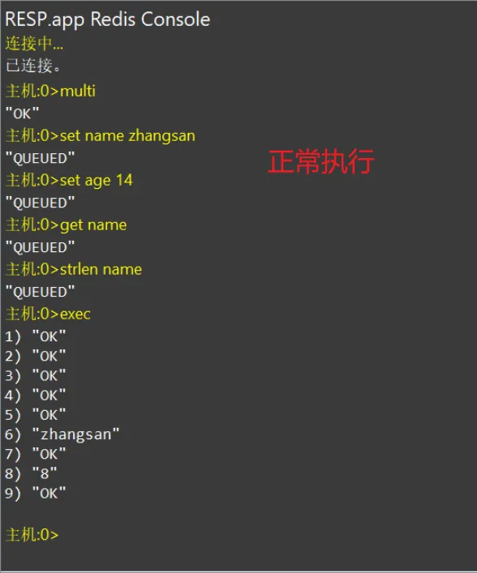
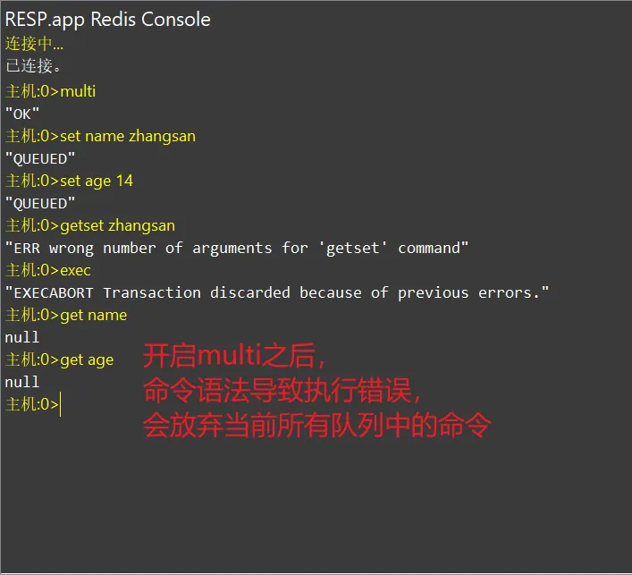
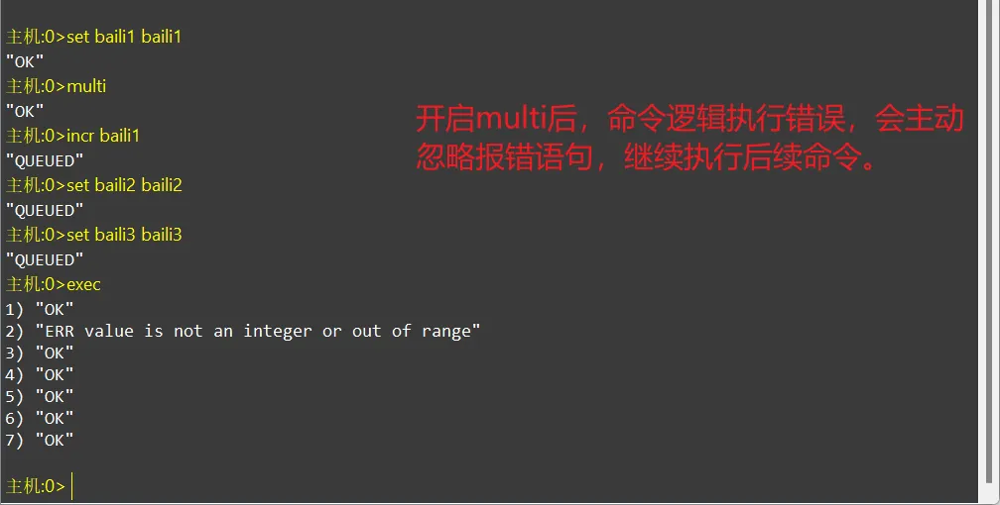
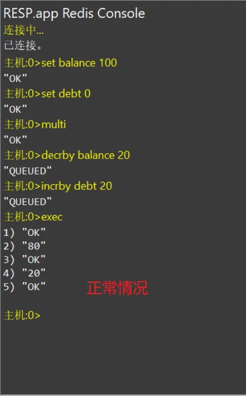
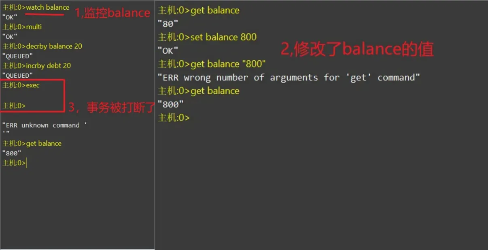

# Redis经典面试题

## 说说你对Redis的理解？
Redis是一个基于key-vlue存储结构的开源内存数据库，也是一种NoSQl数据库。  
它支持多种数据类型，包括String ,Map ,Set ,Zset 和 List,可以满足不同应用场景的需求。   
Redis以内存存储和优化的数据结构为基础，提供了快速的读写性能和高效的数据访问。常用于作应用与数据库之间的缓存组件，提高数据IO效率。   
Redis还支持 主从复制，哨兵机制和集群方式，实现高可用性和水平扩展。  
总而言之，Redis是一款功能强大，灵活可靠的数据库解决方案，适用于各种企业级应用开发场景。   

## Redis支持事务吗？
redis是支持事务的，但是它与传统的关系型数据库中的事务是有所不同的。 

概念：可以一次执行多个命令，本质是一组命令的集合。一个事务中的所有命令都会序列化，按顺序地串行化执行而不会被其它命令插入，不许加塞。  

常用命令：   
● multi :开启一个事务，multi执行之后，客户端可以继续向服务器发送任意多条命令，这些命令不会立即被执行，而是被放到一个队列中。  
● exec :执行队列中的所有命令  
● discard :中断当前事务，然后清空事务队列并放弃执行事务。  
● watch key1 key2... : 监视一个或多个Key,如果在事务执行之前这个或这些Key被其它命令所改动，那么事务将被打断。  
事务三阶段：  
1. 开启，以multi开始一个事务  
2. 入队，将多个命令入队到事务中，接到这些命令并不会立即执行，而是放到等待执行的事务队列里面  
3. 执行，由exec命令触发事务  

使用：  
  
全部回滚的情况：  
  
  
部分执行：  
  
Redis的watch命令是一种乐观锁的实现方式，余额修改示例：  
  
并发修改情况：  
  
在watch监控后，有人修改了balance,会导致事务被打断，必须更新到最新的值，才能执行事务，类似于乐观锁的版本号机制。
## redis的事务和关系型数据库的区别：
1. 原子性：redis事务保证的是队列中的命令作为一个整体要么全部执行，要么全部不执行。但是，如果事务中的某个命令因为执行错误而失败，redis会继续执行事务中的其它命令，而不是回滚整个事务。  

2. 无隔离级别：redis事务中的命令在提交前不会被实际执行，因为不存在传统数据库中的事务隔离级别问题，如脏读，不可重复读和幻读。  

3. 命令队列：当客户端发送multi命令后，所有随后的命令都会被放入一个队列中，而不是立即执行。当exec命令被发送时，redis会尝试执行队列中的所有命令。   

4. 乐观锁：redis使用watch命令来实现乐观锁的机制。客户端可以监控一个或多个键，如果在执行exec之前这些键的值被其它客户端改变，事务将不会执行。    

5. 自动放弃：如果事务因为监控键被修改而不能执行，exec命令将放弃当前队列命令，返回null.      

6. discard命令：如果客户端在发送multi之后决定放弃事务，可以使用discard命令来清空事务队列并退出事务状态。    

7. 有限的回滚：redis事务不支持命令级别的回滚。如果事务中的某个命令失败，redis会停止执行后续命令，而不是回滚到事务开始前的状态。        

## redis的大key是什么东西？
### 什么是大key？
大key是指在Redis中某个key对应的value数据量较大的情况。比如一个哈希结构中包含了大量的字段和值，又或者是一个字符串存储了大段的文本内容。

### 大key通常会带来什么问题？
1. 内存占用增加：大key会占用大量的内存资源，增加了Redis实例的内存压力。
2. 网络传输延迟：读写大key可能会增加网络传输的延迟，尤其是在跨网络节点或者进行数据复制时。
3. 持久化备份困难：大key需要更多的磁盘空间和时间来进行备份，增加了备份的成本和复杂度。

### 该如何解决大key问题？
1. 把大key拆分成多个小key来存储。比如把一个大的哈希结构分割成多个小的哈希结构，减少单个key的大小以降低内存的压力。
2. 搭建redis集群，把key分配到不同的节点上，降低单个redis节点的存储压力。
3. 如果已经存在了大key可以进行数据拆分和迁移，把大key拆分成多个小key，然后分布到不同的redis实例上，处理完成之后再清理掉不需要使用的大key。  

## 缓存双写不一致
### 缓存双写不一致是什么？
缓存双写不一致是指在使用缓存的架构中，当数据更新时，由于缓存和数据库的写操作没有同步进行，导致数据在缓存和数据库之间出现不一致的情况。

### 造成缓存双写不一致的原因？
1. 更新顺序问题：当应用程序更新了数据库中的数据，但在更新缓存之前发生了错误或异常，导致缓存中的数据仍然是旧值。这种情况下，数据库中的数据已经被修改，但缓存中的数据仍然是旧的，导致缓存和数据库之间存在不一致。
2. 缓存失效问题：当数据库中的数据发生变化，并成功更新后，缓存中的数据却没有及时更新或失效了。这可能是由于缓存的过期策略、缓存维护、网络延迟等原因导致的。此时，从缓存读取的数据将是旧值，与数据库中的新值不一致。
3. 并发更新问题：当多个应用程序同时更新相同的数据时，缓存和数据库的更新操作可能不是原子性的。如果两个更新操作同时进行，可能会导致缓存和数据库在更新时发生冲突，导致不一致的结果。

### 为了解决缓存双写不一致的问题，可以考虑以下方法：
1. 优化更新策略：在更新数据库的同时，立即更新缓存，确保缓存中的数据与数据库中的数据保持一致。可以使用同步或异步方式进行。
2. 数据库与缓存的事务性操作：通过数据库事务和缓存的原子性操作来保证更新的一致性。
3. 更新通知机制：通过发布-订阅（Pub／Sub）模式，或使用消息队列等机制来通知缓存节点更新数据，确保缓存的实时性。
4. 使用强一致性缓存：如Redis的事务和 pipeline 特性，可以确保对缓存的多个操作按顺序执行，减少不一致的概率。
5. 定期刷新缓存：通过定期刷新缓存，保证缓存中的数据不会过期太久，降低不一致性发生的概率。
综上所述，缓存双写不一致是在使用缓存时常见的问题，通过合理的缓存更新策略、事务性操作、更新通知机制等措施，可以有效地减少不一致的发生。

## 说说你对pipeline的理解？
pipeline是redis提供的优化命令执行的机制，通过减少网络往返次数和批量处理命令来提高性能。
它将多个命令打包发送给服务器，减少了网络延迟，提高了系统吞吐量。
使用pipeline还可以降低服务器资源消耗，提高整体效率。适用于需要连续执行多个命令或批量操作的场景，特别适合延迟敏感或大量请求的应用程序。
总之，pipeline是一种高效的方式来优化redis命令执行，提升性能和效果。
但是Pipeline不是原子性的,因为里面命令的执行是独立的。

## redis集群会有写操作丢失吗？  
在Redis集群中，由于采用了主从复制模型的异步复制机制，会有一定的写操作丢失风险。  
原因：  
当客户端向主节点发送写操作时，主节点会立即返回成功响应，而不等待所有从节点执行复制。如果主节点在执行完写操作后出现故障或网络问题，导致从节点无法及时接收到复制操作，那么这些未复制的写操作将会丢失。 

为了减少写操作丢失的可能性，可以采取以下措施： 
1．定期监测集群状态，确保主从节点之间的复制正常进行；  
2．设置合理的持久化策略，将数据写入磁盘或使用AOF模式以便数据恢复；  
3．在应用程序层实施数据确认机制，检查写操作是否成功。  
## 什么情况下会导致整个Redis集群不可用？
1. 多个主节点同时故障：如果多个主节点同时发生故障，而且它们的从节点无法正常升级为新的主节点，那么整个集群将无法提供读写服务。  
2. 集群管理节点故障：集群管理节点负责监控集群状态和协调故障转移操作。如果集群管理节点发生故障，并且无法及时恢复或替换，那么集群将失去管理和协调能力，可能导致集群不可用。
3. 网络分区：如果集群中的节点之间发生网络分区，即无法互相通信，那么可能会引起脑裂（split-brain）问题。在这种情况下，每个分区内的节点可能会认为自己是合法的Redis集群，导致数据冲突和不一致性，最终导致整个集群无法正常工作。
4. 配置错误：如果Redis集群的配置出现错误或者某些节点的配置不一致，可能导致集群无法正常运行。
5. 内存不足：如果集群中的某个节点的内存不足以容纳当前处理的数据量，可能会导致该节点性能下降甚至崩溃，从而影响整个集群的可用性。

为避免整个集群不可用，建议采取以下措施：     
1．配置正确的主从复制和故障转移机制，确保每个主节点都有足够的从节点，并定期进行故障转移测试。  
2．部署多个独立的集群管理节点，以确保高可用性和决策一致性。  
3．定期检查和监控集群配置，确保各个节点之间的配置一致性。  
4．实施网络分区容忍策略，例如使用网络拓扑结构和分布式一致性协议，以减少脑裂问题的发生。  
5．监控集群节点的内存使用情况，及时扩容或优化内存管理，避免内存不足问题。  
## Redis的哨兵机制?
Redis 哨兵是一种用于高可用性的解决方案，它可以监控Redis主从复制模式下的主节点和从节点，发现节点故障，并自动进行故障转移，保证Redis系统的稳定性和可靠性。  
Redis哨兵机制由多个相互独立的进程组成，这些进程使用TCP／IP协议相互通信，实现Redis节点的监控和故障转移。哨兵机制的关键进程包括：  
1．sentinel：主进程，用于监控Redis节点的状态，并执行故障转移操作。  
2． monitor：哨兵进程，用于监控Redis的主节点和从节点是否正常工作，并在需要时通知其他哨兵进程和客户端。  
3．judge：哨兵进程，用于对节点的健康状况进行评估，并根据预定义的阈值决定是否要将一个不健康的节点标记为“主观下线”。  
4．failover：哨兵进程，负责执行故障转移操作，将主节点故障时选举出来的从节点晋升为新的主节点，并通知其他Redis节点更新配置信息。  
>通过上述哨兵进程的协同工作，Redis哨兵机制可以实现自动化的故障转移，使得Redis的高可用性得到有效保障。在实际应用中，可以通过配置多个哨兵进程，使其互相监控和备份，从而进一步提高Redis系统的可靠性和稳定性。

## Redis集群的原理？
Redis 集群通过数据分片和主从复制实现了横向扩展和高可用性。它将数据划分为16384个哈希槽，并将这些槽均匀地分配到多个节点上。每个节点负责处理一部分槽的数据，实现了数据的分散存储和负载均衡。   
在集群中，每个哈希槽有一个主节点和多个从节点。主节点负责处理读写请求，而从节点则通过主从复制机制复制主节点的数据，提供数据的冗余备份和故障恢复功能。  
当主节点发生故障时，集群会自动进行故障转移。它会选举一个从节点升级为新的主节点，保证服务的持续可用性。同时，集群管理节点负责监控节点的状态，并协调故障转移过程。  
客户端在与Redis集群交互时，根据键的哈希值将请求发送到相应的节点。客户端还可以通过集群管理节点获取整个集群的拓扑信息，了解哪些键存储在哪个节点上。  

## 缓存穿透
1，什么是缓存穿透：  
正常情况下，我们查询数据就是先查询缓存再查询数据库。如果请求去查询一条压根儿数据库中根本就不存在的数据，也就是缓存和数据库都查询不到这条数据，那么请求每次都会打到数据库上面去。这种查询不存在数据的现象我们称为**缓存穿透**。  
2，穿透带来的问题：  
  试想一下，如果有黑客会对你的系统进行攻击，拿一个不存在的id 去查询数据，会产生大量的请求到数据库去查询。可能会导致你的数据库由于压力过大而宕掉。   
3，解决办法：    
  1. 缓存空值：之所以会发生穿透，就是因为缓存中没有存储这些空数据的key。从而导致每次查询都到数据库去了。那么我们就可以为这些key对应的值设置为null 丢到缓存里面去。后面再出现查询这个key 的请求的时候，直接返回null 。这样，就不用在到数据库中去走一圈了，但是别忘了设置过期时间。
  2. BloomFilter（布隆过滤）：将所有可能存在的数据哈希到一个足够大的bitmap中，一个一定不存在的数据会被 这个bitmap拦截掉，从而避免了对底层存储系统的查询压力。在缓存之前在加一层 BloomFilter ，在查询的时候先去 BloomFilter 去查询 key 是否存在，如果不存在就直接返回，存在再走查缓存 -> 查 DB。
## 缓存击穿
1，什么是缓存击穿？  
热点数据的key在缓存中突然失效，导致大量的并发请求打倒数据库中，就像在屏障上凿开一个洞，这种我们称之为缓存击穿。  
● 解决方案：  
  1. 使用互斥锁(mutex key)：mutex，就是互斥。简单地来说，就是在缓存失效的时候（判断拿出来的值是否为空），不是立即去load db，而是先使用Redis的SETNX去set一个互斥key，当操作返回成功时，再进行load db的操作并回设缓存；否则，就重试整个get缓存的方法。SETNX，是「SET if Not eXists」的缩写，也就是只有不存在的时候才设置，可以利用它来实现互斥的效果。
  2. 软过期：也就是逻辑过期，不使用redis提供的过期时间，而是业务层在数据中存储过期时间信息。查询时由业务程序判断是否过期，如果数据即将过期时，将缓存的时效延长，程序可以派遣一个线程去数据库中获取最新的数据，其他线程这时看到延长了的过期时间，就会继续使用旧数据，等派遣的线程获取最新数据后再更新缓存。
>推荐使用互斥锁，因为软过期会有业务逻辑侵入和额外的判断。
缓存击穿主要担心的是某个Key过期，更新缓存时引起对数据库的突发高并发访问。因此我们可以在更新缓存时采用互斥锁控制，只允许一个线程去更新缓存，其它线程等待并重新读取缓存。例如Redis的setnx命令就能实现互斥效果。
## 缓存雪崩
缓存雪崩，是指在某一个时间段，缓存集中过期失效。对这批数据的访问查询，都落到了数据库上，对于数据库而言，就会产生周期性的压力波峰。  
解决方案：  
● 数据分类分批处理：采取不同分类数据，缓存不同周期  
● 相同分类数据：采用固定时长加随机数方式设置缓存  
● 热点数据缓存时间长一些，冷门数据缓存时间短一些  
● 避免redis节点宕机引起雪崩，搭建主从集群，保证高可用  
>  解决缓存雪崩问题的关键是让缓存Key的过期时间分散。因此我们可以把数据按照业务分类，然后设置不同过期时间。相同业务类型的key，过期时间设置为固定时长加随机数。尽可能保证每个Key的过期时间都不相同。  
另外，Redis宕机也可能导致缓存雪崩，因此我们还要搭建Redis主从集群及哨兵监控，保证Redis的高可用。  

## Redis有哪些应用场景
1.  缓存：Redis 可以作为缓存层，加速访问频繁的数据。由于其高性能、支持持久化和数据结构丰富等特点，使其成为一个理想的缓存解决方案。在缓存方面，Redis 能够存储热点数据、频繁查询结果、会话数据等，从而减轻数据库负载，提高系统整体性能。 
2.  会话存储：Redis 可以用于存储用户会话数据，特别是在分布式系统中，多个服务器之间共享会话数据非常方便。这在网站、应用程序中管理用户登录状态、购物车信息等方面非常有用。 
3.  消息队列：Redis 的发布/订阅功能以及 List 数据结构的弹性特性，使其可以作为轻量级消息队列使用。应用程序可以将消息发布到 Redis，而其他应用程序可以订阅这些消息并处理它们，实现解耦和异步通信。 
4.  计数器：Redis 的原子性操作和计数器数据结构使其成为实现各种计数功能的理想选择。比如，可以用来统计网站的点击量、点赞数、在线用户数等。 
5.  实时排行榜：Redis 的有序集合数据结构非常适合实现实时排行榜功能。通过将用户得分作为有序集合的成员，可以轻松地获取排行榜数据并支持快速的更新。 
6.  分布式锁：Redis 的 SETNX 命令可以用来实现分布式锁，保证在分布式环境下对共享资源的互斥访问。 
7.  应用状态存储：除了会话数据外，Redis 还可以用来存储应用程序的状态信息，比如用户的偏好设置、临时状态等。 
8.  地理位置信息存储与查询：支持存储地理位置信息并进行为止查询。

## Redis的内存淘汰策略
内存淘汰策略是指redis用于在内存不足时选择要淘汰的键，以释放内存空间。以下时几种常见的内存淘汰策略：

1，**LRU（最近最少使用）：** LRU是redis默认的内存淘汰策略，根据最近使用的时间戳来判断键的热度，将最久未被使用的键淘汰出去。这种策略保留了最近较长访问的键，适合于热点数据的场景。
2，**LFU（最不经常使用）：** LFU 根据键被访问的频率来判断热度，淘汰访问频率最低的键。这种策略适合用于访问模式稳定但不同的键的访问频率差异明显的场景。   
3，**Random(随机淘汰）：** 随机淘汰策略是一种基于概率的淘汰方法，随机选择一个键进行淘汰。这种策略简单高效，但可能导致较高的缓存命中率下降。   
4，**TTL（生存时间）：** TTL 策略基于键的过期时间淘汰剩余生存时间最短的键。适用于关注数据时效性的场景。     
5，**Maxmemory Policy(最大内存策略）：** redis提供了几种最大内存策略，包括noeviction(禁止淘汰）,allkeys-lru,allkeys-random等。这些策略是在达到设定的最大内存限制后，对写操作返回错误，避免继续写入导致系统崩溃。  

## Redis的过期策略
redis的过期策略是指redis的键过期之后该如何进行？  
1，**惰性删除：** 是redis的默认的过期键的删除策略。当客户端尝试访问一个已经过期的键时，redis会立即将该键删除，并返回空值。这种策略的优点是删除操作是在需要时进行，减少了不必要的删除开销。但是如果大量的过期键在一次性被访问之前没有被访问过，这些键会一致占据内存空间。  
2，**定期删除：** redis会每隔一段时间执行一次检查，删除那些已经过期的键。默认情况下，redis每秒执行10次检查。定期删除通过释放过期键所占据的内存空间，使得内存能够及时被回收。但这种方式可能会导致内存占用过高，因为redis并不保证在每次定期删除操作中都会删除足够数量的过期键。  
3，**定期淘汰：** 定期淘汰是redis4.0版本引入的一种新的过期策略。与定期删除不同的是，定期淘汰不仅删除已经过期的键，而且会主动查找并淘汰一些尚未过期但是由于内存不足而需要释放的键。通过定期淘汰，redis可以更主动的管理内存，避免因为内存持续增长而导致系统性能下降。  

## Redis的持久化机制
Redis有两种持久化机制：RDB和AOF。  
● RDB是一种快照持久化的方式，它会将Redis在某个时间点的数据状态以二进制的方式保存到硬盘上的一个文件中。RDB持久化可以通过配置定时或手动触发，也可以设置自动触发的条件。RDB的优点是生成的文件比AOF文件更小，恢复速度也更快，适合用于备份和灾难恢复。  
  
● AOF是一种追加日志持久化方式，它会将Redis执行的写命令追加到一个文件的末尾。当Redis重启时，它会重新执行这些写命令来恢复数据状态。AOF提供了更可靠的持久化方式，因为它可以保证每个写操作都被记录下来，并且不会发生数据丢失的情况。AOF文件可以根据配置进行同步写入硬盘的频率，包括每秒同步、每写入命令同步和禁用同步三种模式。  
  
>在使用持久化机制时，可以选择同时使用RDB和AOF，也可以只使用其中一种。同时使用两种方式时，Redis在重启时会先加载AOF文件来恢复数据，如果AOF文件不存在或损坏，则会尝试加载RDB文件。因此，AOF具有更高的优先级。

1. AOF原理概述    
AOF 持久化通过将 Redis 执行的每个写操作命令追加到一个日志文件中来实现数据的持久化。这些命令以 Redis 协议的格式保存，可以在需要时重新执行这些命令以恢复数据。
2. 工作流程    
    1. 命令追加：    
    ○ 每当 Redis 执行一个写操作命令（如 SET、LPUSH 等），该命令会被追加到 AOF 缓冲区中。  
    ○ AOF 缓冲区的内容会根据配置的同步策略（appendfsync）定期写入到 AOF 文件中。   
    2. 同步策略：    
    ○ always：每次写操作都立即同步到磁盘。这种方式最安全，但性能开销最大。  
    ○ everysec：每秒同步一次。这是默认设置，兼顾了性能和安全性。  
    ○ no：由操作系统决定何时同步。这种方式性能最好，但安全性最低。  
    3. 文件重写：  
    ○ 随着时间的推移，AOF 文件会变得越来越大，因为每个写操作都会被记录下来。为了优化 AOF 文件的大小，Redis 提供了 AOF 重写（Rewrite）机制。  
    ○ AOF 重写会在后台创建一个新的 AOF 文件，该文件包含了恢复当前数据集所需的最小命令集合。重写过程不会影响现有的 AOF 文件，也不会阻塞客户端的请求。  
    ○ 重写完成后，新的 AOF 文件会替换旧的文件，从而达到压缩文件的目的。  
    4. 启动恢复：  
    ○ 当 Redis 重启时，会读取 AOF 文件中的命令并重新执行，以恢复数据。  
    ○ 如果 AOF 文件在写入过程中损坏，Redis 提供了 redis-check-aof 工具来修复损坏的文件。  
3. 配置参数  
在 Redis 配置文件（redis.conf）中，可以通过以下参数来配置 AOF 持久化：  
● appendonly yes：启用 AOF 持久化。  
● appendfilename "appendonly.aof"：指定 AOF 文件的名称。  
● appendfsync everysec：设置同步策略，默认为每秒同步一次。  
● auto-aof-rewrite-percentage 100：当 AOF 文件大小超过上一次重写后的大小的百分比时，触发重写。  
● auto-aof-rewrite-min-size 64mb：AOF 文件的最小重写大小。  
4. 优缺点  
● 优点：  
  ○ 数据安全性高：AOF 持久化记录了所有写操作，即使在最后一次写操作后发生宕机，也能恢复到最近的状态。  
  ○ 可读性强：AOF 文件是以 Redis 协议格式保存的，可读性强，便于人工分析和修改。  
  ○ 支持重写：通过重写机制，可以有效地压缩 AOF 文件，减少磁盘空间占用。  
● 缺点：   
  ○ 文件体积大：相比于 RDB，AOF 文件通常更大，因为记录了所有写操作。  
  ○ 恢复速度慢：AOF 文件恢复数据的速度通常比 RDB 慢，因为它需要重新执行所有命令。  
5. 结合使用  
为了兼顾数据安全性和性能，许多生产环境中会同时使用 AOF 和 RDB 持久化：  
● RDB：定期生成快照，用于快速恢复。  
● AOF：记录所有写操作，确保数据的安全性。  
通过这种方式，可以在数据安全性和性能之间找到一个平衡点。  

## Redis操作原子性的理解？
Redis 的操作是原子性的，这是因为Redis的每个命令都是以单线程的方式执行的，整个命令的执行过程是不可中断的，要么全部执行成功，要么全部执行失败。  
在Redis中，每个命令都会被转换成一个或多个底层操作，这些操作会基于数据结构的特定实现来执行。比如，对于字符串类型，获取一个键值对、设置一个键值对等操作都是原子性的。在执行这些底层操作时，Redis会使用一些技术来保证原子性，主要包括以下两点：   

1．Redis使用单线程模型，避免了多线程之间的竞争条件和锁开销，从而保证了操作的原子性。   
2．Redis在执行一些复杂的操作时，比如事务、Lua脚本等，会将多个底层操作打包成一个原子性操作，这些底层操作要么全部执行成功，要么全部执行失败。在事务和Lua脚本中，Redis同时支持回滚操作，即当一些命令执行成功，后面的命令出错时，Redis可以自动撤销已经执行的命令。   

>因此，Redis的操作是原子性的，这得益于Redis单线程模型和底层操作的实现方式。这种原子性操作保证了Redis能够提供高效和可靠的服务。  

## Redis的好处
使用Redis的好处包括：  
1．**缓存功能：** 作为高性能缓存系统，Redis能够将热门数据存储在内存中，提升数据访问速度和减轻数据库负载。    
2．**高性能：** Redis采用内存存储和高效数据结构，具备快速读写速度，适用于处理大量请求和实时数据需求。   
3．**多样化数据类型：** Redis支持多种数据类型，如字符串、哈希、列表、集合和有序集合，满足各种数据存储和操作需求。   
4．**支持持久化：** Redis支持数据持久化，可将数据写入磁盘，确保数据的可靠性和持久存储。    
5．**支持分布式：** Redis提供集群和分片机制，实现数据分布和水平扩展，提供高可用性和可扩展性。    
6．**简单易用：** Redis具有简洁的命令接口，易于使用和管理，同时提供丰富的内置命令和客户端库。    
>总之，Redis以其高性能、多样化数据类型、持久化支持、缓存功能、分布式支持和简单易用等特点，成为广泛应用于各种场景的数据存储解决方案。   

## Redis的数据类型
Redis支持五种主要的数据类型：    
1. **String：** String是最常用的数据类型，在Redis中以二进制安全的方式存储字符串值。它可以包含任何类型的数据，比如文本、整数或二进制数据。  
1. **Hash：** Hash是一个键值对的集合，其中每个键都与一个值相关联。在Redis中，Hash可以用于存储和操作对象，每个键值对相当于对象的字段和值。  
1. **List：** List是一个按照插入顺序排序的字符串元素集合。集合中的元素可以重复，可以从列表的两端进行插入和删除操作，可用于实现队列、栈等数据结构。  
1. **Set：** Set是一个无序、唯一的字符串集合。可以对集合执行添加、删除和判断成员是否存在等操作，也支持集合间的交集、并集和差集运算。  
1. **Sorted Set：**  Sorted Set是一个有序的字符串集合，每个成员都关联着一个分数。集合中的成员根据分数的大小默认从小到大排序，可以进行范围查询和按分数排名操作。  
>除了这些主要的数据类型，Redis还提供了其他一些特殊的数据结构和功能，如HyperLogLog用于基数统计、Geo用于地理位置信息存储、Pub／Sub用于发布与订阅等。   

## Redis为什么那么快
1，**单线程避免的开销：** 与多线程相比，单线程模型避免了线程间的上下文切换，锁竞争和资源管理开销。这使得redis可以更高效的使用CPU资源，并减少了大量与线程相关的开销。   
2，**内存操作：** Redis主要将数据存储在内存，并且由于单线程模型的存在，在内存操作的情况下，Redis可以通过简单的指针操作来实现快速的读写，而不需要考虑复杂的数据同步和竞争条件。    
3，**非阻塞IO：** Redis使用了事件驱动的非阻塞IO机制。它通过事件循环处理来自客户端的请求，在等待数据IO时并不会阻塞主线程，而是继续处理其它请求。这种机制允许Redis以高效的方式处理大量的并发连接。   

## Redis是单线程还是多线程
redis采用的是单线程模型。    
通常说的单线程，主要是指的是Redis对外提供的键值存储服务的主要流程是单线程的，即网络IO和数据读写是由单个线程来完成的。这样设计可以避免多线程之间的竞争条件和锁开销，提高了访问共享数据的效率。  

然而，除了对外提供的键值存储服务，Redis在某些功能上会使用额外的线程来执行，比如**持久化，异步删除和集群数据同步等** 。这些功能需要在后台执行，不参与主要的网络IO和数据处理。因此，严格来说，Redis并不完全是单线程。  

## 怎么实现Redis的高可用
1．**主从复制：** 通过设置主从复制，将主节点的数据同步到多个从节点上。主节点负责处理写操作，并将写操作的日志复制给从节点，从节点则负责处理读请求。如果主节点发生故障，可以将一个从节点升级为新的主节点，从而实现故障转移和高可用。  
2．**哨兵机制：** 使用Redis哨兵来监控主节点和从节点的状态。哨兵是一组独立运行的进程，它会监控Redis实例的健康状态，并在主节点出现故障时自动进行故障转移。它还能够监控从节点，并在需要时将其提升为主节点。  
3．**集群模式：** Redis集群是一种分布式方案，可以将多个Redis节点组成一个逻辑集群，提供数据分片和自动故障恢复。每个节点负责存储和处理部分数据，通过节点间的数据分片和分布式算法保证数据的可用性和负载均衡。当集群中的某个节点出现故障时，集群会自动进行故障转移和恢复。  

## Redis为什么把所有数据都存在内存中
Redis将所有数据放到内存中的主要原因是为了提供高性能的读写操作。  
 以下是几个主要的原因：    
1．**高速读写：** 内存访问速度快，相比于磁盘和数据库，内存操作速度更快，能够更迅速地响应读写请求。将数据存储在内存中可以大大缩短读写的延迟，提高系统的响应速度和吞吐量。  
2．**简单数据结构：** Redis使用简单的数据结构来存储数据，如字符串、列表、哈希、集合和有序集合等。这些数据结构直接映射到内存，不需要进行复杂的数据转换和序列化操作，提高了读写效率。   
3．**数据持久化：** 尽管Redis将数据存储在内存中，但它也支持数据的持久化。通过使用RDB快照和AOF日志两种方式，Redis可以将内存中的数据定期或实时写入磁盘，以保证数据的持久性和安全性。    
>需要注意的是，由于内存容量有限，Redis的内存管理也是需要考虑的。通过设置合适的数据过期策略、内存淘汰策略和最大内存限制等措施，可以在保证高性能的同时，有效地管理内存使用。同时，Redis也可 以通过集群和分片等方式来扩展内存容量和提高系统的可用性和性能。

## 一个Redis实例最多能存放多少个key
Redis的每个实例最多可以存放约**2＾32-1个keys** ，即大约42亿个keys。  
这是由Redis 内部使用的哈希表实现决定的，它使用32位有符号整数作为索引。  
Redis使用的哈希函数和负载因子等因素也会影响实 际可存放键的数量。  
 >需要注意的是，尽管Redis允许存储数量庞大的键，但在实践中，存储过多的键可能会导致性能下降和内存消耗增加。因此，在设计应用程序时，需要根据实际需求和硬件资源来合理规划键的数量，避免过度使 用Redis实例造成负担。如果需要存储更多的键值对，可以考虑使用Redis集群或分片技术，以扩展整体存储容量。  

 ## Redis为什么那么快
 Redis之所以快速的原因主要包括以下几点：  
 1．**内存存储：** Redis将数据存储在内存中，实现了快速的读写操作。  
 2．**单线程模型：** Redis采用单线程处理请求，避免了多线程的竞争和上下文切换开销。    
 3．**高效的数据结构：** Redis内部使用了高效的数据结构，如哈希表、跳跃表等，提供了快速的数据访问和操作。  
 4．**异步IO：** Redis利用异步I0来处理网络请求，能够同时处理多个请求，提高并发性能。   
 5．**事件驱动架构：** Redis基于事件驱动的模型，通过事件循环机制处理请求和操作，提高系统的效率。  
 6．**优化的操作：** Redis对常用操作进行了优化，如批量操作和管道技术，减少了网络通信开销。  

 >综上所述，Redis之所以快速在于内存存储、单线程模型、高效的数据结构、异步IO、事件驱动架构和优化的操作等因素的综合作用。这使得Redis能够以高性能和高响应速度处理各类数据操作请求。

 ## Redis的热key问题如何解决
 热key问题是指在缓存系统中，某些特定的缓存key收到高频访问，导致这些热门数据的读取/写入操作几种在少数几个缓存节点上，使得这些节点的负载过高，而其它的节点负载较轻甚至空闲。  
这会造成系统性能不均衡，可能导致部分请求相应变慢或服务不可用。  

**解决方案：**   
1，缓存预热：在系统启动或业务低峰期，通过批量加载或预先访问热门数据，将这些热门数据加载到缓存中。这样可以避免大量请求同时涌入导致的热点问题，提高系统的稳定性和性能。      
2，动态散列：将热点数据分散到多个节点上，通过随机算法将请求路由到不同的节点上。这样可以避免热点数据集中到单个节点上，从而提高系统的可用性和性能。    
3，数据分片：将数据按特定规则（如数据范围，业务维度）分成多个片段，分别存储在不同的节点上。这样可以使热key所在的数据尽量均匀的分布在多个节点上，减轻单个节点的压力。    