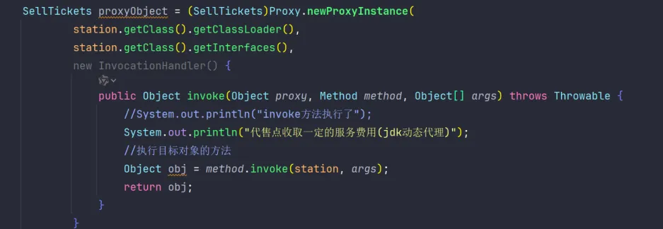
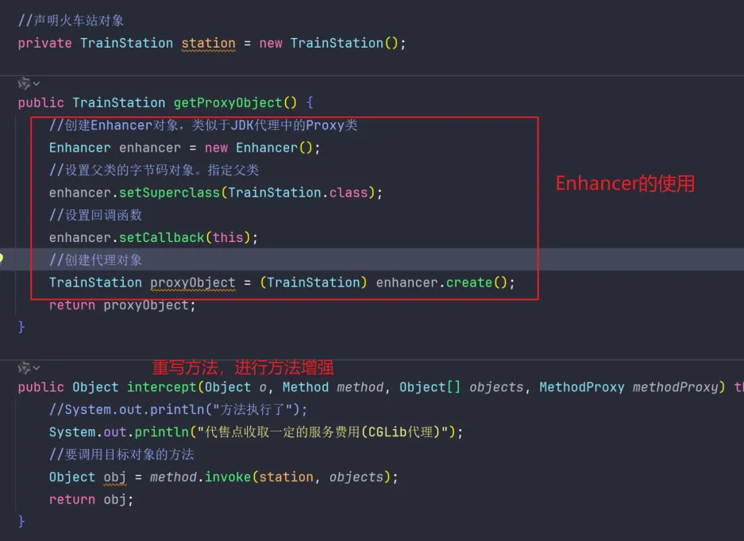

代理模式


<!-- more -->

# 代理模式

## 代理模式的概念

代理模式的核心思想是通过代理对象（例如：媒人）来替代对真实对象（如相亲对象）的直接访问，从而在不修改原始目标对象（你自己）的前提下，提供额外的功能或扩展。  

主要作用：**扩展目标对象的功能**。例如，在目标对象的某个方法执行前后增加自定义操作。

---

## 静态代理与动态代理的区别

### 静态代理

- **特点**：在编译阶段生成代理类，需手动为每个目标对象编写代理类。  
- **缺点**：  
  1. 不灵活，目标对象的每个方法都需要单独实现增强逻辑。
  2. 如果接口新增方法，代理类和目标类都需要更新。
  3. 实际开发中使用较少。  
- **JVM层面**：编译时生成实际的 `.class` 文件。  

### 动态代理

- **特点**：动态代理无需为每个目标对象手动编写代理类，灵活性更高。
- **优势**：  
  1. 不需要目标对象必须实现接口（若实现接口，则优先使用 JDK 动态代理）。  
  2. 在运行时动态生成类的字节码并加载到 JVM 中。  
  3. 更适用于复杂和动态变化的场景。

---

## 动态代理的两种实现方式

### 1. JDK 动态代理

- **特点**：基于接口的代理技术。目标对象必须实现一个或多个接口。  
- **核心组件**：
  - **`Proxy` 类**：用于生成代理对象。  
  - **`InvocationHandler` 接口**：用于定义方法增强逻辑。  
- **实现步骤**：  
  1. 实现 `InvocationHandler` 接口，重写 `invoke` 方法，定义扩展功能。  
  2. 使用 `Proxy.newProxyInstance()` 方法生成代理对象。  

#### 示例代码   
  
>可以看到JDK动态代理在方法调用时需要通过反射机制来调用目标方法，因此性能略低于CGLIB动态代理，虽然JDK动态代理在Java8进行了性能改进，但是CGLIB动态代理调用性能还是更高。因为CGLIB动态代理不需要通过反射来进行方法调用，直接调用目标方法，还不需要类型的转换。

### 2. CGLIB 动态代理
CGLIB (Code Generation Library) 是一个基于 **ASM** 的字节码生成库，它允许在运行时对字节码进行修改和动态生成。CGLIB 通过**继承方式**实现代理。许多知名的开源框架（例如 Spring 的 AOP 模块）都使用了 CGLIB：

- 如果目标对象实现了接口，则 Spring 默认使用 **JDK 动态代理**。
- 如果目标对象未实现接口，则使用 **CGLIB 动态代理**。
与 JDK 动态代理不同，CGLIB 动态代理需要额外引入依赖：

```xml
<dependency>
    <groupId>cglib</groupId>
    <artifactId>cglib</artifactId>
    <version>2.2.2</version>
</dependency>
```
#### 示例代码   
