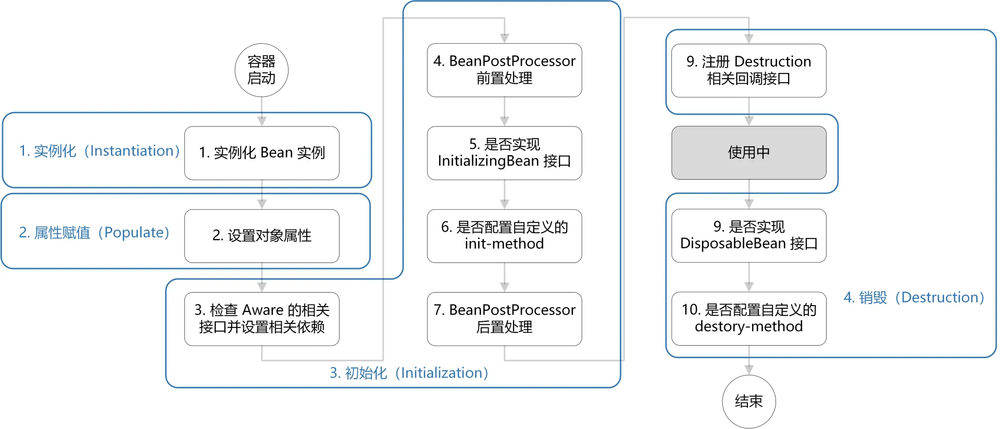

Spring的Bean生命周期

<!-- more -->

# Bean

## 了解Bean的生命周期吗？
1. 创建 Bean 的实例：Bean 容器首先会找到配置文件中的 Bean 定义，然后使用 Java 反射 API 来创建 Bean 的实例。
2. Bean 属性赋值/填充：为 Bean 设置相关属性和依赖，例如@Autowired 等注解注入的对象、@Value 注入的值、setter方法或构造函数注入依赖和值、@Resource注入的各种资源。
3. Bean 初始化：   
● 如果 Bean 实现了 BeanNameAware 接口，调用 setBeanName()方法，传入 Bean 的名字。  
● 如果 Bean 实现了 BeanClassLoaderAware 接口，调用 setBeanClassLoader()方法，传入 ClassLoader对象的实例。  
● 如果 Bean 实现了 BeanFactoryAware 接口，调用 setBeanFactory()方法，传入 BeanFactory对象的实例。   
● 与上面的类似，如果实现了其他 *.Aware接口，就调用相应的方法。    
● 如果有和加载这个 Bean 的 Spring 容器相关的 BeanPostProcessor 对象，执行postProcessBeforeInitialization() 方法    
● 如果 Bean 实现了InitializingBean接口，执行afterPropertiesSet()方法。    
● 如果 Bean 在配置文件中的定义包含 init-method 属性，执行指定的方法。     
● 如果有和加载这个 Bean 的 Spring 容器相关的 BeanPostProcessor 对象，执行postProcessAfterInitialization() 方法。   
4. 销毁 Bean：销毁并不是说要立马把 Bean 给销毁掉，而是把 Bean 的销毁方法先记录下来，将来需要销毁 Bean 或者销毁容器的时候，就调用这些方法去释放 Bean 所持有的资源。    
● 如果 Bean 实现了 DisposableBean 接口，执行 destroy() 方法。     
● 如果 Bean 在配置文件中的定义包含 destroy-method 属性，执行指定的 Bean 销毁方法。或者，也可以直接通过@PreDestroy 注解标记 Bean 销毁之前执行的方法。    
AbstractAutowireCapableBeanFactory 的 doCreateBean() 方法中能看到依次执行了这 4 个阶段：  
```java
protected Object doCreateBean(final String beanName, final RootBeanDefinition mbd, final @Nullable Object[] args)
    throws BeanCreationException {

    // 1. 创建 Bean 的实例
    BeanWrapper instanceWrapper = null;
    if (instanceWrapper == null) {
        instanceWrapper = createBeanInstance(beanName, mbd, args);
    }

    Object exposedObject = bean;
    try {
        // 2. Bean 属性赋值/填充
        populateBean(beanName, mbd, instanceWrapper);
        // 3. Bean 初始化
        exposedObject = initializeBean(beanName, exposedObject, mbd);
    }

    // 4. 销毁 Bean-注册回调接口
    try {
        registerDisposableBeanIfNecessary(beanName, bean, mbd);
    }

    return exposedObject;
}
```
Aware 接口能让 Bean 能拿到 Spring 容器资源。  
Spring 中提供的 Aware 接口主要有： 
1. BeanNameAware：注入当前 bean 对应 beanName；
2. BeanClassLoaderAware：注入加载当前 bean 的 ClassLoader；
3. BeanFactoryAware：注入当前 BeanFactory 容器的引用。
BeanPostProcessor 接口是 Spring 为修改 Bean 提供的强大扩展点。
```java
public interface BeanPostProcessor {

	// 初始化前置处理
	default Object postProcessBeforeInitialization(Object bean, String beanName) throws BeansException {
		return bean;
	}

	// 初始化后置处理
	default Object postProcessAfterInitialization(Object bean, String beanName) throws BeansException {
		return bean;
	}

}
```
●``postProcessBeforeInitialization``：Bean 实例化、属性注入完成后，``InitializingBean#afterPropertiesSet``方法以及自定义的 ``init-method``方法之前执行；   
● ``postProcessAfterInitialization``：类似于上面，不过是在 ``InitializingBean#afterPropertiesSet``方法以及自定义的 ``init-method ``方法之后执行。  
``InitializingBean`` 和 ``init-method`` 是 Spring 为 Bean 初始化提供的扩展点。
```java
public interface InitializingBean {
 // 初始化逻辑
	void afterPropertiesSet() throws Exception;
}
```
指定 init-method 方法，指定初始化方法：
```xml
<?xml version="1.0" encoding="UTF-8"?>
<beans xmlns="http://www.springframework.org/schema/beans"
       xmlns:xsi="http://www.w3.org/2001/XMLSchema-instance"
       xsi:schemaLocation="http://www.springframework.org/schema/beans http://www.springframework.org/schema/beans/spring-beans.xsd">

    <bean id="demo" class="com.chaycao.Demo" init-method="init()"/>

</beans>
```

## 什么是Bean?
简单来说，Bean 代指的就是那些被 IoC 容器所管理的对象。
我们需要告诉 IoC 容器帮助我们管理哪些对象，这个是通过配置元数据来定义的。配置元数据可以是 XML 文件、注解或者 Java 配置类。
## 将一个类声明成Bean的注解有哪些？
1. ``@Component`` - 这是一个通用的注解，用于标记任何Spring管理的组件。当你不确定使用哪个更具体的注解时，可以使用@Component。
2. ``@Service`` - 通常用于业务层的类，表明这是一个服务层的Bean。
3. ``@Repository`` - 用于数据访问层的类，比如DAO（Data Access Object）层，表示这是一个持久化层的Bean。
4. ``@Controller`` - 用于表现层，特别是在MVC模式中的控制器类。它表明这是一个Web层的Bean。
5. ``@Configuration`` - 标记配置类，这类类通常包含@Bean方法，用于定义其他Bean。
6. ``@Bean`` - 在@Configuration类的方法上使用，用于定义一个由Spring管理的Bean。
7. ``@Scope`` - 可以与上述任何一个注解一起使用，用来指定Bean的作用域，如singleton（单例）、prototype（原型）、request（请求）、session（会话）等。
8. ``@Autowired`` - 虽然不是直接用来声明Bean，但它用于自动装配Bean，即告诉Spring框架自动填充其他Bean的依赖关系。
9. ``@Qualifier`` - 当存在多个相同类型的Bean时，使用此注解来指定哪一个Bean应该被注入。
10. ``@Primary`` - 指示当一个以上的Bean满足依赖条件时，哪一个Bean应该是首选。
11. ``@Lazy`` - 声明Bean是否延迟初始化，即在第一次请求时才初始化而不是在启动时。
  
  ## @Component 和 @Bean 的区别是什么？
● ``@Component``注解作用于类，而@Bean注解作用于方法。   
● ``@Component``通常是通过类路径扫描来自动侦测以及自动装配到 Spring 容器中（我们可以使用 @ComponentScan 注解定义要扫描的路径从中找出标识了需要装配的类自动装配到 Spring 的 bean 容器中）。@Bean 注解通常是我们在标有该注解的方法中定义产生这个 bean,@Bean告诉了 Spring 这是某个类的实例，当我需要用它的时候还给我。   
● ``@Bean`` 注解比 @Component 注解的自定义性更强，而且很多地方我们只能通过 @Bean 注解来注册 bean。比如当我们引用第三方库中的类需要装配到 Spring容器时，则只能通过 @Bean来实现。  
``@Bean``注解使用示例：
```java
    @Configuration
    public class AppConfig {
        @Bean
        public TransferService transferService() {
            return new TransferServiceImpl();
        }

    }
```
上面的代码相当于下面的 xml 配置
```xml
<beans>
    <bean id="transferService" class="com.acme.TransferServiceImpl"/>
</beans>
```
下面这个例子是通过 @Component 无法实现的。
```java
@Bean
public OneService getService(status) {
    case (status)  {
        when 1:
                return new serviceImpl1();
        when 2:
                return new serviceImpl2();
        when 3:
                return new serviceImpl3();
    }
}
```
## 注入 Bean 的注解有哪些？


## @Autowired 和 @Resource 的区别是什么？
``Autowired`` 属于 Spring 内置的注解，默认的注入方式为byType（根据类型进行匹配），也就是说会优先根据接口类型去匹配并注入 Bean （接口的实现类）。  
这会有什么问题呢？ 当一个接口存在多个实现类的话，byType这种方式就无法正确注入对象了，因为这个时候 Spring 会同时找到多个满足条件的选择，默认情况下它自己不知道选择哪一个。
这种情况下，注入方式会变为 byName（根据名称进行匹配），这个名称通常就是类名（首字母小写）。就比如说下面代码中的 smsService 就是我这里所说的名称，这样应该比较好理解了吧。
```java
// smsService 就是我们上面所说的名称
@Autowired
private SmsService smsService;
```
举个例子，SmsService 接口有两个实现类: SmsServiceImpl1和 SmsServiceImpl2，且它们都已经被 Spring 容器所管理。
```java
// 报错，byName 和 byType 都无法匹配到 bean
@Autowired
private SmsService smsService;
// 正确注入 SmsServiceImpl1 对象对应的 bean
@Autowired
private SmsService smsServiceImpl1;
// 正确注入  SmsServiceImpl1 对象对应的 bean
// smsServiceImpl1 就是我们上面所说的名称
@Autowired
@Qualifier(value = "smsServiceImpl1")
private SmsService smsService;
```
我们还是建议通过 ``@Qualifier`` 注解来显式指定名称而不是依赖变量的名称。  

``@Resource``属于 JDK 提供的注解，默认注入方式为 ``byName``。如果无法通过名称匹配到对应的 Bean 的话，注入方式会变为byType。
``@Resource`` 有两个比较重要且日常开发常用的属性：``name（名称``）、``type（类型）``。
```java
public @interface Resource {
    String name() default "";
    Class<?> type() default Object.class;
}
```
```java
// 报错，byName 和 byType 都无法匹配到 bean
@Resource
private SmsService smsService;
// 正确注入 SmsServiceImpl1 对象对应的 bean
@Resource
private SmsService smsServiceImpl1;
// 正确注入 SmsServiceImpl1 对象对应的 bean（比较推荐这种方式）
@Resource(name = "smsServiceImpl1")
private SmsService smsService;
```
简单总结一下：  
● ``@Autowired`` 是 Spring 提供的注解，``@Resource`` 是 JDK 提供的注解。  
● ``Autowired`` 默认的注入方式为``byType``（根据类型进行匹配），``@Resource``默认注入方式为 ``byName``（根据名称进行匹配）。  
● 当一个接口存在多个实现类的情况下，``@Autowired`` 和``@Resource``都需要通过``名称``才能正确匹配到对应的 Bean。``Autowired``可以通过 ``@Qualifier`` 注解来显式指定名称，``@Resource``可以通过 ``name`` 属性来显式指定名称。  
● ``@Autowired`` 支持在构造函数、方法、字段和参数上使用。``@Resource`` 主要用于字段和方法上的注入，不支持在构造函数或参数上使用。  

## Bean 的作用域有哪些?
# Spring 中 Bean 的作用域

Spring 提供了以下几种常用的 Bean 作用域：

- **singleton**:  
  IoC 容器中只有唯一的 Bean 实例。Spring 中的 Bean 默认是单例的，是对单例设计模式的应用。

- **prototype**:  
  每次获取都会创建一个新的 Bean 实例。连续调用 `getBean()` 两次，得到的是不同的实例。

- **request** *(仅 Web 应用可用)*:  
  每次 HTTP 请求会创建一个新的 Bean（请求 Bean），该 Bean 仅在当前 HTTP 请求内有效。

- **session** *(仅 Web 应用可用)*:  
  每个新的 HTTP Session 都会创建一个新的 Bean（会话 Bean），该 Bean 仅在当前 HTTP Session 内有效。

- **application/global-session** *(仅 Web 应用可用)*:  
  每个 Web 应用在启动时创建一个 Bean（应用 Bean），该 Bean 仅在当前应用的生命周期内有效。

- **websocket** *(仅 Web 应用可用)*:  
  每次 WebSocket 会话都会创建一个新的 Bean。

---

## 配置 Bean 的作用域

XML 配置方式
```xml
<bean id="myBean" class="com.example.MyBean" scope="singleton" />
<bean id="myPrototypeBean" class="com.example.MyBean" scope="prototype" />
<bean id="myRequestBean" class="com.example.MyBean" scope="request" />
<bean id="mySessionBean" class="com.example.MyBean" scope="session" />
<bean id="myApplicationBean" class="com.example.MyBean" scope="application" />
<bean id="myWebSocketBean" class="com.example.MyBean" scope="websocket" />
```
注解方式：
```java
@Bean
@Scope(value = ConfigurableBeanFactory.SCOPE_PROTOTYPE)
public Person personPrototype() {
    return new Person();
}
```
## Bean 是线程安全的吗？
Spring 框架中的 Bean 是否线程安全，取决于其**作用域和状态** 。  
``Bean``作用域介绍：`prototype` 和 `singleton`
1. 常见的两种作用域

- **singleton**（默认作用域）：  
  IoC 容器中只有唯一的 Bean 实例，是最常用的作用域。几乎所有场景都可以使用 `singleton`，重点关注这一作用域即可。  

- **prototype**：  
  每次获取都会创建一个新的 Bean 实例，因此不存在资源竞争问题，也不会有线程安全问题。

2. 线程安全分析：`singleton` 和 `prototype`

 `singleton` 的线程安全问题

- 在 `singleton` 作用域下，IoC 容器中只有一个唯一的 Bean 实例。
- 如果这个 Bean 是 **有状态** 的（包含可变成员变量的对象），可能会出现资源竞争问题，从而引发线程安全问题。

以下是一个有状态的 Bean，它保存用户购物车中的商品列表：

```java
@Component
public class ShoppingCart {
    private List<String> items = new ArrayList<>();

    public void addItem(String item) {
        items.add(item);
    }

    public List<String> getItems() {
        return items;
    }
}
```
不过，大部分 Bean 实际都是无状态（没有定义可变的成员变量）的（比如 Dao、Service），这种情况下， Bean 是线程安全的。
无状态 Bean 示例：
```java
// 定义了一个用户服务，它仅包含业务逻辑而不保存任何状态。
@Component
public class UserService {

    public User findUserById(Long id) {
        //...
    }
    //...
}
```
对于有状态单例 ``Bean`` 的线程安全问题，常见的三种解决办法是：
1. **避免可变成的员变量**: 尽量设计 Bean 为无状态。
2. **使用ThreadLocal**: 将可变成员变量保存在 ThreadLocal 中，确保线程独立。
3. **使用同步锁机制**: 利用 synchronized 或 ReentrantLock 来进行同步控制，确保线程安全。
这里以 ThreadLocal为例，演示一下ThreadLocal 保存用户登录信息的场景：
```java
public class UserThreadLocal {

    private UserThreadLocal() {}

    private static final ThreadLocal<SysUser> LOCAL = ThreadLocal.withInitial(() -> null);

    public static void put(SysUser sysUser) {
        LOCAL.set(sysUser);
    }

    public static SysUser get() {
        return LOCAL.get();
    }

    public static void remove() {
        LOCAL.remove();
    }
}
```
## BeanFactory和FactoryBean有什么区别？
Spring 中的 `BeanFactory` 和 `FactoryBean`

 1. `BeanFactory`

- **定义**：  
  `BeanFactory` 是 Spring 框架的核心接口之一，用于管理和获取 Bean 对象，也称为 Bean 的容器。

- **作用**：  
  提供了 `getBean()` 方法来获取 Bean 对象，是 Spring 容器的基本实现。

- **设计模式**：  
  使用了简单工厂模式来实现 Bean 的管理和实例化。


 2. `FactoryBean`

- **定义**：  
  `FactoryBean` 是一个特殊的 Bean，本质是一个接口，需要由其他 Bean 实现。  

- **核心方法**：  
  `FactoryBean` 接口定义了两个方法：
  - `getObject()`：用于返回创建的 Bean 对象。最终，该对象会被注入到容器中。
  - `getObjectType()`：用于返回创建的 Bean 对象的类型。

- **功能**：  
  - 允许自定义创建 Bean 对象的逻辑。
  - 可以在创建 Bean 对象之前执行一些额外的处理。

- **典型场景**：  
  - 在 MyBatis 集成 Spring 时，`SqlSessionFactoryBean` 就实现了 `FactoryBean` 接口。
  - 最终通过 `getObject()` 方法将 `SqlSessionFactory` 注入到 IoC 容器中。

- **获取 `FactoryBean` 自身**：  
  如果需要获取 `FactoryBean` 类本身而非 `getObject()` 返回的 Bean，可以在 Bean 名称前加 `&` 符号。例如：  
  ```java
  FactoryBean myFactoryBean = (FactoryBean) context.getBean("&beanName");
  ```
## BeanFactory和ApplicationContext有什么区别？
Spring 容器核心接口：`BeanFactory` 和 `ApplicationContext`

 1. `BeanFactory`

- **定义**：  
  `BeanFactory` 是 Spring 框架的核心接口之一，可称为“低级容器”。

- **特点**：  
  - 负责 **Bean 的创建**，但不处理配置解析。
  - 内存占用更小，因此在早期被用于一些内存受限的可穿戴设备中作为 Spring 容器。

 2. `ApplicationContext`

- **定义**：  
  `ApplicationContext` 是 `BeanFactory` 的子接口，可称为“高级容器”。

- **特点**：  
  - 比 `BeanFactory` 增加了更多功能：
    - 支持配置的读取、解析与扫描。
    - 支持事件监听机制。
    - 支持后置处理器，提高了 Spring 的扩展性。
  - 定义了 `refresh()` 方法，用于刷新整个容器，即重新加载或刷新所有的 Bean。

- **命名意义**：  
  不再是简单的工厂接口，而是“应用上下文”，代表整个 Spring 容器的所有功能。
## Bean有哪几种配置方式？
# Bean 的几种配置方式

Spring 中提供了多种方式来配置 Bean，主要包括以下几种：
1. **XML 配置方式**
通过 Spring 的 XML 文件定义 Bean，这是传统的配置方式。

```xml
<beans xmlns="http://www.springframework.org/schema/beans"
       xmlns:xsi="http://www.w3.org/2001/XMLSchema-instance"
       xsi:schemaLocation="http://www.springframework.org/schema/beans
       http://www.springframework.org/schema/beans/spring-beans.xsd">

    <bean id="myBean" class="com.example.MyBean">
        <property name="propertyName" value="propertyValue" />
    </bean>
</beans>
```
2. **注解配置方式**
通过注解直接定义 Bean，可以减少 XML 配置文件的使用。     
2.1.  使用 ``@Component`` 注解
通过 @Component 和相关注解（如 @Service, @Repository, @Controller）自动扫描并注册到容器中。   
2.2 使用 @Bean 注解

3. **Java 配置方式**   
   通过 Java 配置类以编程方式定义 Bean 配置，使用 ``@Configuration`` 和 ``@Bean`` 注解。
   ```java
   @Configuration
     public class AppConfig {
    @Bean
    public MyBean myBean() {
        return new MyBean();
    }
   }
   ```
4. **属性文件配置**
```properties
app.name=MyApplication
app.version=1.0.0
```
```java
@Component
@PropertySource("classpath:application.properties")
public class AppConfig {
    @Value("${app.name}")
    private String appName;

    @Value("${app.version}")
    private String appVersion;
}
```
5. **基于工厂方法配置**    
   通过静态工厂或实例工厂方法创建 Bean。    
   静态工厂方法   
   ```xml
   <bean id="myBean" class="com.example.MyBeanFactory" factory-method="createMyBean" />
   ```
   实例工厂方法
   ```xml
   <bean id="myFactory" class="com.example.MyBeanFactory" />
   <bean id="myBean" factory-bean="myFactory" factory-method="createMyBean" />
   ```
## Spring 循环依赖了解吗，怎么解决？
# Spring 循环依赖了解吗，怎么解决？

循环依赖是指 Bean 对象循环引用，是**两个或多个 Bean 之间相互持有对方的引用**，例如 CircularDependencyA → CircularDependencyB → CircularDependencyA

```java
@Component
public class CircularDependencyA {
    @Autowired
    private CircularDependencyB circB;
}

@Component
public class CircularDependencyB {
    @Autowired
    private CircularDependencyA circA;
}
```

单个对象的自我依赖也会出现循环依赖，但这种概率极低，属于是代码编写错误.

```java
@Component
public class CircularDependencyA {
    @Autowired
    private CircularDependencyA circA;
}
```

Spring 框架通过使用**三级缓存**来解决这个问题，确保即使在循环依赖的情况下也能正确创建 Bean。

Spring 中的三级缓存其实就是**三个 Map**，如下：

```java
// 一级缓存
/** Cache of singleton objects: bean name to bean instance. */
private final Map<String, Object> singletonObjects = new ConcurrentHashMap<>(256);

// 二级缓存
/** Cache of early singleton objects: bean name to bean instance. */
private final Map<String, Object> earlySingletonObjects = new HashMap<>(16);

// 三级缓存
/** Cache of singleton factories: bean name to ObjectFactory. */
private final Map<String, ObjectFactory<?>> singletonFactories = new HashMap<>(16);
```

简单来说，Spring 的三级缓存包括：  
● 一级缓存（singletonObjects）：存放最终形态的 Bean（已经实例化、属性填充、初始化），单例池，为“Spring 的单例属性”⽽⽣。一般情况我们获取 Bean 都是从这里获取的，但是并不是所有的 Bean 都在单例池里面，例如原型 Bean 就不在里面。   
● 二级缓存（earlySingletonObjects）：存放过渡 Bean（半成品，尚未属性填充），也就是三级缓存中ObjectFactory产生的对象，与三级缓存配合使用的，可以防止 AOP 的情况下，每次调用ObjectFactory#getObject()都是会产生新的代理对象的。   
● 三级缓存（singletonFactories）：存放ObjectFactory，ObjectFactory的getObject()方法（最终调用的是getEarlyBeanReference()方法）可以生成原始 Bean 对象或者代理对象（如果 Bean 被 AOP 切面代理）。    
● 三级缓存只会对单例 Bean 生效。多例bean还是会发生循环依赖的，因为没有一个map存储半成品bean作为死循环的出口。  

接下来说一下 Spring 创建 Bean 的流程：

1. 先去 一级缓存 singletonObjects 中获取，存在就返回；   
2. 如果不存在或者对象正在创建中，于是去 二级缓存 earlySingletonObjects 中获取；  
3. 如果还没有获取到，就去 三级缓存 singletonFactories 中获取，通过执行 ObjectFacotry 的 getObject() 就可以获取该对象，获取成功之后，从三级缓存移除，并将该对象加入到二级缓存中。


在三级缓存中存储的是 ObjectFacoty ：
```java
public interface ObjectFactory<T> {
    T getObject() throws BeansException;
}
```
 Spring 在创建 Bean 的时候，如果允许循环依赖的话，Spring 就会将刚刚实例化完成，但是属性还没有初始化完的 Bean 对象给提前暴露出去，这里通过 addSingletonFactory 方法，向三级缓存中添加一个 ObjectFactory 对象：

```java
// AbstractAutowireCapableBeanFactory # doCreateBean #
public abstract class AbstractAutowireCapableBeanFactory ... {
	protected Object doCreateBean(...) {
        //...

        // 支撑循环依赖：将 ()->getEarlyBeanReference 作为一个 ObjectFactory 对象的 getObject() 方法加入到三级缓存中
		addSingletonFactory(beanName, () -> getEarlyBeanReference(beanName, mbd, bean));
    }
}
```

那么上边在说 Spring 创建 Bean 的流程时说了，如果一级缓存、二级缓存都取不到对象时，会去三级缓存中通过 ObjectFactory 的 getObject 方法获取对象。

```java
class A {
    // 使用了 B
    private B b;
}
class B {
    // 使用了 A
    private A a;
}
```

以上面的循环依赖代码为例，整个解决循环依赖的流程如下：   
● 当 Spring 创建 A 之后，发现 A 依赖了 B ，又去创建 B，B 依赖了 A ，又去创建 A；  
● 在 B 创建 A 的时候，那么此时 A 就发生了循环依赖，由于 A 此时还没有初始化完成，因此在 一二级缓存 中肯定没有 A；   
● 那么此时就去三级缓存中调用 getObject() 方法去获取 A 的 前期暴露的对象 ，也就是调用上边加入的 getEarlyBeanReference() 方法，生成一个 A 的 前期暴露对象；  
● 然后就将这个 ObjectFactory 从三级缓存中移除，并且将前期暴露对象放入到二级缓存中，那么 B 就将这个前期暴露对象注入到依赖，来支持循环依赖。   


**只用两级缓存够吗？** 
在没有 AOP 的情况下，确实可以只使用一级和三级缓存来解决循环依赖问题。但是，当涉及到 AOP 时，就需要二级缓存了，因为它确保了即使在 Bean 的创建过程中有多次对早期引用的请求，也始终只返回同一个代理对象，从而避免了同一个 Bean 有多个代理对象的问题。

**只用一级缓存呢？**

如果只是死循环的问题，一级缓存就可以解决，但是在并发下会获取不完整的Bean。

**最后总结一下 Spring 如何解决三级缓存**：

在三级缓存这一块，主要记一下 Spring 是如何支持循环依赖的即可，也就是如果发生循环依赖的话，就去 **三级缓存 `singletonFactories` 中拿到三级缓存中存储的 `ObjectFactory` 并调用它的 `getObject()` 方法来获取这个循环依赖对象的前期暴露对象（虽然还没初始化完成，但是可以拿到该对象在堆中的存储地址了），并且将这个前期暴露对象放到二级缓存中，这样在循环依赖时，就不会重复初始化了！

不过，这种机制也有一些缺点，比如增加了内存开销（需要维护三级缓存，也就是三个 Map），降低了性能（需要进行多次检查和转换）。并且，还有少部分情况是不支持循环依赖的，比如非单例的 bean 和`@Async`注解的 bean 无法支持循环依赖。

**Spring有没有解决多例Bean的循环依赖？**

+ 多例不会使用缓存进行存储（多例Bean每次使用都需要重新创建）
+ 不缓存早期对象作为死循环的出口就无法解决死循环。

**Spring有没有解决构造函数参数Bean的循环依赖？**

+ 构造函数的循环依赖也是会报错
+ 可以使用@Lazy注解避免报错。

## @Lazy 能解决循环依赖吗？

答：可以解决循环依赖：

@Lazy是用来标记一个类是否需要懒加载或者说是延时加载，使用了@Lazy注解的类，在SpringIOC启动的时候不会被立即实例化，而是在第一次使用的时候被创建。这样可以减少应用的启动时间，也可以用来解决循环依赖问题。那他是如何解决的呢？简单的说，**比如A和B之间发生了循环依赖，容器初始化A的时候不会立即创建B，而是创建一个B的代理对象注入给A，A的初始化顺利完成，等到A实例真正调用B的方法时，代理对象才会真正触发B的真正初始化。**


`@Lazy` 用来标识类是否需要**懒加载/延迟加载**，可以作用在**类上、方法上、构造器上、方法参数上、成员变量中。**

Spring Boot 2.2 新增了**全局懒加载属性**，开启后全局 bean 被设置为懒加载，需要时再去创建。

**配置文件配置**全局懒加载：

```java
#默认false 
spring.main.lazy-initialization=true
```

**编码的方式设置**全局懒加载:

```java
SpringApplication springApplication=new SpringApplication(Start.class);
springApplication.setLazyInitialization(false);
springApplication.run(args);
```

如非必要，尽量不要用全局懒加载。全局懒加载会让 Bean 第一次使用的时候加载会变慢，并且它会延迟应用程序问题的发现（当 Bean 被初始化时，问题才会出现）。

如果一个 Bean 没有被标记为懒加载，那么它会在 Spring IoC 容器启动的过程中被创建和初始化。如果一个 Bean 被标记为懒加载，那么它不会在 Spring IoC 容器启动时立即实例化，而是在第一次被请求时才创建。这可以帮助**减少应用启动时的初始化时间，也可以用来解决循环依赖问题**。

  循环依赖问题是如何通过`@Lazy` 解决的呢？这里举一个例子，比如说有两个 Bean，A 和 B，他们之间发生了循环依赖，那么 A 的构造器上添加 `@Lazy` 注解之后（延迟 Bean B 的实例化），加载的流程如下：

+ 首先 Spring 会去创建 A 的 Bean，创建时需要注入 B 的属性；
+ 由于在 A 上标注了 `@Lazy` 注解，因此 Spring 会去创建一个 B 的代理对象，将这个代理对象注入到 A 中的 B 属性；
+ 之后开始执行 B 的实例化、初始化，在注入 B 中的 A 属性时，此时 A 已经创建完毕了，就可以将 A 给注入进去。

从上面的加载流程可以看出： `@Lazy` 解决循环依赖的关键点在于**代理对象**的使用。

+ **没有 **`@Lazy`** 的情况下**：在 Spring 容器初始化 `A` 时会立即尝试创建 `B`，而在创建 `B` 的过程中又会尝试创建 `A`，最终导致循环依赖（即无限递归，最终抛出异常）。
+ **使用 **`@Lazy`** 的情况下**：Spring 不会立即创建 `B`，而是会注入一个 `B` 的代理对象。由于此时 `B` 仍未被真正初始化，`A` 的初始化可以顺利完成。等到 `A` 实例实际调用 `B` 的方法时，代理对象才会触发 `B` 的真正初始化。

`@Lazy` 能够在一定程度上打破循环依赖链，允许 Spring 容器顺利地完成 Bean 的创建和注入。但这并不是一个根本性的解决方案，尤其是在构造函数注入、复杂的多级依赖等场景中，`@Lazy` 无法有效地解决问题。因此，最佳实践仍然是尽量避免设计上的循环依赖。

## SpringBoot 允许循环依赖发生么？

SpringBoot 2.6.x 以前是默认允许循环依赖的，也就是说你的代码出现了循环依赖问题，一般情况下也不会报错。SpringBoot 2.6.x 以后官方不再推荐编写存在循环依赖的代码，建议开发者自己写代码的时候去减少不必要的互相依赖。这其实也是我们最应该去做的，**循环依赖本身就是一种设计缺陷，我们不应该过度依赖 Spring 而忽视了编码的规范和质量**，说不定未来某个 SpringBoot 版本就彻底禁止循环依赖的代码了。

SpringBoot 2.6.x 以后，如果你不想重构循环依赖的代码的话，也可以采用下面这些方法：  
● 在全局配置文件中设置允许循环依赖存在：spring.main.allow-circular-references=true。最简单粗暴的方式，不太推荐。  
● 在导致循环依赖的 Bean 上添加 @Lazy 注解，这是一种比较推荐的方式。@Lazy 用来标识类是否需要懒加载/延迟加载，可以作用在类上、方法上、构造器上、方法参数上、成员变量中。   
● ……   
