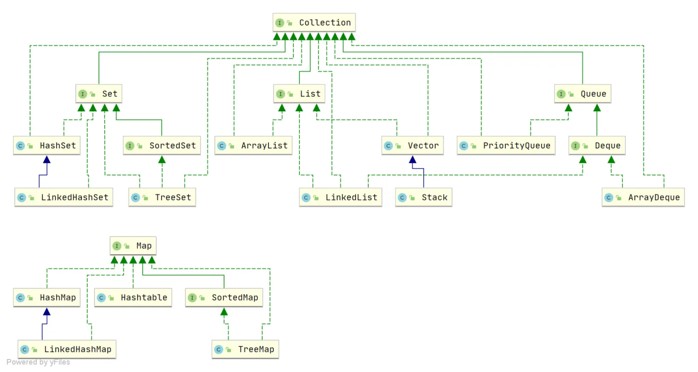
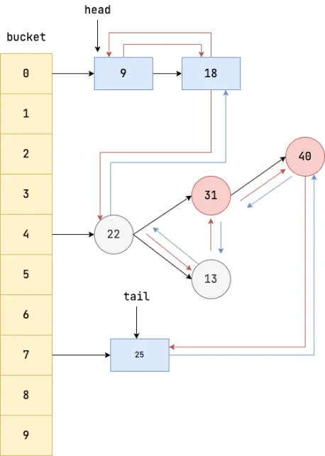

集合

<!-- more -->

# java 集合

## 关于集合你了解多少？  

集合我们也称之为容器，主要有两大接口派生而来，一个是Collection接口，用于存放单一元素；另一个是Map接口，用于存放键值对元素。Collection接口下有List,Set,Queue子接口。  

## List接口接口下有三个子实现类
+ **ArrayList** 底层是数组队列，相当于动态数组。跟java中的数组相比，它的容量会动态增长。当添加大量元素前，应用程序可以使用ensureCapacity操作来增加ArrayList的容量。这样可以减少递增式再分配的数量。ArrayList继承了AbstractList,还实现了一些接口比如：List,RandomAccess,Cloneable,java.io.Serializable这些接口。List表明它是一个列表，支持添加删除和查找等操作，并且可以通过下标进行访问，RandomAccess表明实现这个接口的集合支持随机访问，Cloneable表明它具有拷贝能力，可以进行深拷贝和浅拷贝。这就是我的了解。
+ **Vector** 它和ArrayList都是使用Object[]来存储，但是ArrayList是线程不安全的，Vector是线程安全的
+ **LinkedList** 是一个基于双向链表的集合类，LinkedList只有头尾插入删除元素的时间复杂度是O(1),其它位置都是O(n).LinkedList继承了AbstractSequentialList接口AbstractSequentialList又继承了abstractList接口，因此LinkedList和ArrayList有很多的相似的方法。LinkedList还有实现了接口：List,Deque,Cloneable,Serializable,List表明他是一个列表，支持添加删除和查找，通过下标访问操作，实现Deque接口，表明它具有双端队列的特性，支持从两端插入和删除元素，方便实现栈和队列等数据结构。Cloneable接口表明它具有拷贝能力，包括浅拷贝和深拷贝。Serializable表明它可以进行序列化操作，也就是可以将对象转换为字节流进行持久化存储或网络传输。

## Set接口下面也有三个实现类
+ **HashSet**:讲究元素无序，唯一，是基于HashMap实现的，底层采用HashMap来保存元素
+ **LinkedHashSet** :  LinkedHashSet是HashSet的子类，并且内部是通过LinkedHashMap来实现的。
+ **TreeSet** ：讲究有序，唯一，底层是红黑树。元素是有序的，排序的方式有自然排序和定制排序。

## Queue接口下有三个实现类:
+ **PriorityQueue**:  又叫优先队列，是一种队列数据结构实现，它根据优先级处理对象，在优先队列中，添加的对象会默认按照自然顺序排序，它的头部是最小的元素，如果构建的时候使用了比较器的话，就会按照自定义的顺序排序，那么头部就是按照自定义排序的最小的元素了，优先队列不支持存入null值，也不是线程安全的。
+ **DelayQueue**: 延迟队列，是JUC包提供的，底层是一个基于PriorityQueue(优先队列)实现的一个无边界队列，是线程安全的。DelayQueue可以用来处理延迟任务。
+ **ArrayDeque**：可扩容动态双向数组。

## Map接口有四个实现类
+ **HashMap**: 主要用来存放键值对，它基于哈希表的Map接口实现，是最常用的Java集合之一，是非线程安全的。HashMap可以存储null的key和value，但null作为键的只能有一个，null作为值可以有多个。jdk1.8之前hashmap是由数组+链表组成的，数组是hashMap的主体，链表则是主要为了解决hash冲突而存在的，jdk1.8之后，hashmap在解决hash冲突时有了较大的变化，当链表长度大于等于阈值（默认8）的时候，将链表转成红黑树，用来减少搜索时间。将链表转成红黑树之前会进行判断，如果当前数组的长度小于64，那么会先进行数组扩容，而不是转换成红黑树。数组的默认初始化大小为16，之后每次扩充，容量变为原来的2倍。并且hashmap总是使用2的次幂作为hash表的大小。
+ **LinkedHashMap**: 继承自HashMap，所以它的底层仍然是基于数组和链表或红黑树组成，另外，LinkedHashMap在HashMap结构的基础上，在各个节点之间维护了一条双向链表，使得原本散列在不同bucket上的节点，链表，红黑树有序关联起来。支持遍历时按照插入顺序有序的进行迭代，支持按照元素访问顺序排序，因为内部使用双向链表维护各个节点，所以遍历的效率和元素个数成正比，相比于和容量成正比的HashMap，迭代效率高很多。但是提供的功能多，使用了双向链表，插入的效率比hashMap略低。

+ **Hashtable**:  数组+链表组成的，数组是Hashtable的主题，链表是为了解决hash冲突而存在的。
+ **TreeMap**: 底层是红黑树（自平衡的排序二叉树）

## ArrayList 插入和删除元素的时间复杂度？
`对于插入：`
+ 头部插入：由于需要将所有元素都依次向后移动一个位置，因此时间复杂度是 O(n)。
+ 尾部插入：当 ArrayList 的容量未达到极限时，往列表末尾插入元素的时间复杂度是 O(1)，因为它只需要在数组末尾添加一个元素即可；当容量已达到极限并且需要扩容时，则需要执行一次 O(n) 的操作将原数组复制到新的更大的数组中，然后再执行 O(1) 的操作添加元素。
+ 指定位置插入：需要将目标位置之后的所有元素都向后移动一个位置，然后再把新元素放入指定位置。这个过程需要移动平均 n/2 个元素，因此时间复杂度为 O(n)。  
  
`对于删除：`
+ 头部删除：由于需要将所有元素依次向前移动一个位置，因此时间复杂度是 O(n)。
+ 尾部删除：当删除的元素位于列表末尾时，时间复杂度为 O(1)。
+ 指定位置删除：需要将目标元素之后的所有元素向前移动一个位置以填补被删除的空白位置，因此需要移动平均 n/2 个元素，时间复杂度为 O(n)。

## LinkedList 插入和删除元素的时间复杂度？
+ 头部插入/删除：只需要修改头结点的指针即可完成插入/删除操作，因此时间复杂度为 O(1)。
+ 尾部插入/删除：只需要修改尾结点的指针即可完成插入/删除操作，因此时间复杂度为 O(1)。
+ 指定位置插入/删除：需要先移动到指定位置，再修改指定节点的指针完成插入/删除，不过由于有头尾指针，可以从较近的指针出发，因此需要遍历平均 n/4 个元素，时间复杂度为 O(n)。

## ArrayList和LinkedList的区别？
1. 首先，线程安全上，两个都不是线程安全的
然后，底层数据结构上，ArrayList底层是一个动态数组（Object数组），LinkedList底层是一个双向链表（jdk1.6之前是循环列表，JDK1.7取消了循环，变成了双向链表。
1. 还有插入和删除对元素位置的影响：
ArrayList采用数组存储，插入和删除元素的时间复杂度受到元素位置的影响，比如使用add方法的时候如果插入的元素会追加到数组的末尾，这样时间复杂度就是O1,但是如果将元素插入到指定位置，时间复杂度就是On,因为操作的时候，比如插入到i位置，那么i位置的元素和i元素后面的元素都需要向后移动一位。
LinkedList采用链表存储，在头尾插入或者删除元素不受元素位置的影响，时间复杂度都是O1,而在指定位置插入或者删除时间复杂度就是On,因为头尾有指针，可以从较近的指针出发，因此需要遍历平均n/4个元素，时间复杂度是On.
1. 是否支持快速随机访问上，ArrayList支持因为他实现类AccessRandom接口，LinkedList不支持，他没实现接口。
1. 内存空间占用上，ArrayList的空间浪费主要体现在list列表的结尾会预留一定的容量空间，而LinkedList的空间花费在它的每一个元素都需要消耗比ArrayList更多的空间。

## LinkedList 为什么不能实现 RandomAccess 接口？
`RandomAccess` 是一个标记接口，用来表明实现该接口的类支持随机访问（即可以通过索引快速访问元素）。由于 `LinkedList`底层数据结构是链表，内存地址不连续，只能通过指针来定位，不支持随机快速访问，所以不能实现 `RandomAccess`接口。